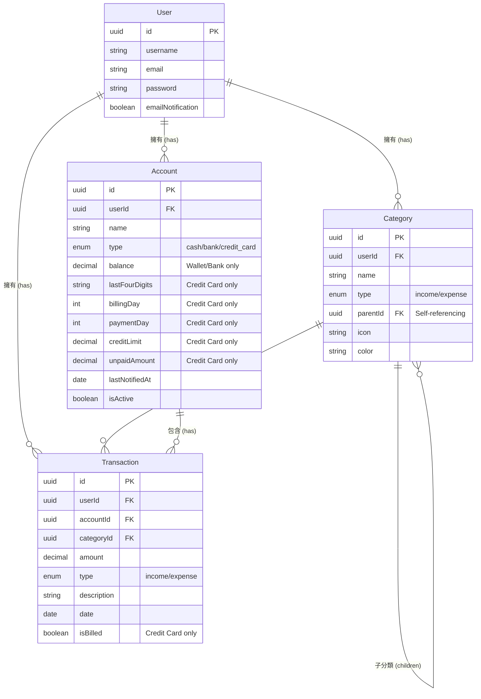

# Sequelize 練習作業:個人記帳 App

## 📝 專案目標

建立一個個人記帳系統後端,練習 Sequelize 的關聯設計與實用功能開發。

### 核心功能

- ✅ 收支記錄管理
- ✅ 分類系統 (支援階層)
- ✅ 多帳戶管理 (錢包 + 信用卡)

### 亮點功能 ⭐

- 🔔 **Email 提醒信用卡繳費** - 自動排程檢查並發送提醒
- 📊 **匯出 Excel 報表** - 產生完整的收支明細表
- 📢 **系統公告 (MongoDB)** - 練習 NoSQL 與 SQL 混合架構

## 🏗️ 系統架構設計 (MVP 上線規劃)

### 1. 部署架構 (Azure App Service)

> 💡 **目標**: 前後端部署至 Azure，並使用 Nginx 做反向代理。

- **運算資源**: **Azure App Service (Linux)**
  - **方案選擇**:
    - **F1 (Free)**: 免費，但每天有 CPU 分鐘數限制，且無 "Always On" (閒置會休眠，冷啟動慢)。適合開發測試。
    - **B1 (Basic)**: 開發用最便宜付費版 (~$13 USD/月)，支援 Always On 和自訂網域。建議 MVP 上線使用此方案以免系統睡著。
  - **部署方式**:
    - **Option A (簡單)**: 直接使用 App Service 的 Node.js 環境部署。App Service 本身前方已有負載平衡，對於 MVP 來說其實不一定需要自架 Nginx。
    - **Option B (進階 - Docker)**: 將 Nginx + Node.js 包在 Docker Image 中部署。這樣可以完全掌控 Nginx 設定 (gzip, cache header, reverse proxy rules)。
      - _成本_: 與 Option A 相同（看 App Service 本體價格）。

### 2. 資料庫 (Database)

- **關聯式資料庫 (PostgreSQL)**:
  - **Azure Database for PostgreSQL**: 價格較高 (最便宜 Flexible Server 也要 ~$15-20 USD+/月，雖然有 12 個月免費額度但過了就要錢)。
  - **替代方案 (MVP 推薦)**: **Neon** 或 **Supabase** (皆提供 PostgreSQL Serverless 免費層)，可大幅降低 MVP 成本。
- **NoSQL 資料庫 (MongoDB)**:
  - **MongoDB Atlas**: 使用官方雲端服務的 **M0 Free Tier** (永久免費，512MB 儲存)。連接字串直接設定在 App Service 環境變數即可。
  - **用途**: 儲存系統公告、非結構化 User 其他資訊。

### 3. 靜態資源 (Static Assets)

- **儲存**: **Azure Blob Storage**
  - **用途**: 存放使用者上傳的頭像、收據圖片、或前端 build 出來的靜態檔。
  - **成本**: 極低 (以 GB 計費)，MVP 用量幾乎可忽略。
- **CDN (內容傳遞網路)**:
  - **建議**: 若要加速讀取，需在 Blob 前面掛一個 **Azure CDN** (Standard Microsoft Tier)，將 Blob 設為 Origin。Azure CDN 也有免費流量額度。

### 4. CI/CD (GitHub Actions)

- **流程**:
  1. **Push to main**: 觸發 GitHub Action。
  2. **Build**: 建置 Docker Image 或直接 `npm build`。
  3. **Deploy**:
     - 若用 Docker: Push image to **Azure Container Registry (ACR)** (需微小費用) → App Service 拉取更新。
     - 若用 Code: 使用 `azure/webapps-deploy` Action 直接部署程式碼。
- **成本**: GitHub Free Tier 每月有 2000 分鐘 Action 時間，MVP 綽綽有餘。

### 5. 訊息佇列 (Message Queue) - (尚未決定/暫緩)

- **現狀**: MVP 階段流量不大，暫不需要複雜的 MQ (如 RabbitMQ, Azure Service Bus)。
- **替代**:
  - 簡單的非同步任務可先用 `setTimeout` 或 `node-cron` 處理。
  - 若真的需要 (如大量 Email 發送)，可使用 **Redis (Upstash Free Tier)** 搭配 BullMQ。

---

## 💡 業務流程

### 記帳流程

```
1. 選擇交易類型 → 收入 / 支出
2. 選擇分類 → 飲食 > 晚餐 > 便當 (支援多層級)
3. 選擇付款方式 → 現金錢包 / 台新信用卡
4. 記錄金額 → 自動更新帳戶餘額或信用卡未出帳金額
```

### 信用卡提醒流程

```
1. 每天早上 9:00 自動檢查
2. 找出 3 天後要繳費的信用卡
3. 檢查是否有未出帳金額
4. 發送 Email 提醒使用者
5. 記錄提醒時間,避免重複發送
```

### Excel 匯出流程

```
1. 使用者選擇日期範圍
2. 查詢該期間所有交易記錄
3. 包含分類、帳戶等關聯資料
4. 生成 Excel 檔案並下載
5. 包含樣式、總計計算
```

---

## 📊 資料表設計

### 1. User (使用者)

| 欄位              | 類型            | 說明                       |
| ----------------- | --------------- | -------------------------- |
| id                | UUID (PK)       | 主鍵                       |
| name              | STRING          | 使用者名稱                 |
| email             | STRING (UNIQUE) | Email (用於登入和發送提醒) |
| password          | STRING          | 密碼 (加密後)              |
| emailNotification | BOOLEAN         | 是否啟用 Email 提醒        |
| createdAt         | DATE            | 建立時間                   |
| updatedAt         | DATE            | 更新時間                   |

---

### 2. Category (分類) - 自關聯設計

| 欄位      | 類型                | 說明                       |
| --------- | ------------------- | -------------------------- |
| id        | UUID (PK)           | 主鍵                       |
| userId    | UUID (FK, nullable) | 所屬使用者 (NULL=系統預設) |
| name      | STRING              | 分類名稱                   |
| type      | ENUM                | 'income' 或 'expense'      |
| parentId  | UUID (FK, nullable) | 父分類 ID                  |
| icon      | STRING              | 圖示名稱                   |
| color     | STRING              | 顏色代碼 (如 '#FF5733')    |
| createdAt | DATE                | 建立時間                   |
| updatedAt | DATE                | 更新時間                   |

**階層結構範例:**

```
飲食 (parentId: null)
  └─ 晚餐 (parentId: 飲食ID)
      └─ 便當 (parentId: 晚餐ID)
  └─ 午餐 (parentId: 飲食ID)
      └─ 自助餐 (parentId: 午餐ID)

交通 (parentId: null)
  └─ 大眾運輸 (parentId: 交通ID)
      ├─ 捷運 (parentId: 大眾運輸ID)
      └─ 公車 (parentId: 大眾運輸ID)
```

**設計重點:**

- `parentId` 為 `null` 表示主分類
- 透過 `parentId` 建立父子關係
- 支援無限層級 (但建議 2-3 層)

---

### 3. Account (帳戶) - 統一管理錢包和信用卡

| 欄位            | 類型          | 說明                          | 適用類型  |
| --------------- | ------------- | ----------------------------- | --------- |
| id              | UUID (PK)     | 主鍵                          | 全部      |
| userId          | UUID (FK)     | 所屬使用者                    | 全部      |
| name            | STRING        | 帳戶名稱                      | 全部      |
| type            | ENUM          | 'cash', 'bank', 'credit_card' | 全部      |
| balance         | DECIMAL(10,5) | 當前餘額                      | 錢包/銀行 |
| icon            | STRING        | 圖示                          | 全部      |
| color           | STRING        | 顏色                          | 全部      |
| isActive        | BOOLEAN       | 是否啟用                      | 全部      |
| creditLimit     | DECIMAL(10,5) | 信用額度                      | 信用卡    |
| unpaidAmount    | DECIMAL(10,5) | 未出帳金額                    | 信用卡    |
| billingDay      | DATE          | 帳單日                        | 信用卡    |
| nextBillingDate | DATE          | 下次繳款日                    | 信用卡    |
| paymentStatus   | ENUM          | 繳款狀態                      | 信用卡    |
| daysUntilDue    | INTEGER       | 距離繳款日天數                | 信用卡    |
| createdAt       | DATE          | 建立時間                      | 全部      |
| updatedAt       | DATE          | 更新時間                      | 全部      |

**設計重點:**

- 使用 `type` 欄位區分帳戶類型
- 錢包/銀行使用 `balance` 欄位
- 信用卡使用 `unpaidAmount` 追蹤未出帳金額
- 包含 `icon` 與 `color` 讓前端顯示更豐富

---

### 4. Transaction (交易記錄)

| 欄位             | 類型          | 說明                  |
| ---------------- | ------------- | --------------------- |
| id               | UUID (PK)     | 主鍵                  |
| userId           | UUID (FK)     | 所屬使用者            |
| accountId        | UUID (FK)     | 使用的帳戶            |
| categoryId       | UUID (FK)     | 交易分類              |
| amount           | DECIMAL(10,5) | 金額                  |
| type             | ENUM          | 'income' 或 'expense' |
| description      | TEXT          | 備註說明              |
| date             | DATEONLY      | 交易日期 (年月日)     |
| time             | TIME          | 交易時間 (時分秒)     |
| receipt          | STRING        | 收據/發票路徑         |
| paymentFrequency | ENUM          | 付款頻率 (單次/週期)  |
| createdAt        | DATE          | 建立時間              |
| updatedAt        | DATE          | 更新時間              |

**設計重點:**

- 所有交易都關聯到一個帳戶
- 分離 `date` 和 `time` 欄位
- 金額使用 `DECIMAL(10,5)` 確保精確度

---

### 5. Announcement (系統公告) - MongoDB

| 欄位      | 類型     | 說明                  |
| --------- | -------- | --------------------- |
| \_id      | ObjectId | 主鍵                  |
| title     | String   | 公告標題              |
| content   | String   | 公告內容 (支援 HTML)  |
| type      | String   | 'maintenance', 'news' |
| isActive  | Boolean  | 是否顯示              |
| createdAt | Date     | 建立時間              |
| expiresAt | Date     | 過期時間 (TTL Index)  |

**設計重點:**

- 使用 MongoDB 儲存
- 練習 TTL Index (時間到自動刪除)
- 獨立於關聯式資料庫

---

## 🔗 關聯關係設計

```
User (1) → (N) Category
  - 一個使用者有多個分類
  - 使用 userId 關聯

User (1) → (N) Account
  - 一個使用者有多個帳戶 (錢包/信用卡)
  - 使用 userId 關聯

User (1) → (N) Transaction
  - 一個使用者有多筆交易記錄
  - 使用 userId 關聯

Category (1) → (N) Category (自關聯)
  - 一個分類可以有多個子分類
  - 使用 parentId 關聯自己

Category (1) → (N) Transaction
  - 一個分類下有多筆交易
  - 使用 categoryId 關聯

Account (1) → (N) Transaction
  - 一個帳戶有多筆交易記錄
  - 使用 accountId 關聯
```

---

## 🔧 API 端點設計

### 認證相關

- `POST /login` - 登入 (回傳 JWT token)

### 使用者管理

- `POST /user` - 註冊新使用者
- `GET /user` - 取得所有使用者
- `GET /user/:id` - 取得指定使用者資訊
- `PUT /user/:id` - 更新使用者設定
- `DELETE /user/:id` - 刪除使用者

### 分類管理

- `POST /category` - 新增分類 (可指定 parentId)
- `GET /category` - 取得所有分類
- `GET /category/:id` - 取得指定分類的子分類
- `PUT /category/:id` - 更新分類
- `DELETE /category/:id` - 刪除分類

### 帳戶管理

- `POST /account` - 新增帳戶 (錢包或信用卡)
- `GET /personnel-accounts` - 取得使用者的所有帳戶
- `PUT /account/:accountId` - 更新帳戶資訊
- `DELETE /account/:accountId` - 刪除帳戶

### 交易記錄 (核心)

- `POST /transaction` - 新增交易 (自動更新帳戶餘額)
- `GET /transaction/date/:date` - 取得指定日期所有交易
- `GET /transaction/id/:id` - 取得單筆交易詳情
- `PUT /transaction/:id` - 更新交易 (重新計算餘額)
- `DELETE /transaction/:id` - 刪除交易 (還原餘額)

### 統計查詢

- `GET /statistics/summary` - 總覽 (總收入、總支出、淨值)
- `GET /statistics/monthly` - 本月收支統計
- `GET /statistics/category` - 分類支出統計 (圓餅圖資料)
- `GET /statistics/trend` - 收支趨勢 (最近 6 個月)

### Email 提醒 (亮點功能)

- `POST /notifications/test` - 測試發送提醒信
- `GET /notifications/settings` - 取得提醒設定
- `PUT /notifications/settings` - 更新提醒設定

### Excel 匯出 (亮點功能)

- `GET /export/transactions` - 匯出交易記錄 (支援日期範圍)
- `GET /export/monthly/:year/:month` - 匯出指定月份報表
- `GET /export/category/:categoryId` - 匯出指定分類的交易

### 系統公告

- `POST /announcement` - 發布公告
- `GET /announcement` - 取得公告
- `PUT /announcement/:id` - 更新公告
- `DELETE /announcement/:id` - 刪除公告

---

## 💡 關鍵業務邏輯

### 1. 新增交易時的處理

- 建立交易記錄
- 根據帳戶類型更新餘額:
  - 錢包/銀行: 更新 `balance`
  - 信用卡: 更新 `unpaidAmount`
- 使用資料庫交易 (Transaction) 確保一致性

### 2. 信用卡提醒邏輯

- 每天定時檢查 (使用 node-cron)
- 計算 3 天後的日期
- 找出 `paymentDay` 符合的信用卡
- 檢查 `unpaidAmount > 0`
- 檢查使用者的 `emailNotification` 是否啟用
- 檢查 `lastNotifiedAt` 避免重複提醒
- 發送 Email 並更新 `lastNotifiedAt`

### 3. Excel 匯出邏輯

- 根據日期範圍查詢交易
- 包含分類、帳戶等關聯資料
- 生成 Excel 檔案:
  - 設定欄位 (日期、類型、分類、帳戶、金額、備註)
  - 套用樣式 (標題粗體、背景色)
  - 計算總計 (使用公式)
  - 設定數字格式
- 回傳檔案供下載

### 4. 分類階層查詢

- 查詢主分類 (`parentId = null`)
- 遞迴包含子分類 (使用 Sequelize `include`)
- 或使用 CTE (Common Table Expression) 查詢完整路徑

---

## 📦 所需技術與套件

### 核心套件

- `express` - Web 框架
- `sequelize` - ORM
- `pg` / `pg-hstore` - PostgreSQL 驅動
- `bcrypt` - 密碼加密
- `jsonwebtoken` - JWT 認證

### 亮點功能套件

- `nodemailer` - 發送 Email
- `node-cron` - 排程任務
- `exceljs` - 生成 Excel

### 其他

- `dotenv` - 環境變數管理
- `express-validator` - 輸入驗證 (可選)

---

## 📌 重要注意事項

### 資料一致性

- 新增/更新/刪除交易時,必須使用資料庫交易 (`sequelize.transaction()`)
- 確保交易記錄和帳戶餘額同時成功或失敗

### 金額精確度

- 所有金額欄位使用 `DECIMAL(10, 2)`
- 避免使用 `FLOAT` 或 `DOUBLE` (會有精度問題)

### Email 設定

- Gmail 需要使用「應用程式密碼」
- 不要在程式碼中寫死密碼,使用環境變數

### 效能考量

- 交易記錄可能很多,查詢時要加上分頁
- Excel 匯出大量資料時注意記憶體使用
- 為常用查詢欄位建立索引 (userId, date, categoryId)

### 刪除保護

- 刪除分類前檢查是否有交易使用
- 刪除帳戶前檢查是否有交易記錄
- 或使用軟刪除 (soft delete)

## ✅ 作業任務

### 階段 1: 環境設定 ✅

- [x] 建立專案 `expense-tracker-api`
- [x] 安裝套件: `express`, `sequelize`, `pg`, `pg-hstore`
- [x] 安裝額外套件: `nodemailer`, `exceljs`, `node-cron`, `bcrypt`, `jsonwebtoken`, `dotenv`
- [x] 建立 4 個 Model 檔案: User, Category, Account, Transaction
- [x] 在 `app.js` 定義所有關聯
- [x] 執行 `sequelize.sync()` 建立資料表

**已完成:**

- ✅ 建立 User Model (UUID, 軟刪除)
- ✅ 建立 Category Model (自關聯, parentId)
- ✅ 建立 Account Model (支援多種帳戶類型: 現金、銀行、信用卡、證券戶)
- ✅ 建立 Transaction Model (關聯 User, Account, Category)
- ✅ 定義所有關聯關係:
  - User → Category, Account, Transaction (一對多)
  - Category → Category (自關聯)
  - Category → Transaction (一對多)
  - Account → Transaction (一對多)
- ✅ 設定 TABLE_DEFAULT_SETTING (schema, paranoid, timestamps, freezeTableName)
- ✅ 建立 Sequelize Migration 機制

### 階段 2.5: 使用者 CRUD 管理 ✅

- [x] `POST /user` - 新增使用者 (密碼使用 bcrypt 加密)
- [x] `GET /users` - 取得所有使用者 (過濾已刪除的使用者)
- [x] `GET /user/:id` - 取得單一使用者 (檢查是否已刪除)
- [x] `PUT /user/:id` - 更新使用者資訊
- [x] `DELETE /user/:id` - 軟刪除使用者 (使用 deletedAt)

**學習重點:**

- bcrypt 密碼加密
- 軟刪除機制 (Soft Delete)
- 使用 Zod 進行請求驗證
- Service 層抽離邏輯

**已完成:**

- ✅ 建立 User Model
- ✅ 實作完整 CRUD API endpoints
- ✅ 密碼加密處理
- ✅ 軟刪除機制 (deletedAt)
- ✅ 建立 userServices 抽離共用邏輯
- ✅ 使用 TypeScript 型別定義

### 階段 3: 分類管理 (自關聯) ⭐

- [x] `POST /categories` - 新增分類 (可指定 parentId 建立子分類)
- [x] `GET /categories` - 取得所有分類 (樹狀結構,包含子分類)
- [x] `GET /categories/:id` - 取得指定分類的子分類
- [x] `PUT /categories/:id` - 更新分類資訊
- [x] `DELETE /categories/:id` - 刪除分類

**學習重點:**

- Sequelize 自關聯設計 (parentId)
- 使用 `include` 查詢子分類
- 樹狀結構的資料處理

**已完成:**

- ✅ 建立 Category Model (支援自關聯)
- ✅ 實作 CRUD API endpoints
- ✅ 使用 Zod 進行請求驗證
- ✅ 使用 TypeScript 型別定義
- ✅ 實作 `getChildren()` 魔法方法查詢子分類

### 階段 4: 帳戶管理

- [x] `POST /accounts` - 新增帳戶 (根據 type 決定是錢包或信用卡)
- [x] `GET /accounts` - 取得所有帳戶
- [x] `GET /accounts/:id` - 取得單一帳戶詳情
- [x] `PUT /accounts/:id` - 更新帳戶資訊
- [x] `DELETE /accounts/:id` - 刪除帳戶 (需檢查是否有交易記錄)

**學習重點:**

- 使用 `type` 欄位區分不同類型的帳戶
- 條件式欄位使用 (錢包用 balance,信用卡用 unpaidAmount)

### 階段 5: 交易記錄 (核心功能) ⭐⭐⭐

- [x] `POST /transactions` - 新增交易並自動更新帳戶餘額
- [x] `GET /transactions` - 取得所有交易 (支援篩選、分頁、包含關聯)
- [x] `GET /transactions/:id` - 取得單筆交易詳情
- [x] `PUT /transactions/:id` - 更新交易 (需重新計算餘額變化)
- [x] `DELETE /transactions/:id` - 刪除交易 (需還原帳戶餘額)

**學習重點:**

- 使用 `sequelize.transaction()` 確保資料一致性
- 新增交易時同步更新帳戶餘額
- 包含多個關聯的查詢 (Category, Account)
- 處理錢包和信用卡的不同邏輯

**關鍵邏輯:**

- 錢包交易: 更新 `Account.balance`
- 信用卡交易: 更新 `Account.unpaidAmount`,設定 `isBilled = false`

### 階段 6: 統計查詢

- [ ] `GET /statistics/summary` - 總覽 (總收入、總支出、淨值)
- [ ] `GET /statistics/monthly` - 本月收支統計
- [ ] `GET /statistics/category` - 分類支出統計 (圓餅圖資料)
- [ ] `GET /statistics/trend` - 收支趨勢 (最近 6 個月,用於折線圖)

**學習重點:**

- 使用 Sequelize 聚合函數 (SUM, COUNT)
- GROUP BY 查詢
- 日期範圍查詢 (Op.between)
- 複雜的統計計算

### 階段 7: Email 提醒功能 ⭐⭐⭐ (亮點 1)

- [ ] 設定 Nodemailer (使用 Gmail SMTP)
- [ ] 建立 Email HTML 模板
- [ ] 實作檢查信用卡繳費日期的函數
- [ ] 使用 node-cron 設定每日排程 (每天早上 9:00)
- [ ] `POST /notifications/test` - 測試發送提醒信

**學習重點:**

- Nodemailer 設定與使用
- node-cron 排程任務
- 日期計算 (找出 3 天後要繳費的卡)
- 避免重複提醒 (使用 lastNotifiedAt)

**提醒邏輯:**

1. 計算 3 天後的日期
2. 找出 `paymentDay` 符合的信用卡
3. 檢查 `unpaidAmount > 0` 且 `emailNotification = true`
4. 檢查 `lastNotifiedAt` 避免同一天重複發送
5. 發送 Email 並更新 `lastNotifiedAt`

### 階段 8: Excel 匯出功能 ⭐⭐⭐ (亮點 2)

- [ ] 安裝並設定 `exceljs`
- [ ] `GET /export/transactions` - 匯出交易記錄 (支援日期範圍篩選)
- [ ] `GET /export/monthly/:year/:month` - 匯出指定月份報表
- [ ] `GET /export/category/:categoryId` - 匯出指定分類的交易

**學習重點:**

- ExcelJS 基本使用
- 設定欄位、樣式、格式
- 使用公式計算總計
- 設定 HTTP 回應標頭讓瀏覽器下載檔案

**Excel 內容:**

- 欄位: 日期、類型、分類、帳戶、金額、備註
- 樣式: 標題粗體、背景色
- 總計: 使用 SUM 公式
- 數字格式: `#,##0.00`

### 階段 9: 測試與優化

- [ ] 建立種子資料 (Seed data) 方便測試
- [ ] 測試所有 API 端點 (使用 Postman 或類似工具)
- [ ] 測試 Email 提醒功能
- [ ] 測試 Excel 匯出
- [ ] 加入錯誤處理 (try-catch)
- [ ] 加入輸入驗證 (express-validator)
- [ ] 為常用欄位建立資料庫索引

### 階段 10: MongoDB 練習 (系統公告)

- [x] 安裝 `mongoose`
- [x] 建立 Announcement Schema
- [x] `POST /announcements` - 發布公告 (管理員)
- [x] `GET /announcements` - 取得有效公告
- [x] 練習 MongoDB TTL Index (設定過期時間)
- [x] `PUT /announcements/:id` - 編輯公告
- [x] `DELETE /announcements/:id` - 刪除公告

---

## 🎯 學習重點總結

### Sequelize 技巧

1. **一對多關聯**: User → Categories, User → Accounts, Account → Transactions
2. **自關聯**: Category 的階層結構 (使用 parentId)
3. **資料庫交易**: 使用 `sequelize.transaction()` 確保資料一致性
4. **複雜查詢**:
   - 聚合函數 (SUM, COUNT)
   - GROUP BY
   - 日期範圍查詢 (Op.between)
   - 多層 include 關聯查詢

### 後端開發技巧

1. **認證**: JWT token 驗證
2. **密碼安全**: bcrypt 加密
3. **排程任務**: node-cron 定時執行
4. **Email 發送**: Nodemailer 整合
5. **檔案生成**: ExcelJS 產生報表
6. **錯誤處理**: 統一的錯誤處理機制
7. **輸入驗證**: 防止無效資料

### 業務邏輯

1. 交易記錄與帳戶餘額的同步更新
2. 信用卡未出帳金額追蹤
3. 自動提醒系統
4. 統計資料計算

---

## 📚 參考資源

### Sequelize 文件

- [Associations](https://sequelize.org/docs/v6/core-concepts/assocs/)
- [Transactions](https://sequelize.org/docs/v6/other-topics/transactions/)
- [Querying](https://sequelize.org/docs/v6/core-concepts/model-querying-basics/)

### 套件文件

- [Nodemailer](https://nodemailer.com/)
- [node-cron](https://github.com/node-cron/node-cron)
- [ExcelJS](https://github.com/exceljs/exceljs)
- [bcrypt](https://github.com/kelektiv/node.bcrypt.js)
- [jsonwebtoken](https://github.com/auth0/node-jsonwebtoken)

```json
{
  "dependencies": {
    "express": "^4.18.0",
    "sequelize": "^6.35.0",
    "pg": "^8.11.0",
    "pg-hstore": "^2.3.4",
    "bcrypt": "^5.1.1",
    "jsonwebtoken": "^9.0.2",
    "nodemailer": "^6.9.0",
    "exceljs": "^4.4.0",
    "node-cron": "^3.0.3",
    "dotenv": "^16.3.1"
  },
  "devDependencies": {
    "nodemon": "^3.0.0"
  }
}
```

## 🔐 環境變數 (.env)

```env
# Database
DB_HOST=localhost
DB_PORT=5432
DB_NAME=expense_tracker
DB_USER=your_user
DB_PASSWORD=your_password

# JWT
JWT_SECRET=your_secret_key

# Email (Gmail)
EMAIL_USER=your_email@gmail.com
EMAIL_PASSWORD=your_app_password

# Server
PORT=3000
NODE_ENV=development
```

## 📌 注意事項

- 所有金額使用 `DECIMAL(10, 2)` 確保精確度
- 新增/刪除/更新交易時,必須使用資料庫交易 (`sequelize.transaction()`) 確保餘額正確
- Gmail 需要使用「應用程式密碼」而非帳號密碼
- Excel 匯出時注意記憶體使用,大量資料建議分批處理
- 信用卡提醒使用 `lastNotifiedAt` 避免同一天重複發送
- 分類刪除時需檢查是否有交易記錄使用該分類

## 📊 資料庫關聯圖 (ER Diagram)



## 未來規劃 (Post-MVP)

- **多幣別支援 (Currency Support)**
  - 目前專案僅支援新台幣 (TWD)
  - 未來需在 Account 和 Transaction 增加 currency 欄位
  - 需考慮匯率換算問題
