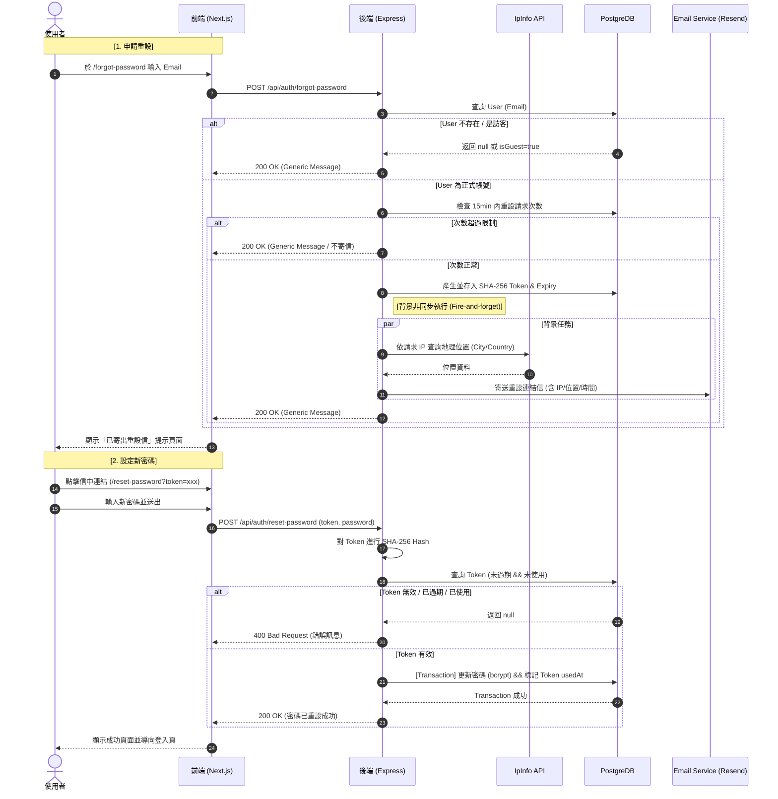

# Forgot Password (忘記密碼)

> Status: DRAFT
> Created: 2026-03-19
> Last Updated: 2026-03-20

## Summary

新增忘記密碼功能，讓使用者可以透過信箱重設密碼。完整流程：輸入信箱 → 收信 → 點擊連結 → 設定新密碼 → 成功畫面 → 返回登入頁。信件內包含操作者 IP、地理位置與操作時間，並提醒使用者如非本人操作應聯絡管理員。

## Process Flow (流程圖)



## Background & Motivation

目前系統只有登入/註冊/訪客登入/帳號轉正功能，若使用者忘記密碼則無法自助重設，只能聯繫管理員。此功能為基本安全需求。

## Requirements

### Functional Requirements

- [ ] FR-1: 登入頁面已有「忘記密碼?」連結 (已存在)，點擊後導向 `/forgot-password` 頁面
- [ ] FR-2: `/forgot-password` 頁面 — 使用者輸入 email，送出後顯示「已寄出重設信件」提示 (不論 email 是否存在都顯示相同訊息，防止 email 列舉攻擊)
- [ ] FR-3: 後端產生一次性 reset token (有效期 15 分鐘)，寄送重設密碼信件至使用者信箱
- [ ] FR-4: 信件內容包含：
  - 重設密碼按鈕（Call To Action）/ 連結
  - 觸發此操作的 IP 位址
  - IP 對應的地理位置 (城市/國家)
  - 操作觸發時間
  - 安全提醒：「若此操作非您本人進行，請立即聯繫管理員：{SUPPORT_EMAIL_FROM}」
- [ ] FR-5: `/reset-password?token=xxx` 頁面 — 使用者輸入新密碼 + 確認新密碼，送出
- [ ] FR-6: 重設成功後顯示成功訊息頁面，包含「返回登入頁」按鈕
- [ ] FR-7: Token 只能使用一次，使用後標記 `usedAt`。同一使用者再次申請時產生新 token，舊 token 自動失效
- [ ] FR-8: 訪客帳號 (isGuest = true) 不允許重設密碼（靜默處理，仍回傳成功）
- [ ] FR-9: 已登入使用者造訪 `/forgot-password` 或 `/reset-password` 時 replace 回 `/dashboard`

### Non-Functional Requirements

- [ ] NFR-1: Reset token 使用 **SHA-256** hash 儲存（高亂數 token 不需 bcrypt，可直接 DB 查詢 O(1)）
- [ ] NFR-2: `token` 欄位建立 **DB Index**，確保 token 驗證為 O(1) 查詢
- [ ] NFR-3: 前端不洩漏該 email 是否在系統中已註冊 (統一回應)
- [ ] NFR-4: Rate limit — **雙層限制**：
  - Per-IP：每分鐘最多 3 次
  - Per-Email：同一 email 15 分鐘內最多 3 封信（產生新 token + 重寄信，舊 token 自動失效）
- [ ] NFR-5: 設定 Express `trust proxy`，確保在 Cloudflare 後能取得真實 Client IP
- [ ] NFR-6: IP Geolocation 使用 HTTPS API（`ipinfo.io`），避免明文傳輸使用者 IP

## Technical Design

### Data Model

新增獨立 `PasswordResetToken` table（不汙染 user table，職責分離）：

| Column      | Type                | Nullable | Index | Description                      |
| ----------- | ------------------- | -------- | ----- | -------------------------------- |
| `id`        | UUID (PK)           | false    | ✅    | 主鍵                             |
| `userId`    | UUID (FK → user.id) | false    | ✅    | 關聯使用者                       |
| `token`     | STRING              | false    | ✅    | SHA-256 hashed reset token       |
| `expiresAt` | DATE                | false    |       | Token 過期時間                   |
| `usedAt`    | DATE                | true     |       | 使用時間（用過就標記，方便追蹤） |
| `createdAt` | DATE                | false    |       | 建立時間                         |

### Token 策略

```
產生: crypto.randomBytes(32).toString('hex') → rawToken
儲存: crypto.createHash('sha256').update(rawToken).digest('hex') → DB token 欄位
驗證: 前端傳 rawToken → 後端 SHA-256 → findOne({ token: hashed, expiresAt > NOW, usedAt IS NULL })
```

- ✅ O(1) Index 查詢，不需逐筆比對
- ✅ DB 洩漏時 token 無法直接使用（需反推 SHA-256，不可能）
- ✅ 不會卡 Event Loop（SHA-256 同步但極快 ~microseconds）

### API Changes

#### POST `/api/auth/forgot-password`

- **Body**: `{ email: string }`
- **Response**: `{ isSuccess: true, message: "若此信箱已註冊，您將收到重設密碼的信件" }`
- **邏輯**:
  1. 查詢使用者（不存在或 isGuest → 不寄信但仍回傳成功）
  2. 檢查該使用者 15 分鐘內已寄出的 token 數量 → 超過 10 封不寄信但仍回傳成功
  3. 產生 raw token (`crypto.randomBytes(32)`) + expiry (15min)
  4. SHA-256 hash token → 寫入 `PasswordResetToken` table
  5. 取得 request IP（透過 `trust proxy`）→ `ipinfo.io` 查詢地理位置
  6. 呼叫 emailService 寄送重設密碼信（含 IP、位置、時間）

#### POST `/api/auth/reset-password`

- **Body**: `{ token: string, password: string, confirmPassword: string }`
- **Response**: `{ isSuccess: true, message: "密碼已重設成功" }`
- **邏輯**:
  1. SHA-256 hash 前端傳來的 raw token
  2. `PasswordResetToken.findOne({ token: hashed, expiresAt > now, usedAt IS NULL })`
  3. 更新使用者密碼 (bcrypt hash)
  4. 標記 token `usedAt = now`
  5. 回傳成功

### Frontend Changes

#### 新增 2 個頁面（在 `(auth)` layout group 下，支援深淺色主題）：

1. **`/forgot-password`** (`app/(auth)/forgot-password/page.tsx`)
   - Email 輸入表單
   - 送出後 state 切換為提示畫面（已寄出）
   - Auth guard：已登入 → `router.replace('/dashboard')`
   - 深淺色主題支援（`dark:` prefix，同 login page 風格）

2. **`/reset-password`** (`app/(auth)/reset-password/page.tsx`)
   - 從 URL searchParams 取得 token
   - 新密碼 + 確認新密碼表單
   - 送出成功後 state 切換為成功畫面 + 「返回登入頁」按鈕
   - Auth guard：已登入 → `router.replace('/dashboard')`
   - 深淺色主題支援

#### 新增 Email Template

- `apps/backend/src/emails/passwordReset.tsx` — React Email 模板
  - 品牌一致風格（參考 `welcome.tsx`）
  - 顯示 IP、地理位置、操作時間
  - 安全警告文字 + 管理員聯絡信箱 (`SUPPORT_EMAIL_FROM`)
  - 重設密碼按鈕（Call To Action）

#### 新增 Shared Validation Schema

- `forgotPasswordSchema` — email 驗證
- `resetPasswordSchema` — password + confirmPassword 驗證

### Email Configuration

- **寄件人**: `EMAIL_FROM` 環境變數（Resend 發送）
- **管理員聯絡信箱**: `SUPPORT_EMAIL_FROM` 環境變數（顯示在信件中，Cloudflare Email Routing 轉寄）

### IP Geolocation

使用 `https://ipinfo.io/{ip}/json` (HTTPS)，免費版每月 50k requests，不需 API key。
Fallback：如果查詢失敗則信件中顯示「位置未知」。

### Trust Proxy

在 `app.ts` 中設定 `app.set('trust proxy', true)`，確保 `req.ip` 在 Cloudflare 後回傳真實 Client IP（從 `x-forwarded-for` header 解析）。

## Edge Cases & Error Handling

| Case                          | Handling                           |
| ----------------------------- | ---------------------------------- |
| Email 不存在                  | 回傳成功（不洩漏）                 |
| 訪客帳號                      | 不寄信，回傳成功                   |
| Token 已過期                  | 回傳錯誤「連結已過期，請重新申請」 |
| Token 已使用 (usedAt != null) | 同上                               |
| Token 不存在                  | 回傳錯誤「無效的重設連結」         |
| IP geolocation 失敗           | 信件顯示「位置未知」               |
| 密碼不符                      | 前端 + 後端雙重驗證                |
| 已登入使用者                  | replace 回 `/dashboard`            |
| 同一 email 超過 3 封/15min    | 不寄信，回傳成功（不洩漏）         |

## Out of Scope

- 帳號鎖定 / 重設次數限制
- 簡訊驗證
- 二次驗證 (2FA)

## Open Questions

（已全部解決）
