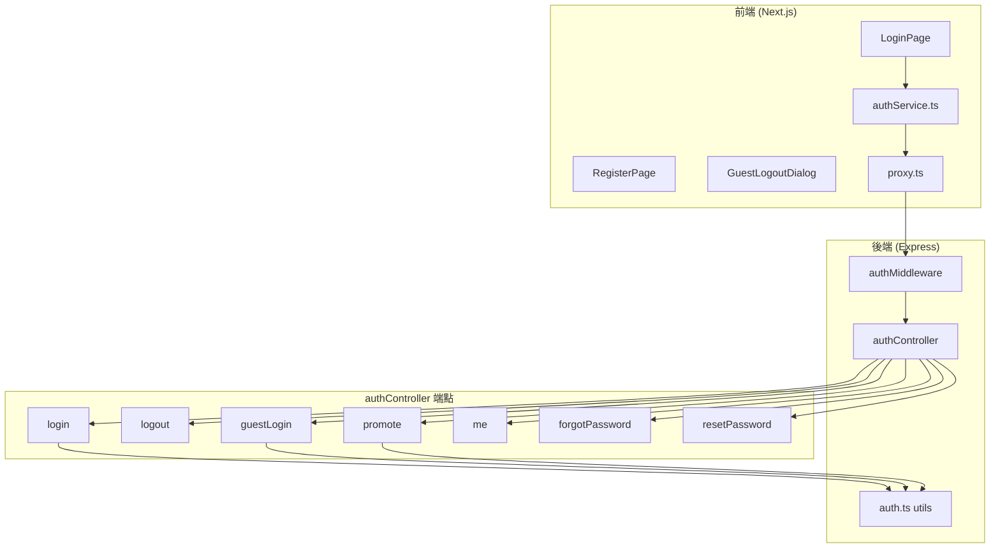
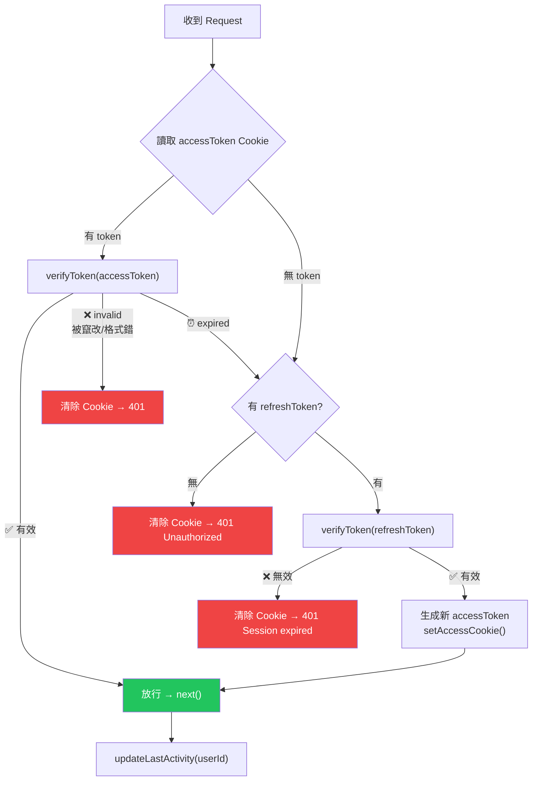

# 🔐 EasyAccounting 認證與自動換證規格 (Auth & Token Rotation)

> 本文件定義了系統的認證架構、Token 策略以及後端自動換證 (Silent Refresh) 的實作細節。

---

## 1. 架構總覽 (System Overview)

系統採用 **BFF (Backend For Frontend)** 模式配合 **雙 Token 策略**，透過 Cookie 進行狀態管理。

---

## 2. Token 策略 (Dual Token Strategy)

| 項目 | Access Token | Refresh Token |
| :--- | :--- | :--- |
| **用途** | 存取 API 的唯一憑證 | **僅用於**換發新的 Access Token |
| **效期 (JWT)** | 短 (15 分鐘) | 長 (7 天) |
| **儲存方式** | HTTP-Only Cookie (`accessToken`) | HTTP-Only Cookie (`refreshToken`) |
| **Cookie 行為** | `Max-Age` 設為長效 (7天)，不隨 JWT 過期自動消失 | 隨 JWT 效期自動失效 |

### Cookie 安全設定 (COOKIE_OPTIONS)
- `httpOnly: true`: 防止 XSS 攻擊讀取 Token。
- `secure: true`: 雲端環境強制 HTTPS。
- `sameSite: 'lax'`: 防止 CSRF 攻擊，同時允許同註冊域名的子網域跳轉。
- `domain`: 生產環境設為 `.riinouo-eaccounting.win` 以支援跨子網域 (如 `app.` 與 `api.`)。

---

## 3. authMiddleware 自動換證流程

這是系統的核心認證閘門，負責攔截請求、驗證權限，並在 Access Token 過期時自動利用 Refresh Token 換發新證，達成使用者「無感刷新」。

> [!TIP]
> **原子性優勢**：刷新與請求在同一條連線中完成，前端無需處理 401 重試邏輯，減少 Race Condition 機會。

---

## 4. 認證端點詳解 (API Endpoints)

### A. 登入系列
- **`POST /api/auth/login`**: 一般用戶登入。檢查 `isGuest` 標記，禁止訪客透過此路徑進入。
- **`POST /api/auth/guest-login`**: 訪客登入。生成隨機身份並建立 `isGuest: true` 的用戶。
- **`POST /api/auth/promote`**: 訪客轉正。使用 **DB Transaction + SELECT FOR UPDATE** 確保 email 註冊與身份轉換的原子性。

### B. 常規操作
- **`POST /api/auth/logout`**: 清除 `accessToken` 與 `refreshToken` Cookies。
- **`GET /api/auth/me`**: 驗證 Session 並回傳當前使用者資訊 (`name`, `email`, `isGuest`)。

### C. 密碼管理 (安全強化)
- **`POST /api/auth/forgot-password`**: 
    - 統一回傳 200 (防 Email 列舉攻擊)。
    - **Rate Limit**: 15 分鐘內最多 10 次。
    - **背景處理**: IP Geolocation 與郵件寄送為 Fire-and-forget，不阻塞回應。
- **`POST /api/auth/reset-password`**: 
    - Token 以 SHA-256 Hash 存於 DB，原始 Token 僅存於郵件。
    - 密碼更新與 Token 標記失效需在同一 Transaction 完成。

---

## 5. 安全特性摘要

| 特性 | 實作細節 |
| :--- | :--- |
| **密碼雜湊** | 使用 `bcrypt` (Salt Round: 12)。 |
| **JWT 安全** | 使用 `jose` 庫實作 HS256 簽名，核心 Secret 存於隱密環境變數。 |
| **防 CSRF** | Cookie 設定 `SameSite: Lax`。 |
| **防 XSS** | 敏感 Token 僅存於 `HttpOnly` Cookie。 |
| **活躍追蹤** | `updateLastActivity` 在每次認證通過後非同步更新，監控帳號異常活動。 |
| **訪客隔離** | 資料庫層級標記 `isGuest`，關鍵操作（如 Promote）強制 Transaction 檢查。 |
