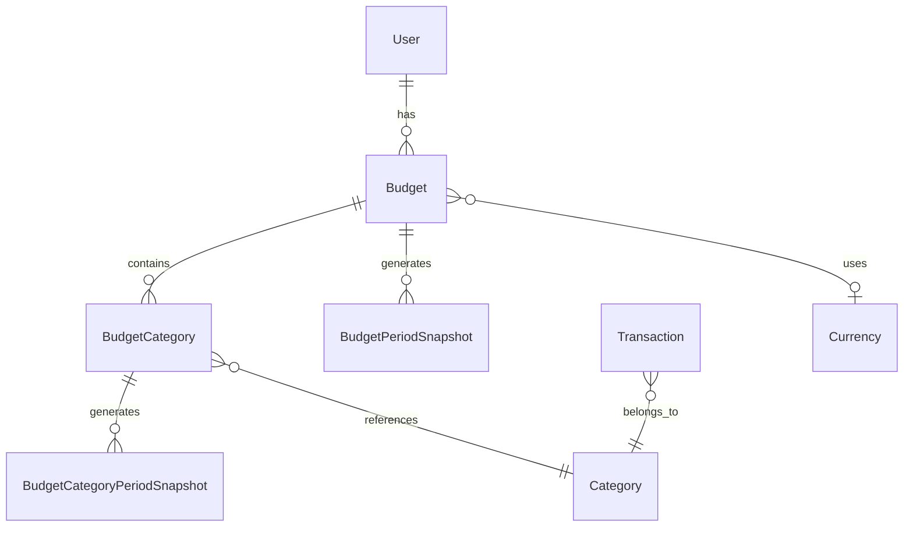
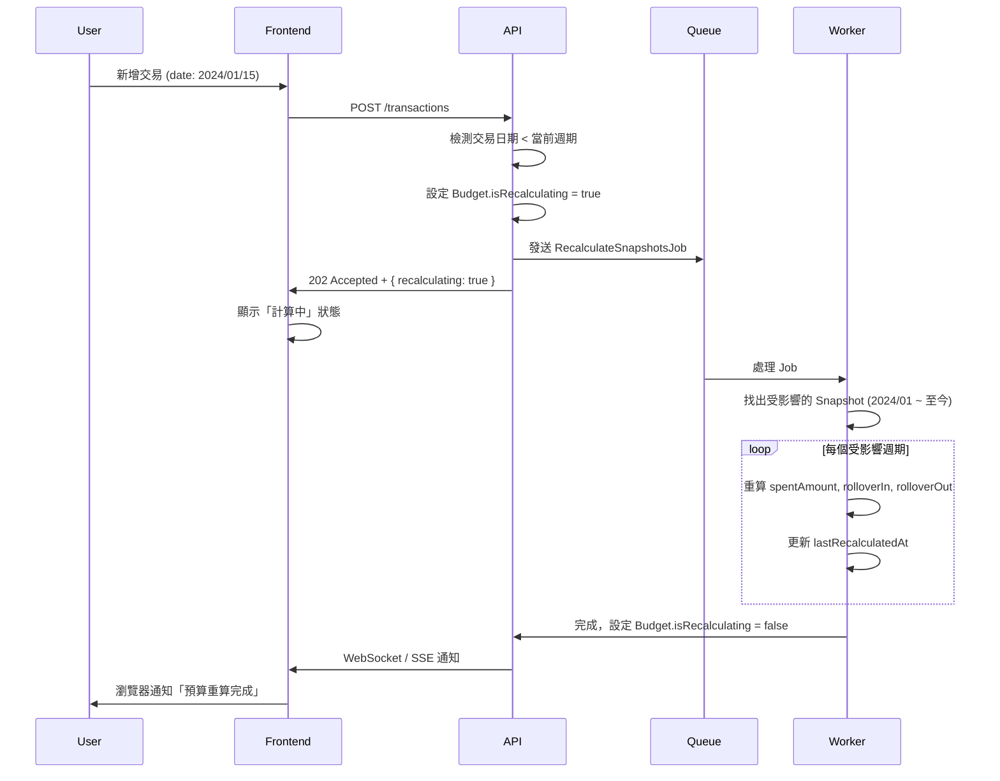

# Budget System Technical Specification

> **文件狀態**: 🔄 Revising (YNAB Model)  
> **作者**: Riin with co-authoring skill  
> **最後更新**: 2026-01-22

---

## 0. Glossary（名詞表）

| 英文                | 中文     | 說明                                             |
| ------------------- | -------- | ------------------------------------------------ |
| **Budget**          | 預算專案 | 一個預算計劃（如「月薪預算」）                   |
| **Budget category** | 子預算   | 預算專案底下的分類配額                           |
| **Assigned**        | 分配額度 | 本期分配給該分類的金額 = `budgetCategory.amount` |
| **Activity**        | 交易活動 | 該分類本期的交易淨額（即時計算，不儲存）         |
| **Available**       | 可用餘額 | `rolloverIn + assigned + activity`               |
| **Ready to assign** | 待分配   | 主預算還沒分配給子預算的餘額                     |
| **Rollover in**     | 結轉進入 | 從上期帶入的餘額                                 |
| **Rollover out**    | 結轉移出 | 帶到下期的餘額 = `max(0, available)`             |

---

## 1. Overview & Goals

**目標**：建立 YNAB 風格的 Zero-based budgeting 系統，讓用戶主動分配資金並追蹤預算執行狀況。

**核心功能**：

- 支援年/月/週/日週期，可自訂起始日
- 重複循環 vs 單次預算
- 總預算 + 子預算（分類級），皆支援餘額結轉
- 交易透過分類自動歸入對應預算（無需手動選擇）
- Ready to assign 顯示待分配餘額
- 80%/100% 超支提醒
- 歷史週期保護（Snapshot 不可變）

---

## 2. Data Model

### 2.1 Budget (預算專案)

| 欄位             | 型別          | 說明                                                                                          |
| ---------------- | ------------- | --------------------------------------------------------------------------------------------- |
| `id`             | INT (PK)      | 主鍵                                                                                          |
| `userId`         | INT (FK)      | 所屬使用者                                                                                    |
| `name`           | VARCHAR(100)  | 預算名稱（如「月薪預算」「旅遊基金」）                                                        |
| `description`    | TEXT          | 備註說明 (nullable)                                                                           |
| `amount`         | DECIMAL(15,2) | 預算總額                                                                                      |
| `cycleType`      | ENUM          | `YEAR` / `MONTH` / `WEEK` / `DAY`                                                             |
| `cycleStartDay`  | INT           | 週期起始日（MONTH: 1-31, WEEK: 1-7 週一=1 週日=7, DAY: ignored, YEAR: 使用 startDate 的月日） |
| `startDate`      | DATE          | 預算生效起始日（第一個週期從何時開始）                                                        |
| `endDate`        | DATE          | 預算結束日 (nullable)                                                                         |
| `isRecurring`    | BOOLEAN       | `true`=重複循環, `false`=單次週期                                                             |
| `rollover`       | BOOLEAN       | 是否結轉餘額至下期（僅 `isRecurring=true` 時有效）                                            |
| `isActive`       | BOOLEAN       | 是否啟用 (default: true)                                                                      |
| `currencyId`     | INT (FK)      | 幣別 (nullable, Future Enhancement)                                                           |
| `createdAt`      | TIMESTAMP     | 建立時間                                                                                      |
| `updatedAt`      | TIMESTAMP     | 更新時間                                                                                      |
| `deletedAt`      | TIMESTAMP     | 軟刪除 (nullable)                                                                             |
| `pendingAmount`  | DECIMAL(15,2) | 待下期生效的新額度 (nullable)                                                                 |
| `alert80SentAt`  | TIMESTAMP     | 80% 警示發送時間 (nullable)                                                                   |
| `alert100SentAt` | TIMESTAMP     | 100% 警示發送時間 (nullable)                                                                  |

> [!IMPORTANT]
> **修改預算額度時的規則**：變更 `amount` 只影響「當前及未來週期」，不可追溯更動已結束週期的計算結果。實作方式見 [3.4 修改生效時間](#34-修改生效時間)。

### 2.2 BudgetCategory (子預算)

| 欄位         | 型別          | 說明                                       |
| ------------ | ------------- | ------------------------------------------ |
| `id`         | UUID (PK)     | 主鍵                                       |
| `budgetId`   | UUID (FK)     | 所屬預算專案                               |
| `categoryId` | UUID (FK)     | 關聯分類（現有 Category 系統）             |
| `amount`     | DECIMAL(15,2) | 該分類的分配額度 (Assigned)                |
| `rollover`   | BOOLEAN       | 是否結轉餘額至下期 (default: true, 不顯示) |
| `createdAt`  | TIMESTAMP     | 建立時間                                   |
| `updatedAt`  | TIMESTAMP     | 更新時間                                   |

> [!NOTE]
> **交易歸入邏輯**：交易透過 `Transaction.categoryId` → `Category.parentId` (MainCategory) → `BudgetCategory` 自動歸入對應的預算。
>
> **修改額度**：變更 `amount` 時，UI 彈出選項讓用戶選擇「立即生效」或「下期生效」，預設為下期生效。

### 2.3 BudgetCategoryPeriodSnapshot (子預算週期快照) [NEW]

記錄每個「已結束週期」的子預算最終結果。

| 欄位                 | 型別          | 說明                         |
| -------------------- | ------------- | ---------------------------- |
| `id`                 | UUID (PK)     | 主鍵                         |
| `budgetCategoryId`   | UUID (FK)     | 所屬子預算                   |
| `periodStart`        | DATE          | 週期起始日                   |
| `periodEnd`          | DATE          | 週期結束日                   |
| `assignedAmount`     | DECIMAL(15,2) | 該週期的分配額度（Assigned） |
| `activityAmount`     | DECIMAL(15,2) | 該週期的交易活動（Activity） |
| `rolloverIn`         | DECIMAL(15,2) | 從上期結轉進來的金額         |
| `rolloverOut`        | DECIMAL(15,2) | 結轉至下期的金額             |
| `createdAt`          | TIMESTAMP     | 快照建立時間                 |
| `lastRecalculatedAt` | TIMESTAMP     | 最後重算時間 (nullable)      |

### ~~2.4 TransactionBudget~~ [DEPRECATED]

> [!WARNING]
> **此表已棄用**。交易改為透過 Category 自動歸入預算，不再需要手動關聯。
>
> 舊資料保留供相容性使用，新功能不再寫入此表。

### 2.4 BudgetPeriodSnapshot (主預算週期快照)

記錄每個「已結束週期」的主預算最終結果。**此表的目的是保護歷史資料**：即使用戶事後修改預算額度，過去週期的記錄不會被追溯更動。

**何時建立**：每個週期結束時由 Cron Job 自動產生。

| 欄位                 | 型別          | 說明                           |
| -------------------- | ------------- | ------------------------------ |
| `id`                 | UUID (PK)     | 主鍵                           |
| `budgetId`           | UUID (FK)     | 所屬預算專案                   |
| `periodStart`        | DATE          | 週期起始日                     |
| `periodEnd`          | DATE          | 週期結束日                     |
| `budgetAmount`       | DECIMAL(15,2) | 該週期的預算額度（快照）       |
| `totalActivity`      | DECIMAL(15,2) | 該週期所有子預算 Activity 總和 |
| `rolloverIn`         | DECIMAL(15,2) | 從上期結轉進來的金額           |
| `rolloverOut`        | DECIMAL(15,2) | 結轉至下期的金額               |
| `createdAt`          | TIMESTAMP     | 快照建立時間                   |
| `lastRecalculatedAt` | TIMESTAMP     | 最後重算時間 (nullable)        |

> [!TIP]
> 此表在週期結束時自動建立，但回溯補帳時會觸發重算，詳見 [3.6 回溯補帳](#36-回溯補帳-backdating)。

### 2.5 Entity Relationships



**關聯說明**：

- 一個 User 可有多個 Budget
- 一個 Budget 可有多個 BudgetCategory
- 交易透過 Category 自動關聯到 BudgetCategory，進而歸入 Budget
- 一個分類可被多個預算使用（同一分類可在多個預算專案中設定子預算）
- Budget 可選擇性關聯 Currency（多幣別 Future）
- 每個結束的週期產生 BudgetPeriodSnapshot（主預算）和 BudgetCategoryPeriodSnapshot（子預算）

---

## 3. Business Logic

### 3.1 週期計算

根據 `cycleType` 和 `cycleStartDay` 計算當前週期的起訖日：

```typescript
function getCurrentPeriod(budget: Budget, referenceDate: Date): { start: Date; end: Date } {
  switch (budget.cycleType) {
    case 'DAY':
      return { start: referenceDate, end: referenceDate };

    case 'WEEK':
      // cycleStartDay: 1=週一, 7=週日
      const weekStart = getWeekStart(referenceDate, budget.cycleStartDay);
      return { start: weekStart, end: addDays(weekStart, 6) };

    case 'MONTH':
      // cycleStartDay: 1-31，超過當月天數則取當月最後一天
      const monthStart = getMonthStart(referenceDate, budget.cycleStartDay);
      return { start: monthStart, end: addMonths(monthStart, 1) - 1day };

    case 'YEAR':
      const yearStart = new Date(referenceDate.getFullYear(), 0, 1);
      return { start: yearStart, end: new Date(referenceDate.getFullYear(), 11, 31) };
  }
}
```

**邊界處理**：

- `cycleStartDay = 31` 但該月只有 28 天 → 取 28 號
- 預算 `startDate` 晚於今天 → 尚未開始，不計算
- **時區處理**：週期計算必須使用 User 設定的時區（如 `Asia/Taipei`），不可依賴 Server 本地時間

### 3.2 餘額 Rollover (YNAB 風格)

主預算和子預算**皆支援** Rollover：

**子預算 Rollover 計算**：

```typescript
// 子預算 Available = 上期結轉 + 本期分配 + 本期交易活動
available = rolloverIn + assigned + activity;

// 子預算結轉至下期 = 正餘額結轉，負餘額不結轉
rolloverOut = Math.max(0, available);
```

**主預算 Rollover 計算**：

```typescript
// 主預算 Available = 預算額度 + 上期結轉
available = budget.amount + rolloverIn;

// Ready to Assign = 主預算 Available - 所有子預算已分配額度
readyToAssign = available - totalAssigned;

// 主預算結轉至下期
rolloverOut = budget.rollover ? Math.max(0, readyToAssign) : 0;
```

> [!NOTE]
> **Rollover 來源**：
>
> - 若上期 Snapshot 存在 → 使用上期 `rolloverOut`
> - 若上期 Snapshot 不存在（首期）→ `rolloverIn = 0`

### 3.3 預算使用率計算 (YNAB 風格)

#### 3.3.1 子預算計算

```typescript
interface CategoryUsage {
  assigned: number; // = budgetCategory.amount
  activity: number; // Σ 該分類交易金額（負值）
  available: number; // rolloverIn + assigned + activity
  rolloverIn: number; // 從上期帶入
}

function calculateCategoryUsage(
  budgetCategory: BudgetCategory,
  period: Period,
  userId: string,
): CategoryUsage {
  // 1. 取得分配額度
  const assigned = budgetCategory.amount;

  // 2. 計算本期交易活動（包含子分類）
  const categoryIds = [
    budgetCategory.categoryId,
    ...getChildCategoryIds(budgetCategory.categoryId, userId),
  ];
  const transactions = await Transaction.findAll({
    where: {
      userId,
      categoryId: { [Op.in]: categoryIds },
      type: RootType.EXPENSE,
      date: { [Op.between]: [period.start, period.end] },
    },
  });
  const activity = -1 * sum(transactions.map((t) => Math.abs(t.amount)));

  // 3. 取得上期結轉
  const rolloverIn = getCategoryRolloverIn(budgetCategory.id, period);

  // 4. 計算可用餘額
  const available = rolloverIn + assigned + activity;

  return { assigned, activity, available, rolloverIn };
}
```

#### 3.3.2 主預算計算

```typescript
interface BudgetUsage {
  totalAssigned: number; // Σ 所有子預算 assigned
  totalActivity: number; // Σ 所有子預算 activity
  available: number; // budget.amount + rolloverIn
  readyToAssign: number; // available - totalAssigned
  rolloverIn: number;
}

function calculateBudgetUsage(budget: Budget, period: Period): BudgetUsage {
  const categories = await BudgetCategory.findAll({
    where: { budgetId: budget.id },
  });

  const categoryUsages = await Promise.all(
    categories.map((cat) => calculateCategoryUsage(cat, period, budget.userId)),
  );

  const totalAssigned = sum(categoryUsages.map((u) => u.assigned));
  const totalActivity = sum(categoryUsages.map((u) => u.activity));
  const rolloverIn = getBudgetRolloverIn(budget.id, period);
  const available = budget.amount + rolloverIn;
  const readyToAssign = available - totalAssigned;

  return { totalAssigned, totalActivity, available, readyToAssign, rolloverIn };
}
```

### 3.8 子預算計算邏輯 (YNAB 風格)

**範圍 (Scope)**:

- 包含所選 MainCategory 及其所有**子分類**的交易
- 例如：子預算設為「飲食」（MainCategory），則「早餐」、「午餐」等子分類的交易皆納入計算
- 需遞迴取得所有子分類 ID（包含用戶自訂分類）

**新增交易時的行為**：

當用戶新增交易，該交易的分類沒有對應的 BudgetCategory 時：

1. **自動建立** BudgetCategory，`amount = 0`
2. **顯示 Toast**：「已在『月薪預算』中建立『餐飲』子預算，請記得設定分配額度」
3. **新增通知**：在 Notification Center 顯示待處理項目

**子預算額度上限公式 (Amount Limit Formulas)**:

| 變數名稱        | 定義                             | 說明                                   |
| --------------- | -------------------------------- | -------------------------------------- |
| `available`     | `budget.amount + rolloverIn`     | 主預算本期可用總額                     |
| `totalAssigned` | `Σ budgetCategories.amount`      | 所有子預算已分配額度加總               |
| `readyToAssign` | `available - totalAssigned`      | 尚未分配的餘額                         |
| `otherAssigned` | `totalAssigned - current.amount` | 其他子預算已分配額度（不含正在編輯的） |

```typescript
// 新增子預算時
const maxAmount = available - totalAssigned; // = readyToAssign

// 編輯子預算時
const maxAmount = available - otherAssigned;
```

> [!IMPORTANT]
> **約束條件**：`totalAssigned <= available`
>
> 子預算的分配是「計劃」性質，不受 Activity 影響。即使本期 Available 已為負，新增子預算的上限仍以 `readyToAssign` 為準。

**設計哲學 (Design Philosophy)**:

本系統採用 **YNAB 零基預算** 設計：

| 項目                        | 行為           | 說明                                                                     |
| --------------------------- | -------------- | ------------------------------------------------------------------------ |
| **主預算 (Budget)**         | ✅ 有 Rollover | `available = amount + rolloverIn`，可結轉至下期                          |
| **子預算 (BudgetCategory)** | ✅ 有 Rollover | `available = rolloverIn + assigned + activity`，正餘額結轉，負餘額不結轉 |

**YNAB 風格特點**：

- **主動分配**：用戶需分配資金到各子預算（Assigned）
- **Ready to Assign**：顯示尚未分配的餘額，鼓勵用戶分配到 0
- **超支處理**：子預算 Available 為負時顯示紅色，但不自動從其他分類扣除
- **結轉行為**：正餘額自動結轉，負餘額重置為 0（鼓勵下期補足）

### 3.4 修改生效時間

用戶修改預算時，UI 提供選項：

| 選項         | 行為                                 |
| ------------ | ------------------------------------ |
| **立即生效** | 更新 `amount`，當前週期重新計算      |
| **下期生效** | 記錄 `pendingAmount`，週期結束後套用 |

**預設行為**：下期生效（降低誤操作風險）

**實作方式**：

- Budget 表新增 `pendingAmount` (nullable)
- Cron Job 在週期結束時：若 `pendingAmount` 存在 → 更新 `amount` 並清空 `pendingAmount`

> [!WARNING]
> 已結束週期的 Snapshot 不會被追溯修改。若用戶選擇「立即生效」，只影響當前進行中的週期。

### 3.5 Alert 觸發條件

系統強制啟用兩個 threshold：

| Threshold | 觸發條件           | 通知方式       |
| --------- | ------------------ | -------------- |
| **80%**   | `usageRate >= 80`  | Email / In-App |
| **100%**  | `usageRate >= 100` | Email / In-App |

**觸發邏輯**：

- 每次新增交易後檢查
- 同一週期內，每個 threshold 只觸發一次（需記錄 `alertSentAt`）

**實作建議**：

- Budget 表新增 `alert80SentAt`, `alert100SentAt` (nullable TIMESTAMP)
- 週期結束時重置為 null

### 3.6 回溯補帳 (Backdating)

> [!CAUTION]
> 這是預算系統最複雜的邏輯，需謹慎實作。

**情境**：用戶在 2026/02/02 補記了一筆 2024/01/15 的交易，該日期屬於已結束的週期。

**處理流程**：



**新增欄位**：

| 表     | 欄位                 | 說明                        |
| ------ | -------------------- | --------------------------- |
| Budget | `isRecalculating`    | BOOLEAN，是否正在重算中     |
| Budget | `lastRecalculatedAt` | TIMESTAMP，最後重算完成時間 |

**前端 UI 設計**：

當 `isRecalculating = true` 時：

- 預算卡片顯示 loading skeleton 或 spinner
- 禁用編輯/刪除按鈕
- 顯示提示文字：「正在重新計算歷史資料...」

**用戶確認 Modal**：

新增過去週期交易時，彈出警告：

```
┌─────────────────────────────────────┐
│  ⚠️ 回溯補帳確認                      │
├─────────────────────────────────────┤
│  您正在新增 2024/01/15 的交易。       │
│                                       │
│  此交易屬於已結束的預算週期，系統將    │
│  重新計算從該日期起至今的所有週期。    │
│                                       │
│  預計影響 24 個月的歷史紀錄。         │
│                                       │
│        [取消]    [確認新增]           │
└─────────────────────────────────────┘
```

### 3.7 Snapshot 惰性建立 (Lazy Evaluation)

為避免 Cron Job 單點故障，採用惰性建立策略：

**觸發時機**：

1. Cron Job 每日凌晨檢查（主要）
2. 用戶請求 Budget 資料時，若發現上期 Snapshot 不存在（備援）

**邏輯**：

```typescript
async function getBudgetWithUsage(budgetId: number): Promise<BudgetUsage> {
  const budget = await Budget.findByPk(budgetId);
  const currentPeriod = getCurrentPeriod(budget, new Date());
  const previousPeriod = getPreviousPeriod(budget, currentPeriod.start);

  // 檢查上期 Snapshot 是否存在
  const snapshot = await BudgetPeriodSnapshot.findOne({
    where: { budgetId, periodEnd: previousPeriod.end },
  });

  if (!snapshot && previousPeriod.end < new Date()) {
    // 惰性建立 Snapshot
    await createSnapshot(budget, previousPeriod);
  }

  return calculateUsage(budget, currentPeriod);
}
```

---

## 4. API Endpoints

### 4.1 Budget CRUD

| Method | Endpoint       | 說明                                                            |
| ------ | -------------- | --------------------------------------------------------------- |
| GET    | `/budgets`     | 取得用戶所有預算                                                |
| GET    | `/budgets/:id` | 取得單一預算詳情（含子預算、當前週期使用率）                    |
| POST   | `/budgets`     | 建立預算                                                        |
| PUT    | `/budgets/:id` | 更新預算（需傳入 `effectiveFrom`: `immediate` \| `nextPeriod`） |
| DELETE | `/budgets/:id` | 軟刪除預算                                                      |

### 4.2 BudgetCategory CRUD

| Method | Endpoint                         | 說明             |
| ------ | -------------------------------- | ---------------- |
| GET    | `/budgets/:id/categories`        | 取得預算的子分類 |
| POST   | `/budgets/:id/categories`        | 新增子預算       |
| PUT    | `/budgets/:id/categories/:catId` | 更新子預算       |
| DELETE | `/budgets/:id/categories/:catId` | 刪除子預算       |

### 4.3 Statistics

| Method | Endpoint               | 說明                   |
| ------ | ---------------------- | ---------------------- |
| GET    | `/budgets/:id/usage`   | 取得當前週期使用率     |
| GET    | `/budgets/:id/history` | 取得歷史週期 Snapshots |

---

## 5. UI/UX Guidelines

### 5.1 建立預算表單

根據 `isRecurring` 動態顯示欄位：

| 欄位       | isRecurring=true | isRecurring=false | 說明           |
| ---------- | ---------------- | ----------------- | -------------- |
| 名稱       | ✅               | ✅                | 必填           |
| 預算金額   | ✅               | ✅                | 必填           |
| 週期類型   | ✅               | ✅                | 年/月/週/日    |
| 起始日     | ✅               | ✅                | 第一個週期開始 |
| 結束日     | ❌ 隱藏          | ✅                | 單次週期需指定 |
| 週期起始日 | ✅               | ❌ 隱藏           | 僅循環有意義   |
| 餘額結轉   | ✅               | ❌ 隱藏           | 單次無結轉概念 |

> [!NOTE]
> 建立預算時**不需設定子預算/關聯分類**，子預算在預算詳情頁面管理（見 [5.6 子預算管理](#56-子預算管理)）。

### 5.2 預算卡片（Dashboard Widget）

顯示內容：

- 預算名稱
- 進度條（已花費 / 可用額度）
- 剩餘金額
- 使用率 % （小數第二位）
- 週期倒數天數

**顏色規則**：

- `< 80%`：綠色
- `80% ~ 99%`：橘色
- `>= 100%`：紅色

### 5.3 修改預算時的確認

當用戶修改 `amount` 時，彈出確認框：

```
┌─────────────────────────────────────┐
│  預算額度變更                         │
├─────────────────────────────────────┤
│  原額度：$30,000                      │
│  新額度：$35,000                      │
│                                       │
│  ○ 立即生效                           │
│  ● 下期生效                              │
│                                       │
│        [取消]    [確認]               │
└─────────────────────────────────────┘
```

### ~~5.4 交易歸入預算（多選欄位）~~ [DEPRECATED]

> [!WARNING]
> **此功能已棄用**。交易改為透過 Category 自動歸入預算，不再需要手動選擇。

**新行為**：

交易透過分類自動歸入對應的預算：

```
Transaction.categoryId → Category.parentId (MainCategory) → BudgetCategory → Budget
```

**自動建立 BudgetCategory**：

當交易的 MainCategory 在某預算中不存在對應的 BudgetCategory 時，系統會：

1. 自動建立 `BudgetCategory`，`amount = 0`
2. 顯示 Toast：「已在『月薪預算』中建立『餐飲』子預算，請記得設定分配額度」
3. 在 Notification Center 新增待處理項目

### 5.5 子預算管理（Budget Detail 頁面）

在「預算詳情」頁面管理子預算（分類配額）：

**分類選擇規則**：

- 只能選擇 **MainCategory** 等級的分類（`parentId` 指向 Root Category）
- 不可選擇 SubCategory（第三層）

**UI 設計**：

```
┌─────────────────────────────────────┐
│  月薪預算                               │
│  $30,000 / 月                          │
├─────────────────────────────────────┤
│  子預算（分類配額）                      │
│                                       │
│  餐飲         $10,000   [===80%==]    │
│  交通         $5,000    [==60%=]      │
│  娛樂         $3,000    [=40%]        │
│                                       │
│  [+ 新增子預算]                        │
├─────────────────────────────────────┤
│  新增子預算                             │
│  主分類：   [選擇主分類...      ▼]      │
│  配額：     [___________] $            │
│                                       │
│            [取消]    [新增]            │
└─────────────────────────────────────┘
```

**功能**：

1. 顯示現有子預算及其使用率
2. 「+ 新增子預算」展開下拉選單，只列出 MainCategory
3. 已新增的分類從下拉選單中排除
4. 可編輯/刪除現有子預算

**驗證**：

- 子預算總額不得超過主預算總額（可選擇顯示警告或阻止）
- 同一分類不可重複加入

---

## 6. Future Enhancements

### 6.1 多幣別整合

當多幣別功能完成後：

1. **啟用 `currencyId`**：預算可指定幣別
2. **匯率換算**：交易歸入預算時，依當日匯率換算
3. **顯示**：預算卡片顯示原始幣別金額

### 6.2 存錢目標連動

若未來實作 Savings Goal 功能：

1. Budget 新增 `linkedGoalId` (nullable FK)
2. 每期結轉餘額可自動撥入 Goal
3. 需額外 UI 讓用戶設定撥款比例

---

## Appendix

### A. 新增欄位摘要

Business Logic 段落中提到的額外欄位，需補充至 Data Model：

| 表                   | 欄位                 | 說明                          |
| -------------------- | -------------------- | ----------------------------- |
| Budget               | `pendingAmount`      | 待下期生效的新額度 (nullable) |
| Budget               | `alert80SentAt`      | 80% 警示發送時間 (nullable)   |
| Budget               | `alert100SentAt`     | 100% 警示發送時間 (nullable)  |
| Budget               | `isRecalculating`    | 是否正在重算 (default: false) |
| Budget               | `lastRecalculatedAt` | 最後重算完成時間 (nullable)   |
| BudgetPeriodSnapshot | `lastRecalculatedAt` | 最後重算時間 (nullable)       |

### B. 效能優化 (Future)

當交易量變大時，考慮實作 **CQRS (Command Query Responsibility Segregation)** 模式：

> **CQRS 是什麼？**  
> 將「寫入」和「讀取」分離的架構模式。寫入時計算並儲存結果，讀取時直接拿預先算好的值，避免每次都重新計算。

**實作方式**：

1. Budget 表新增 `currentSpent` 欄位
2. 每次 Transaction CRUD 時，透過 Domain Event 非同步更新 `currentSpent`
3. 讀取時直接讀欄位，不用每次 aggregate
