# Budget System Technical Specification

> **文件狀態**: Draft  
> **作者**: Co-authored with AI  
> **最後更新**: 2026-01-19

---

## 1. Overview & Goals

**目標**：建立彈性預算管理系統，讓用戶能有效控制支出並追蹤預算執行狀況。

**核心功能**：

- 支援年/月/週/日週期，可自訂起始日
- 重複循環 vs 單次預算
- 總預算 + 子預算（分類級）
- 餘額結轉至下期
- 隱藏分類（不納入計算）
- 80%/100% 超支提醒
- 歷史週期保護（Snapshot 不可變）

**參考競品**：Moze 3.0，在此基礎上改善「設定不明確」與「歷史被追溯修改」的痛點。

---

## 2. Data Model

### 2.1 Budget (預算專案)

| 欄位             | 型別          | 說明                                                    |
| ---------------- | ------------- | ------------------------------------------------------- |
| `id`             | INT (PK)      | 主鍵                                                    |
| `userId`         | INT (FK)      | 所屬使用者                                              |
| `name`           | VARCHAR(100)  | 預算名稱（如「月薪預算」「旅遊基金」）                  |
| `description`    | TEXT          | 備註說明 (nullable)                                     |
| `amount`         | DECIMAL(15,2) | 預算總額                                                |
| `cycleType`      | ENUM          | `YEAR` / `MONTH` / `WEEK` / `DAY`                       |
| `cycleStartDay`  | INT           | 週期起始日（MONTH: 1-31, WEEK: 1-7, DAY/YEAR: ignored） |
| `startDate`      | DATE          | 預算生效起始日（第一個週期從何時開始）                  |
| `endDate`        | DATE          | 預算結束日 (nullable)                                   |
| `isRecurring`    | BOOLEAN       | `true`=重複循環, `false`=單次週期                       |
| `rollover`       | BOOLEAN       | 是否結轉餘額至下期（僅 `isRecurring=true` 時有效）      |
| `isActive`       | BOOLEAN       | 是否啟用 (default: true)                                |
| `currencyId`     | INT (FK)      | 幣別 (nullable, Future Enhancement)                     |
| `createdAt`      | TIMESTAMP     | 建立時間                                                |
| `updatedAt`      | TIMESTAMP     | 更新時間                                                |
| `deletedAt`      | TIMESTAMP     | 軟刪除 (nullable)                                       |
| `pendingAmount`  | DECIMAL(15,2) | 待下期生效的新額度 (nullable)                           |
| `alert80SentAt`  | TIMESTAMP     | 80% 警示發送時間 (nullable)                             |
| `alert100SentAt` | TIMESTAMP     | 100% 警示發送時間 (nullable)                            |

> [!IMPORTANT]
> **修改預算額度時的規則**：變更 `amount` 只影響「當前及未來週期」，不可追溯更動已結束週期的計算結果。實作方式見 [3.4 修改生效時間](#34-修改生效時間)。

### 2.2 BudgetCategory (子預算 / 預設關聯)

| 欄位         | 型別          | 說明                           |
| ------------ | ------------- | ------------------------------ |
| `id`         | INT (PK)      | 主鍵                           |
| `budgetId`   | INT (FK)      | 所屬預算專案                   |
| `categoryId` | INT (FK)      | 關聯分類（現有 Category 系統） |
| `amount`     | DECIMAL(15,2) | 該分類的預算額度               |
| `isExcluded` | BOOLEAN       | 是否排除計算（隱藏預算）       |
| `createdAt`  | TIMESTAMP     | 建立時間                       |
| `updatedAt`  | TIMESTAMP     | 更新時間                       |

> [!NOTE]
> `BudgetCategory` 現為**預設關聯**，用於在交易表單中預選預算。實際歸屬由 `TransactionBudget` 決定。

### 2.3 TransactionBudget (交易-預算關聯)

**新增表**：記錄每筆交易歸屬於哪些預算（多對多）。

| 欄位            | 型別      | 說明     |
| --------------- | --------- | -------- |
| `id`            | INT (PK)  | 主鍵     |
| `transactionId` | INT (FK)  | 關聯交易 |
| `budgetId`      | INT (FK)  | 關聯預算 |
| `createdAt`     | TIMESTAMP | 建立時間 |

> [!IMPORTANT]
> **交易歸入預算的方式改為「手動選擇」**：
>
> - 新增/編輯交易時，UI 提供多選欄位讓用戶選擇歸入哪些預算
> - `BudgetCategory` 設定的分類作為「預設選項」，用戶可取消或新增

### 2.4 BudgetPeriodSnapshot (週期快照)

記錄每個「已結束週期」的最終結果。**此表的目的是保護歷史資料**：即使用戶事後修改預算額度，過去週期的記錄不會被追溯更動。

**何時建立**：每個週期結束時由 Cron Job 自動產生。

| 欄位                 | 型別          | 說明                     |
| -------------------- | ------------- | ------------------------ |
| `id`                 | INT (PK)      | 主鍵                     |
| `budgetId`           | INT (FK)      | 所屬預算專案             |
| `periodStart`        | DATE          | 週期起始日               |
| `periodEnd`          | DATE          | 週期結束日               |
| `budgetAmount`       | DECIMAL(15,2) | 該週期的預算額度（快照） |
| `spentAmount`        | DECIMAL(15,2) | 該週期實際支出           |
| `rolloverIn`         | DECIMAL(15,2) | 從上期結轉進來的金額     |
| `rolloverOut`        | DECIMAL(15,2) | 結轉至下期的金額         |
| `createdAt`          | TIMESTAMP     | 快照建立時間             |
| `lastRecalculatedAt` | TIMESTAMP     | 最後重算時間 (nullable)  |

> [!TIP]
> 此表在週期結束時自動建立，但回溯補帳時會觸發重算，詳見 [3.6 回溯補帳](#36-回溯補帳-backdating)。

### 2.5 Entity Relationships


**關聯說明**：

- 一個 User 可有多個 Budget
- 一個 Budget 可有多個 BudgetCategory（作為預設選項）
- **一筆 Transaction 可歸屬於多個 Budget**（透過 TransactionBudget）
- 一個 Budget 可接收多筆 Transaction
- Budget 可選擇性關聯 Currency（多幣別 Future）
- 每個結束的週期產生一筆 BudgetPeriodSnapshot

---

## 3. Business Logic

### 3.1 週期計算

根據 `cycleType` 和 `cycleStartDay` 計算當前週期的起訖日：

```typescript
function getCurrentPeriod(budget: Budget, referenceDate: Date): { start: Date; end: Date } {
  switch (budget.cycleType) {
    case 'DAY':
      return { start: referenceDate, end: referenceDate };

    case 'WEEK':
      // cycleStartDay: 1=週一, 7=週日
      const weekStart = getWeekStart(referenceDate, budget.cycleStartDay);
      return { start: weekStart, end: addDays(weekStart, 6) };

    case 'MONTH':
      // cycleStartDay: 1-31，超過當月天數則取當月最後一天
      const monthStart = getMonthStart(referenceDate, budget.cycleStartDay);
      return { start: monthStart, end: addMonths(monthStart, 1) - 1day };

    case 'YEAR':
      const yearStart = new Date(referenceDate.getFullYear(), 0, 1);
      return { start: yearStart, end: new Date(referenceDate.getFullYear(), 11, 31) };
  }
}
```

**邊界處理**：

- `cycleStartDay = 31` 但該月只有 28 天 → 取 28 號
- 預算 `startDate` 晚於今天 → 尚未開始，不計算
- **時區處理**：週期計算必須使用 User 設定的時區（如 `Asia/Taipei`），不可依賴 Server 本地時間

### 3.2 餘額 Rollover

當 `rollover = true` 且 `isRecurring = true` 時：

```
本期可用額度 = 本期預算額度 + 上期結轉金額
本期結轉金額 = 本期可用額度 - 本期已花費（若為負則結轉 0）
```

**Rollover 來源**：

- 若上期 Snapshot 存在 → 使用 `rolloverOut`
- 若上期 Snapshot 不存在（首期）→ `rolloverIn = 0`

### 3.3 預算使用率計算

```typescript
function calculateUsage(
  budget: Budget,
  period: { start: Date; end: Date },
): UsageInfo {
  // 1. 透過 TransactionBudget 取得歸屬於此預算的交易
  const transactions = getTransactions({
    userId: budget.userId,
    dateRange: period,
    budgetId: budget.id, // 透過 TransactionBudget 關聯
    type: 'EXPENSE',
  });

  // 2. 計算已花費
  const spent = sum(transactions.map((t) => t.netAmount));

  // 3. 計算可用額度 (含 rollover)
  const available = budget.amount + getRolloverIn(budget, period);

  // 4. 計算使用率（小數第二位）
  const usageRate = Math.round((spent / available) * 10000) / 100;

  return { spent, available, remaining: available - spent, usageRate };
}
```

> [!NOTE]
> 使用率計算現在基於 `TransactionBudget` 關聯，而非 Category。用戶手動選擇哪些交易歸入預算。

### 3.4 修改生效時間

用戶修改預算時，UI 提供選項：

| 選項         | 行為                                 |
| ------------ | ------------------------------------ |
| **立即生效** | 更新 `amount`，當前週期重新計算      |
| **下期生效** | 記錄 `pendingAmount`，週期結束後套用 |

**預設行為**：下期生效（降低誤操作風險）

**實作方式**：

- Budget 表新增 `pendingAmount` (nullable)
- Cron Job 在週期結束時：若 `pendingAmount` 存在 → 更新 `amount` 並清空 `pendingAmount`

> [!WARNING]
> 已結束週期的 Snapshot 不會被追溯修改。若用戶選擇「立即生效」，只影響當前進行中的週期。

### 3.5 Alert 觸發條件

系統強制啟用兩個 threshold：

| Threshold | 觸發條件           | 通知方式       |
| --------- | ------------------ | -------------- |
| **80%**   | `usageRate >= 80`  | Email / In-App |
| **100%**  | `usageRate >= 100` | Email / In-App |

**觸發邏輯**：

- 每次新增交易後檢查
- 同一週期內，每個 threshold 只觸發一次（需記錄 `alertSentAt`）

**實作建議**：

- Budget 表新增 `alert80SentAt`, `alert100SentAt` (nullable TIMESTAMP)
- 週期結束時重置為 null

### 3.6 回溯補帳 (Backdating)

> [!CAUTION]
> 這是預算系統最複雜的邏輯，需謹慎實作。

**情境**：用戶在 2026/02/02 補記了一筆 2024/01/15 的交易，該日期屬於已結束的週期。

**處理流程**：

```mermaid
sequenceDiagram
    participant User
    participant Frontend
    participant API
    participant Queue
    participant Worker

    User->>Frontend: 新增交易 (date: 2024/01/15)
    Frontend->>API: POST /transactions
    API->>API: 檢測交易日期 < 當前週期
    API->>API: 設定 Budget.isRecalculating = true
    API->>Queue: 發送 RecalculateSnapshotsJob
    API->>Frontend: 202 Accepted + { recalculating: true }
    Frontend->>Frontend: 顯示「計算中」狀態

    Queue->>Worker: 處理 Job
    Worker->>Worker: 找出受影響的 Snapshot (2024/01 ~ 至今)
    loop 每個受影響週期
        Worker->>Worker: 重算 spentAmount, rolloverIn, rolloverOut
        Worker->>Worker: 更新 lastRecalculatedAt
    end
    Worker->>API: 完成，設定 Budget.isRecalculating = false
    API->>Frontend: WebSocket / SSE 通知
    Frontend->>User: 瀏覽器通知「預算重算完成」
```



**新增欄位**：

| 表     | 欄位                 | 說明                        |
| ------ | -------------------- | --------------------------- |
| Budget | `isRecalculating`    | BOOLEAN，是否正在重算中     |
| Budget | `lastRecalculatedAt` | TIMESTAMP，最後重算完成時間 |

**前端 UI 設計**：

當 `isRecalculating = true` 時：

- 預算卡片顯示 loading skeleton 或 spinner
- 禁用編輯/刪除按鈕
- 顯示提示文字：「正在重新計算歷史資料...」

**用戶確認 Modal**：

新增過去週期交易時，彈出警告：

```
┌─────────────────────────────────────┐
│  ⚠️ 回溯補帳確認                      │
├─────────────────────────────────────┤
│  您正在新增 2024/01/15 的交易。       │
│                                       │
│  此交易屬於已結束的預算週期，系統將    │
│  重新計算從該日期起至今的所有週期。    │
│                                       │
│  預計影響 24 個月的歷史紀錄。         │
│                                       │
│        [取消]    [確認新增]           │
└─────────────────────────────────────┘
```

### 3.7 Snapshot 惰性建立 (Lazy Evaluation)

為避免 Cron Job 單點故障，採用惰性建立策略：

**觸發時機**：

1. Cron Job 每日凌晨檢查（主要）
2. 用戶請求 Budget 資料時，若發現上期 Snapshot 不存在（備援）

**邏輯**：

```typescript
async function getBudgetWithUsage(budgetId: number): Promise<BudgetUsage> {
  const budget = await Budget.findByPk(budgetId);
  const currentPeriod = getCurrentPeriod(budget, new Date());
  const previousPeriod = getPreviousPeriod(budget, currentPeriod.start);

  // 檢查上期 Snapshot 是否存在
  const snapshot = await BudgetPeriodSnapshot.findOne({
    where: { budgetId, periodEnd: previousPeriod.end },
  });

  if (!snapshot && previousPeriod.end < new Date()) {
    // 惰性建立 Snapshot
    await createSnapshot(budget, previousPeriod);
  }

  return calculateUsage(budget, currentPeriod);
}
```

---

## 4. API Endpoints

### 4.1 Budget CRUD

| Method | Endpoint       | 說明                                                            |
| ------ | -------------- | --------------------------------------------------------------- |
| GET    | `/budgets`     | 取得用戶所有預算                                                |
| GET    | `/budgets/:id` | 取得單一預算詳情（含子預算、當前週期使用率）                    |
| POST   | `/budgets`     | 建立預算                                                        |
| PUT    | `/budgets/:id` | 更新預算（需傳入 `effectiveFrom`: `immediate` \| `nextPeriod`） |
| DELETE | `/budgets/:id` | 軟刪除預算                                                      |

### 4.2 BudgetCategory CRUD

| Method | Endpoint                         | 說明             |
| ------ | -------------------------------- | ---------------- |
| GET    | `/budgets/:id/categories`        | 取得預算的子分類 |
| POST   | `/budgets/:id/categories`        | 新增子預算       |
| PUT    | `/budgets/:id/categories/:catId` | 更新子預算       |
| DELETE | `/budgets/:id/categories/:catId` | 刪除子預算       |

### 4.3 Statistics

| Method | Endpoint               | 說明                   |
| ------ | ---------------------- | ---------------------- |
| GET    | `/budgets/:id/usage`   | 取得當前週期使用率     |
| GET    | `/budgets/:id/history` | 取得歷史週期 Snapshots |

---

## 5. UI/UX Guidelines

### 5.1 建立預算表單

根據 `isRecurring` 動態顯示欄位：

| 欄位       | isRecurring=true | isRecurring=false | 說明           |
| ---------- | ---------------- | ----------------- | -------------- |
| 名稱       | ✅               | ✅                | 必填           |
| 預算金額   | ✅               | ✅                | 必填           |
| 週期類型   | ✅               | ✅                | 年/月/週/日    |
| 起始日     | ✅               | ✅                | 第一個週期開始 |
| 結束日     | ❌ 隱藏          | ✅                | 單次週期需指定 |
| 週期起始日 | ✅               | ❌ 隱藏           | 僅循環有意義   |
| 餘額結轉   | ✅               | ❌ 隱藏           | 單次無結轉概念 |
| 子預算     | ✅               | ✅                | 可選           |

### 5.2 預算卡片（Dashboard Widget）

顯示內容：

- 預算名稱
- 進度條（已花費 / 可用額度）
- 剩餘金額
- 使用率 % （小數第二位）
- 週期倒數天數

**顏色規則**：

- `< 80%`：綠色
- `80% ~ 99%`：橘色
- `>= 100%`：紅色

### 5.3 修改預算時的確認

當用戶修改 `amount` 時，彈出確認框：

```
┌─────────────────────────────────────┐
│  預算額度變更                         │
├─────────────────────────────────────┤
│  原額度：$30,000                      │
│  新額度：$35,000                      │
│                                       │
│  ○ 立即生效                           │
│  ● 下期生效                              │
│                                       │
│        [取消]    [確認]               │
└─────────────────────────────────────┘
```

### 5.4 Moze 痛點改善

| Moze 問題            | 本系統解法                           |
| -------------------- | ------------------------------------ |
| 設定後不知道效果     | 每個欄位旁加 tooltip 說明            |
| 修改後不確定何時生效 | 明確的「立即/下期」選項 + 確認 modal |
| 週期設定複雜         | 簡化為「類型 + 起始日」兩欄位        |
| 歷史紀錄被改         | Snapshot 機制保護歷史不可變          |

### 5.5 交易歸入預算（多選欄位）

在新增/編輯交易的表單中，新增「歸入預算」多選欄位：

**UI 設計**：

- 位置：在「分類」欄位下方
- 樣式：多選 Chip/Tag 選擇器
- 預設選項：根據交易分類，自動帶入 `BudgetCategory` 設定的預算（用戶可取消）

```
┌─────────────────────────────────────┐
│  分類： [餐飲 > 午餐]               │
│                                       │
│  歸入預算（可多選）：                 │
│  [✓ 月薪預算] [✓ 旅遊預算] [□ 專案A] │
│                                       │
│  💡 根據分類設定，已預選相關預算      │
└─────────────────────────────────────┘
```

**邏輯**：

1. 取得該分類所關聯的 `BudgetCategory`
2. 預選這些預算
3. 用戶可手動新增/移除
4. 儲存時寫入 `TransactionBudget` 表

---

## 6. Future Enhancements

### 6.1 多幣別整合

當多幣別功能完成後：

1. **啟用 `currencyId`**：預算可指定幣別
2. **匯率換算**：交易歸入預算時，依當日匯率換算
3. **顯示**：預算卡片顯示原始幣別金額

### 6.2 存錢目標連動

若未來實作 Savings Goal 功能：

1. Budget 新增 `linkedGoalId` (nullable FK)
2. 每期結轉餘額可自動撥入 Goal
3. 需額外 UI 讓用戶設定撥款比例

---

## Appendix

### A. 新增欄位摘要

Business Logic 段落中提到的額外欄位，需補充至 Data Model：

| 表                   | 欄位                 | 說明                          |
| -------------------- | -------------------- | ----------------------------- |
| Budget               | `pendingAmount`      | 待下期生效的新額度 (nullable) |
| Budget               | `alert80SentAt`      | 80% 警示發送時間 (nullable)   |
| Budget               | `alert100SentAt`     | 100% 警示發送時間 (nullable)  |
| Budget               | `isRecalculating`    | 是否正在重算 (default: false) |
| Budget               | `lastRecalculatedAt` | 最後重算完成時間 (nullable)   |
| BudgetPeriodSnapshot | `lastRecalculatedAt` | 最後重算時間 (nullable)       |

### B. 效能優化 (Future)

當交易量變大時，考慮實作 **CQRS (Command Query Responsibility Segregation)** 模式：

> **CQRS 是什麼？**  
> 將「寫入」和「讀取」分離的架構模式。寫入時計算並儲存結果，讀取時直接拿預先算好的值，避免每次都重新計算。

**實作方式**：

1. Budget 表新增 `currentSpent` 欄位
2. 每次 Transaction CRUD 時，透過 Domain Event 非同步更新 `currentSpent`
3. 讀取時直接讀欄位，不用每次 aggregate
