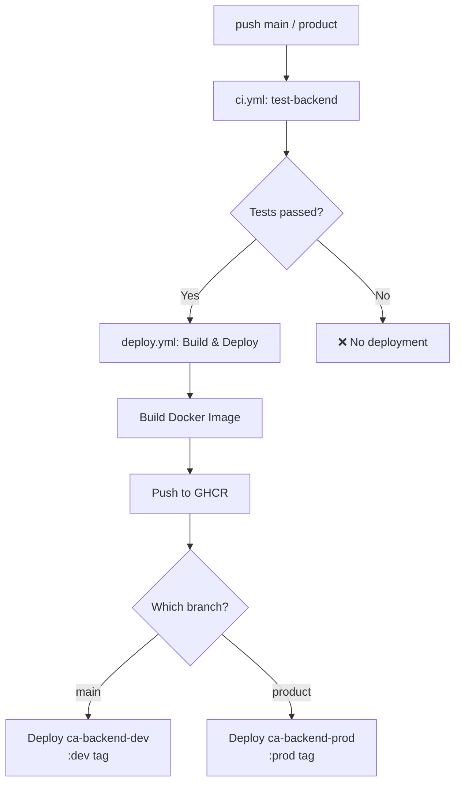

# EasyAccounting — Containerization & CI/CD Spec

> Version: v1.0 | Last updated: 2026-04-07

---

## 1. Overview

### 1.1 Objective

Migrate the EasyAccounting **Backend** from Railway to **Azure Container Apps**, using Docker containerization for a standardized build and deployment pipeline.

### 1.2 Motivation

- **Learn Docker containerization**: Understand the full workflow from Dockerfile → image build → container deployment
- **Environment consistency**: Local and production both use Node.js v24.14.1. The production image can be validated locally before deployment
- **Cost optimization**: Azure Container Apps' free tier (180K vCPU-seconds/month) covers low-traffic scenarios; with `minReplicas: 1`, monthly cost is ~$1 USD
- **Future-proofing**: Containerization is the foundation for microservices, auto-scaling, and blue-green deployments

### 1.3 Scope of Changes

| Component               | Current                             | After                                                   |
| ----------------------- | ----------------------------------- | ------------------------------------------------------- |
| **Backend Deployment**  | Railway (auto-detect Node.js)       | Azure Container Apps (Docker image from GHCR)           |
| **Frontend Deployment** | Vercel                              | **No change**                                           |
| **PostgreSQL**          | Neon (cloud)                        | **No change**                                           |
| **MongoDB**             | Atlas (cloud)                       | **No change**                                           |
| **Azure Blob Storage**  | Already in use                      | **No change**                                           |
| **CI/CD**               | GitHub Actions (backend tests only) | Add Docker build → push GHCR → deploy to Container Apps |
| **Local Development**   | `pnpm dev` directly                 | **No change**                                           |
| **Container Registry**  | None                                | GitHub Container Registry (GHCR)                        |

### 1.4 Out of Scope

- Frontend containerization (stays on Vercel)
- Self-hosted databases (stays on Neon + Atlas)
- Nginx reverse proxy (Container Apps has built-in ingress)

---

## 2. Architecture

### 2.1 Current Architecture

```
┌── Production ─────────────────────────────────┐
│                                                │
│  Frontend                                      │
│  └─ Vercel                                     │
│     ├─ prod: riinouo-eaccounting.win           │
│     └─ dev:  dev.riinouo-eaccounting.win       │
│                                                │
│  Backend                                       │
│  └─ Railway (auto-detect Node.js, no Docker)   │
│     ├─ prod: api.riinouo-eaccounting.win       │
│     └─ dev:  api.dev.riinouo-eaccounting.win   │
│                                                │
│  Databases                                     │
│  ├─ PostgreSQL: Neon (westus3)                 │
│  ├─ MongoDB: Atlas (Cluster0)                  │
│  └─ Azure Blob Storage                         │
│                                                │
│  DNS: Cloudflare                               │
│                                                │
└── CI/CD ──────────────────────────────────────┘
│  GitHub Actions                                │
│  └─ ci.yml: test-backend (Postgres service)    │
└────────────────────────────────────────────────┘
```

### 2.2 New Architecture

```
┌── Production ─────────────────────────────────┐
│                                                │
│  Frontend (no change)                          │
│  └─ Vercel                                     │
│     ├─ prod: riinouo-eaccounting.win           │
│     └─ dev:  dev.riinouo-eaccounting.win       │
│                                                │
│  Backend (new)                                 │
│  └─ Azure Container Apps                       │
│     ├─ prod: api.riinouo-eaccounting.win       │
│     │   └─ image: ghcr.io/<owner>/backend:prod │
│     │   └─ minReplicas: 1                      │
│     │   └─ 0.25 vCPU / 0.5 GiB                │
│     └─ dev:  api.dev.riinouo-eaccounting.win   │
│         └─ image: ghcr.io/<owner>/backend:dev  │
│         └─ minReplicas: 0 (scale to zero)      │
│         └─ 0.25 vCPU / 0.5 GiB                │
│                                                │
│  Databases (no change)                         │
│  ├─ PostgreSQL: Neon                           │
│  ├─ MongoDB: Atlas                             │
│  └─ Azure Blob Storage                         │
│                                                │
│  DNS: Cloudflare                               │
│  └─ CNAME api. → Container Apps prod URL       │
│  └─ CNAME api.dev. → Container Apps dev URL    │
│                                                │
└── CI/CD ──────────────────────────────────────┘
│  GitHub Actions                                │
│  ├─ ci.yml (existing, runs backend tests)      │
│  └─ deploy.yml (new)                           │
│     ├─ push product → build + push GHCR :prod  │
│     │                → deploy Container Apps   │
│     └─ push main    → build + push GHCR :dev   │
│                      → deploy Container Apps   │
└────────────────────────────────────────────────┘
```

### 2.3 Branch-to-Environment Mapping

| Git Branch | Docker Tag | Container Apps Env | Domain                            | minReplicas |
| ---------- | ---------- | ------------------ | --------------------------------- | ----------- |
| `product`  | `:prod`    | production         | `api.riinouo-eaccounting.win`     | 1           |
| `main`     | `:dev`     | development        | `api.dev.riinouo-eaccounting.win` | 0           |

---

## 3. Dockerfile

### 3.1 Design Principles

- **Multi-stage build**: Separates the dependency installation stage from the runtime stage. The deps stage accumulates pnpm cache and temp files; multi-stage ensures the final image only contains essential files (node_modules + source code) without build artifacts
- **Layer caching**: Each `COPY` / `RUN` in a Dockerfile creates a layer (like a git commit). If a line hasn't changed, Docker reuses the cache. By copying `package.json` + lockfile first → `pnpm install` → then source code last, business logic changes only rebuild the final layer (~10s) without reinstalling dependencies (~2min)
- **pnpm workspace handling**: `apps/backend`'s `package.json` depends on `"@repo/shared": "workspace:*"`. Unlike local `pnpm dev` which auto-resolves workspaces, Docker builds require manually copying `packages/shared` into the image, otherwise `pnpm install` can't find the dependency
- **No `.env` files in image**: Environment variables are injected by Container Apps — never baked into the image

### 3.2 Version Pinning

Version consistency is enforced at four levels:

| File                            | Controls                                   | Value                   |
| ------------------------------- | ------------------------------------------ | ----------------------- |
| `.nvmrc`                        | Local `nvm use` auto-switches Node version | `24.14.1`               |
| `package.json` `engines`        | Validates Node/pnpm version on install     | `>=24.14.1` / `>=9.0.0` |
| `package.json` `packageManager` | Corepack activates matching pnpm version   | `pnpm@9.0.0`            |
| `Dockerfile` `FROM`             | Container image Node version               | `node:24.14.1-slim`     |

### 3.3 Dockerfile (`apps/backend/Dockerfile`)

```dockerfile
# ============================================
# Stage 1: Install dependencies
# Purpose: produce clean node_modules
# pnpm cache, temp files, etc. won't enter the final image
# ============================================
FROM node:24.14.1-slim AS deps
# ↑ slim = Debian minimal (~200MB)
#   vs full (~1GB — bloated with unnecessary tools)
#   vs alpine (~130MB — uses musl instead of glibc, bcrypt and other native addons break)

# Install pnpm via Node.js built-in corepack
RUN corepack enable && corepack prepare pnpm@9.0.0 --activate

WORKDIR /app

# ---- Layer Cache Strategy ----
# Copy only "dependency definition files" first, not source code
# This way, deps are only reinstalled when packages are added/removed
# Business code changes won't trigger a full reinstall
COPY pnpm-workspace.yaml pnpm-lock.yaml package.json ./

# Copy each package's package.json (still no source code)
COPY apps/backend/package.json ./apps/backend/
COPY packages/shared/package.json ./packages/shared/
COPY packages/typescript-config/ ./packages/typescript-config/

# Install dependencies
# --frozen-lockfile: ensure exact match with lockfile, no auto-modifications
# --filter backend...: install only backend and its workspace deps (@repo/shared)
#   "..." means include all transitive dependencies
RUN pnpm install --frozen-lockfile --filter backend...

# ============================================
# Stage 2: Production runtime
# Starts from a fresh slim image, copies only node_modules from Stage 1
# Stage 1's pnpm cache, temp files, etc. are all discarded
# ============================================
FROM node:24.14.1-slim AS runner

# Set timezone to Taipei
# Docker containers default to UTC — without this setting,
# a cron job for "8am daily reminder" would fire at 4am Taiwan time
ENV TZ=Asia/Taipei
RUN ln -snf /usr/share/zoneinfo/$TZ /etc/localtime && echo $TZ > /etc/timezone
# ↑ ln -snf: create symbolic link pointing system timezone to Taipei
#   echo $TZ > /etc/timezone: write timezone config file

WORKDIR /app

# Copy only node_modules from Stage 1 (deps), nothing else
COPY --from=deps /app/node_modules ./node_modules
COPY --from=deps /app/apps/backend/node_modules ./apps/backend/node_modules
COPY --from=deps /app/packages/shared/node_modules ./packages/shared/node_modules

# Copy source code
COPY apps/backend/ ./apps/backend/
COPY packages/shared/ ./packages/shared/
COPY packages/typescript-config/ ./packages/typescript-config/

# Copy workspace root config (tsx needs this to resolve workspace paths)
COPY pnpm-workspace.yaml package.json ./

WORKDIR /app/apps/backend

# Expose port
EXPOSE 3000

# Health check (Container Apps uses this to determine if the container is healthy)
HEALTHCHECK --interval=30s --timeout=5s --start-period=10s --retries=3 \
  CMD node -e "fetch('http://localhost:3000/api/deploy-health').then(r => { if (!r.ok) process.exit(1) }).catch(() => process.exit(1))"

# Run TypeScript directly with tsx (consistent with local development)
CMD ["npx", "tsx", "./src/app.ts"]
```

### 3.4 .dockerignore

Create `.dockerignore` in the **repo root**:

```
node_modules
.git
.github
.vscode
.agent
.gemini
*.md
!README.md
apps/frontend
apps/backend/tests
apps/backend/.env
apps/backend/.env.production
apps/backend/test-*.ts
apps/backend/todo.md
.gitnexus
docs
e2e
```

### 3.5 Key Design Decisions

| Decision                 | Choice                                                       | Rationale                                                                                                                                                      |
| ------------------------ | ------------------------------------------------------------ | -------------------------------------------------------------------------------------------------------------------------------------------------------------- |
| Base image               | `node:24.14.1-slim`                                          | slim (~200MB) balances size and compatibility: much smaller than full (~1GB), better native addon support than alpine (~130MB)                                 |
| Why not compile TS → JS? | Run TS directly with `tsx`                                   | Backend has no `tsc build` script; the existing architecture uses tsx directly. Switching to compile requires handling path alias (`@/*`) resolution — low ROI |
| Why not alpine?          | `bcrypt`, `sharp`, and other C++ native addons require glibc | Alpine uses musl (lightweight glibc alternative); these addons need extra build tools to compile — error-prone                                                 |
| pnpm filter              | `--filter backend...`                                        | `...` means backend itself plus all its workspace dependencies (recursively), ensuring `@repo/shared` is also installed                                        |

---

## 4. Docker Compose (Local Validation)

### 4.1 Purpose

Occasionally used to **validate that the production Docker image runs correctly**, ensuring behavior on Container Apps matches expectations.

> **Daily development**: Continue using `pnpm dev`, connecting directly to the Neon dev branch. Docker is not needed.

### 4.2 `docker-compose.prod.yml` (Production Simulation)

```yaml
# Pre-deployment validation
# Usage: docker compose -f docker-compose.prod.yml up --build
services:
  backend:
    build:
      context: . # Docker build context is the repo root
      dockerfile: apps/backend/Dockerfile
    container_name: easyaccounting-backend
    ports:
      - '3000:3000'
    env_file:
      - apps/backend/.env # Uses local .env (connects to Neon dev branch)
```

### 4.3 Usage

```bash
# Pre-deployment: validate production image
docker compose -f docker-compose.prod.yml up --build

# Validate health check
curl http://localhost:3000/api/deploy-health

# Cleanup
docker compose -f docker-compose.prod.yml down
```

---

## 5. Azure Container Apps Configuration

### 5.1 Resource Architecture

```
Azure Subscription
└── Resource Group: rg-easyaccounting
    ├── Container Apps Environment: cae-easyaccounting
    │   ├── Container App: ca-backend-prod
    │   │   ├── image: ghcr.io/<owner>/easyaccounting-backend:prod
    │   │   ├── resources: 0.25 vCPU / 0.5 GiB
    │   │   ├── minReplicas: 1
    │   │   ├── maxReplicas: 3
    │   │   └── ingress: external, port 3000
    │   │
    │   └── Container App: ca-backend-dev
    │       ├── image: ghcr.io/<owner>/easyaccounting-backend:dev
    │       ├── resources: 0.25 vCPU / 0.5 GiB
    │       ├── minReplicas: 0 (scale to zero)
    │       ├── maxReplicas: 1
    │       └── ingress: external, port 3000
    │
    └── (existing resources like Blob Storage are unchanged)
```

### 5.2 Scaling Rules

| Environment | minReplicas | maxReplicas | Scale Trigger                 | Est. Monthly Cost |
| ----------- | ----------- | ----------- | ----------------------------- | ----------------- |
| Production  | 1           | 3           | HTTP concurrent requests > 10 | ~$1 USD (idle)    |
| Development | 0           | 1           | Any HTTP request              | ~$0 (almost free) |

### 5.3 Custom Domain + TLS (HTTPS Certificate)

Container Apps includes free managed TLS certificates (powered by Let's Encrypt), with **automatic issuance and renewal** — no manual handling required.

**Setup Steps (one-time)**:

1. In Azure Portal → Container Apps → Custom domains, add a custom domain
2. Add CNAME records in Cloudflare DNS:
   - `api` → `ca-backend-prod.<region>.azurecontainerapps.io`
   - `api.dev` → `ca-backend-dev.<region>.azurecontainerapps.io`
3. Container Apps automatically validates domain ownership and generates the HTTPS certificate
4. Once complete, all requests to `https://api.riinouo-eaccounting.win` automatically have HTTPS

**About Cloudflare Proxy (orange cloud ☁️ vs grey cloud)**:

| Mode                | Traffic Path                           | Pros                                 | Cons                              |
| ------------------- | -------------------------------------- | ------------------------------------ | --------------------------------- |
| **DNS Only (grey)** | User → directly to Container Apps      | Simple, TLS validation not disrupted | Exposes real IP                   |
| **Proxy (orange)**  | User → Cloudflare CDN → Container Apps | Free DDoS protection, hides real IP  | May interfere with TLS validation |

### 5.4 Azure Budget Alert

Azure doesn't support a hard spending cap that auto-stops services, but you can set up **Budget Alerts** to get notifications as spending approaches the limit.

**Setup Steps**:

1. Azure Portal → **Cost Management + Billing** → **Budgets**
2. Create a new Budget:
   - Name: `easyaccounting-monthly`
   - Scope: Resource Group `rg-easyaccounting`
   - Amount: **$5 USD / month**
   - Reset period: Monthly
3. Configure Alert conditions:
   - **50% ($2.5)** → Email notification (start paying attention)
   - **80% ($4.0)** → Email notification (prepare to act)
   - **100% ($5.0)** → Email notification + trigger Action Group
4. Action Group (optional, advanced):
   - At 100%, automatically set `minReplicas` to 0 via Azure Automation
   - This causes the container to scale to zero when idle, preventing further charges

> **Estimate**: Your scenario costs ~$1 USD/month (prod idle), making it nearly impossible to hit the $5 alert.
> This is mainly a safety net — e.g., if someone attacks your API causing massive request spikes.

### 5.5 Health Check

Container Apps uses HTTP probes to confirm the container is healthy:

| Probe         | Path                 | Interval                  | Purpose                                                        |
| ------------- | -------------------- | ------------------------- | -------------------------------------------------------------- |
| **Liveness**  | `/api/deploy-health` | 30s                       | Is the container still alive?                                  |
| **Readiness** | `/api/deploy-health` | 10s                       | Is the container ready to receive traffic?                     |
| **Startup**   | `/api/deploy-health` | 5s (failureThreshold: 10) | Did the container start successfully? (allows cold start time) |

The backend already has a `deployHealthRoute` — this endpoint works perfectly for this.

---

## 6. CI/CD Pipeline

### 6.1 Existing Pipeline (Retained)

`ci.yml` continues handling backend tests, trigger conditions unchanged.

### 6.2 New Deploy Pipeline

Add `.github/workflows/deploy.yml`:

```yaml
name: Deploy Backend

# Triggered after CI Pipeline completes
on:
  workflow_run:
    workflows: ['CI Pipeline'] # ci.yml's name
    types: [completed]
    branches: ['main', 'product']

# Ensure the same branch doesn't run two deployments simultaneously
concurrency:
  group: deploy-${{ github.event.workflow_run.head_branch }}
  cancel-in-progress: true

env:
  REGISTRY: ghcr.io
  IMAGE_NAME: ${{ github.repository_owner }}/easyaccounting-backend

jobs:
  deploy:
    name: Build & Deploy
    runs-on: ubuntu-latest
    # Only runs when CI succeeds (CI failure → no deployment)
    if: ${{ github.event.workflow_run.conclusion == 'success' }}
    permissions:
      contents: read
      packages: write # push to GHCR

    steps:
      # Without this, runner can't find your Dockerfile.
      - uses: actions/checkout@v4

      # Docker Buildx (supports cache)
      - name: Set up Docker Buildx
        uses: docker/setup-buildx-action@v3

      # Log in to GHCR
      - name: Log in to GHCR
        uses: docker/login-action@v3
        with:
          registry: ${{ env.REGISTRY }}
          username: ${{ github.actor }}
          password: ${{ secrets.GITHUB_TOKEN }}

      # Determine tag and environment (workflow_run gets branch from upstream)
      - name: Set environment variables
        id: vars
        run: |
          BRANCH="${{ github.event.workflow_run.head_branch }}"
          if [ "$BRANCH" = "product" ]; then
            echo "tag=prod" >> $GITHUB_OUTPUT
            echo "env_name=production" >> $GITHUB_OUTPUT
            echo "app_name=ca-backend-prod" >> $GITHUB_OUTPUT
          else
            echo "tag=dev" >> $GITHUB_OUTPUT
            echo "env_name=development" >> $GITHUB_OUTPUT
            echo "app_name=ca-backend-dev" >> $GITHUB_OUTPUT
          fi

      # Build & Push Docker image
      - name: Build and push
        uses: docker/build-push-action@v6
        with:
          context: .
          file: apps/backend/Dockerfile
          push: true
          tags: |
            ${{ env.REGISTRY }}/${{ env.IMAGE_NAME }}:${{ steps.vars.outputs.tag }}
            ${{ env.REGISTRY }}/${{ env.IMAGE_NAME }}:${{ github.sha }}
          cache-from: type=gha
          cache-to: type=gha,mode=max

      # Deploy to Azure Container Apps
      - name: Deploy to Azure Container Apps
        uses: azure/container-apps-deploy-action@v2
        with:
          azureCredentials: ${{ secrets.AZURE_CREDENTIALS }}
          containerAppName: ${{ steps.vars.outputs.app_name }}
          resourceGroup: rg-easyaccounting
          imageToDeploy: ${{ env.REGISTRY }}/${{ env.IMAGE_NAME }}:${{ github.sha }}
```

### 6.3 Required GitHub Secrets

| Secret Name         | Source                                | Description                                                      |
| ------------------- | ------------------------------------- | ---------------------------------------------------------------- |
| `AZURE_CREDENTIALS` | Azure CLI: `az ad sp create-for-rbac` | Azure Service Principal JSON for CI deployment to Container Apps |

> `GITHUB_TOKEN` is automatically provided by GitHub Actions — no manual setup needed. Used for pushing images to GHCR.

### 6.4 CI/CD Flow Diagram



`deploy.yml` uses `workflow_run` trigger — **build and deployment only begin after CI tests pass**.

---

## 7. Environment Variable Management

### 7.1 Issue: dotenv Path Logic

Currently, `postgres.ts`, `mongodb.ts`, and `auth.ts` in the backend all contain:

```typescript
dotenv.config({
  path: process.env.NODE_ENV === 'production' ? '.env.production' : '.env',
});
```

In Container Apps, environment variables are injected directly into `process.env` by the platform — **no `.env` file reading is needed**.
Moreover, the Docker image won't contain `.env` or `.env.production` at all (excluded by `.dockerignore`).

### 7.2 Solution: dotenv Is Already Safe

`dotenv.config()` behavior:

- **If the file doesn't exist → fails silently, no error thrown**
- **If the env var already exists → won't overwrite**

So the existing code works fine in Container Apps:

1. `dotenv.config()` can't find `.env.production` → silently skips
2. `process.env.PG_HOST` is already injected by Container Apps → works normally

**Conclusion: No code changes needed.** However, consider unifying to `dotenv.config()` without a path parameter in the future.

### 7.3 Container Apps Environment Variable Setup

Configure via Azure Portal → Container App → Settings → **Environment variables**.

Variable checklist (reference your `.env` and `.env.production`):

| Category              | Variables                                                             | Secret?                        |
| --------------------- | --------------------------------------------------------------------- | ------------------------------ |
| **Basic**             | `NODE_ENV`, `PORT`, `TZ`, `ORIGIN_URL`                                | ❌                             |
| **PostgreSQL**        | `PG_USER`, `PG_HOST`, `PG_DATABASE`, `PG_PASSWORD`, `PG_PORT`         | ✅ Password as Secret          |
| **MongoDB**           | `MONGODB_URL`                                                         | ✅ Secret                      |
| **Auth**              | `JWT_SECRET`                                                          | ✅ Secret                      |
| **Email**             | `RESEND_API_KEY`, `EMAIL_FROM`, `SUPPORT_EMAIL_FROM`                  | ✅ API Key as Secret           |
| **Azure Storage**     | `AZURE_BLOB_CONNECTION_STRING`, `AZURE_STORAGE_CONTAINER_NAME`        | ✅ Connection String as Secret |
| **Azure Service Bus** | `AZURE_SERVICE_BUS_CONNECTION_STRING`, `AZURE_SERVICE_BUS_QUEUE_NAME` | ✅ Connection String as Secret |
| **AI**                | `GOOGLE_AI_API_KEY`, `OPEN_ROUTER_API_KEY`                            | ✅ Secret                      |
| **Test Account**      | `TEST_USER_EMAIL`, `TEST_USER_PASSWORD`                               | ✅ Password as Secret          |

Configure separately for Prod and Dev, with values pointing to the corresponding environment's resources.

> Variables marked as Secret in Container Apps are encrypted at rest and hidden from view in the Portal.

---

## 8. Migration Plan (Railway → Container Apps)

### 8.1 Prerequisites

1. ✅ Azure account created (you already have one since you use Azure Blob Storage)
2. Create Azure Resource Group: `rg-easyaccounting`
3. Create Container Apps Environment: `cae-easyaccounting`
4. Create Azure Service Principal and store credentials in GitHub Secrets
5. Confirm GHCR package visibility settings

### 8.2 Migration Steps (Recommended Order)

```
Phase 1: Local Docker image validation (no impact on production)
├── Step 1: Create Dockerfile + .dockerignore
├── Step 2: Local `docker build` to verify image builds successfully
├── Step 3: Local `docker compose -f docker-compose.prod.yml up` to verify it runs
└── Step 4: Confirm health check endpoint works

Phase 2: CI/CD setup (no impact on production)
├── Step 5: Add deploy.yml (build + push to GHCR only, no deploy)
├── Step 6: Push to main, confirm image is successfully pushed to GHCR
└── Step 7: Configure Azure Service Principal + GitHub Secret

Phase 3: Container Apps deployment (dev first)
├── Step 8: Create Container Apps Environment + ca-backend-dev
├── Step 9: Configure dev environment variables
├── Step 10: Deploy dev image, validate functionality
├── Step 11: Configure Cloudflare api.dev CNAME
└── Step 12: Connect frontend dev to Container Apps, run smoke tests

Phase 4: Production cutover
├── Step 13: Create ca-backend-prod
├── Step 14: Configure prod environment variables
├── Step 15: Deploy prod image, validate functionality
├── Step 16: Cloudflare: switch api CNAME from Railway → Container Apps
├── Step 17: Monitor for 24 hours to confirm no issues
└── Step 18: Shut down Railway service

Phase 5: Cleanup
├── Step 19: Remove .env.production (no longer needed, env managed by Container Apps)
├── Step 20: Update README.md deployment instructions
└── Step 21: Keep Railway account for 30 days as rollback option
```

### 8.3 Rollback Plan

If Container Apps encounters issues:

1. **Quick Rollback**: Switch Cloudflare CNAME back to Railway (DNS propagation < 5 minutes)
2. **Retain Railway for 30 days**: Don't delete immediately; shut down only after stability is confirmed

---

## 9. Verification Plan

### 9.1 Local Verification

```bash
# 1. Build image
docker build -f apps/backend/Dockerfile -t easyaccounting-backend:test .

# 2. Check image size (target < 500MB)
docker images easyaccounting-backend:test

# 3. Run with production compose
docker compose -f docker-compose.prod.yml up --build

# 4. Smoke test
curl http://localhost:3000/api/deploy-health
# Expected: 200 OK
```

### 9.2 CI Verification

- [ ] `deploy.yml` push main → image successfully pushed to GHCR
- [ ] `deploy.yml` push product → image successfully pushed to GHCR
- [ ] Image tags are correct (`:dev` / `:prod` + `:sha`)

### 9.3 Container Apps Verification

**Functional Verification Checklist**:

| Test Item     | Method                                                           | Expected Result              |
| ------------- | ---------------------------------------------------------------- | ---------------------------- |
| Health check  | `curl https://api.dev.riinouo-eaccounting.win/api/deploy-health` | 200 OK                       |
| User login    | Frontend login flow                                              | JWT cookie set correctly     |
| Data read     | View transaction list                                            | Queries from Neon succeed    |
| Data write    | Create a transaction                                             | Writes to Neon + MongoDB     |
| File upload   | Upload Excel file                                                | Azure Blob upload succeeds   |
| Email sending | Trigger notification                                             | Resend sends email           |
| Cron Jobs     | Wait for scheduled trigger                                       | Logs show normal execution   |
| Service Bus   | Upload PDF bill                                                  | Worker processes normally    |
| CORS          | Frontend cross-origin request                                    | ORIGIN_URL correctly allowed |
| TLS           | `https://api...`                                                 | Valid cert, HTTPS working    |

### 9.4 Cost Monitoring

Within 7 days of deployment, check in Azure Portal:

- Whether Container Apps usage stays within the free tier
- Whether there's any unexpected high consumption (e.g., a cron job keeping the CPU running continuously)
