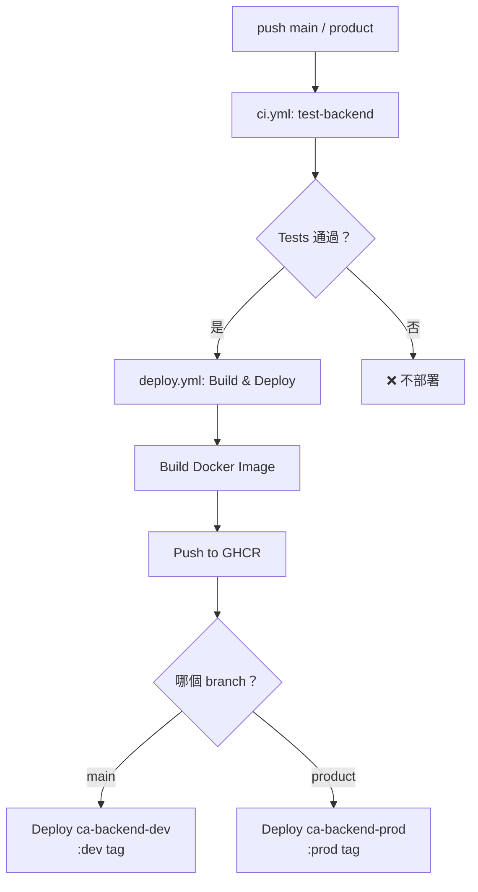

# EasyAccounting 容器化與 CI/CD 改造規格書

> 版本：v1.0 | 最後更新：2026-04-06

---

## 1. 概述 (Overview)

### 1.1 目標

將 EasyAccounting 的 **Backend** 從 Railway 遷移至 **Azure Container Apps**，通過 Docker 容器化實現標準化的打包與部署流程。

### 1.2 動機

- **學習 Docker 容器化**：理解從 Dockerfile → image build → container 部署的完整流程
- **環境一致性**：本地和線上使用相同的 Node.js v24.14.1，容器化後 production image 可在本地驗證
- **成本優化**：Azure Container Apps 的免費額度（180K vCPU-秒/月）足以覆蓋低流量場景，搭配 `minReplicas: 1` 月費約 $1 USD
- **為未來擴展做準備**：容器化是微服務、auto-scaling、blue-green deploy 的基礎

### 1.3 變更範圍

| 元件                   | 現況                                 | 改動後                                                |
| ---------------------- | ------------------------------------ | ----------------------------------------------------- |
| **Backend 部署**       | Railway（自動偵測 Node.js）          | Azure Container Apps（Docker image from GHCR）        |
| **Frontend 部署**      | Vercel                               | **不變**                                              |
| **PostgreSQL**         | Neon (cloud)                         | **不變**                                              |
| **MongoDB**            | Atlas (cloud)                        | **不變**                                              |
| **Azure Blob Storage** | 已在使用                             | **不變**                                              |
| **CI/CD**              | GitHub Actions（僅跑 backend tests） | 新增 Docker build → push GHCR → deploy Container Apps |
| **本地開發**           | `pnpm dev` 直接跑                    | **不變**                                              |
| **Container Registry** | 無                                   | GitHub Container Registry (GHCR)                      |

### 1.4 不在範圍內

- Frontend 容器化（繼續使用 Vercel）
- 資料庫自架（繼續使用 Neon + Atlas）
- Nginx 反向代理（Container Apps 已內建 ingress）

---

## 2. 架構設計 (Architecture)

### 2.1 現有架構

```
┌── Production ─────────────────────────────────┐
│                                                │
│  Frontend                                      │
│  └─ Vercel                                     │
│     ├─ prod: riinouo-eaccounting.win           │
│     └─ dev:  dev.riinouo-eaccounting.win       │
│                                                │
│  Backend                                       │
│  └─ Railway (自動偵測 Node.js, 無 Dockerfile)  │
│     ├─ prod: api.riinouo-eaccounting.win       │
│     └─ dev:  api.dev.riinouo-eaccounting.win   │
│                                                │
│  Databases                                     │
│  ├─ PostgreSQL: Neon (westus3)                 │
│  ├─ MongoDB: Atlas (Cluster0)                  │
│  └─ Azure Blob Storage                         │
│                                                │
│  DNS: Cloudflare                               │
│                                                │
└── CI/CD ──────────────────────────────────────┘
│  GitHub Actions                                │
│  └─ ci.yml: test-backend (Postgres service)    │
└────────────────────────────────────────────────┘
```

### 2.2 新架構

```
┌── Production ─────────────────────────────────┐
│                                                │
│  Frontend (不變)                               │
│  └─ Vercel                                     │
│     ├─ prod: riinouo-eaccounting.win           │
│     └─ dev:  dev.riinouo-eaccounting.win       │
│                                                │
│  Backend (新)                                  │
│  └─ Azure Container Apps                       │
│     ├─ prod: api.riinouo-eaccounting.win       │
│     │   └─ image: ghcr.io/<owner>/backend:prod │
│     │   └─ minReplicas: 1                      │
│     │   └─ 0.25 vCPU / 0.5 GiB                │
│     └─ dev:  api-dev.riinouo-eaccounting.win   │
│         └─ image: ghcr.io/<owner>/backend:dev  │
│         └─ minReplicas: 0 (scale to zero)      │
│         └─ 0.25 vCPU / 0.5 GiB                │
│                                                │
│  Databases (不變)                              │
│  ├─ PostgreSQL: Neon                           │
│  ├─ MongoDB: Atlas                             │
│  └─ Azure Blob Storage                         │
│                                                │
│  DNS: Cloudflare                               │
│  └─ CNAME api. → Container Apps prod URL       │
│  └─ CNAME api.dev. → Container Apps dev URL    │
│                                                │
└── CI/CD ──────────────────────────────────────┘
│  GitHub Actions                                │
│  ├─ ci.yml (現有，跑 backend tests)            │
│  └─ deploy.yml (新增)                          │
│     ├─ push product → build + push GHCR :prod  │
│     │                → deploy Container Apps   │
│     └─ push main    → build + push GHCR :dev   │
│                      → deploy Container Apps   │
└────────────────────────────────────────────────┘
```

### 2.3 Branch 與環境對應

| Git Branch | Docker Tag | Container Apps 環境 | Domain                            | minReplicas |
| ---------- | ---------- | ------------------- | --------------------------------- | ----------- |
| `product`  | `:prod`    | production          | `api.riinouo-eaccounting.win`     | 1           |
| `main`     | `:dev`     | development         | `api-dev.riinouo-eaccounting.win` | 0           |

---

## 3. Dockerfile

### 3.1 設計原則

- **Multi-stage build**：分離 deps 安裝階段和 runtime 階段。deps 階段會有 pnpm cache、安裝暫存檔等垃圾，用 multi-stage 可以確保最終 image 只包含必要檔案（node_modules + source code），不帶安裝過程的副產物
- **Layer caching**：Docker 每一行 `COPY` / `RUN` 會產生一個 layer（像 git commit）。如果某行內容沒變，Docker 會用 cache 跳過。所以先 COPY `package.json` + lockfile → `pnpm install` → 最後才 COPY source code。這樣改業務邏輯只有最後一層重跑（10 秒），不用重新安裝依賴（2 分鐘）
- **pnpm workspace 處理**：`apps/backend` 的 `package.json` 依賴了 `"@repo/shared": "workspace:*"`。Docker build 時不像本地 `pnpm dev` 自動解析 workspace，必須手動把 `packages/shared` 也 COPY 進 image，否則 `pnpm install` 會找不到依賴
- **不打包 `.env` 檔案**：環境變數由 Container Apps 注入，不進 image

### 3.2 版本鎖定

版本一致性由以下三個地方控制：

| 檔案                            | 控制什麼                             | 值                      |
| ------------------------------- | ------------------------------------ | ----------------------- |
| `.nvmrc`                        | 本地 `nvm use` 自動切換 Node 版本    | `24.14.1`               |
| `package.json` `engines`        | `pnpm install` 時驗證 Node/pnpm 版本 | `>=24.14.1` / `>=9.0.0` |
| `package.json` `packageManager` | Corepack 自動啟用對應 pnpm 版本      | `pnpm@9.0.0`            |
| `Dockerfile` `FROM`             | Container image 的 Node 版本         | `node:24.14.1-slim`     |

### 3.3 Dockerfile（`apps/backend/Dockerfile`）

```dockerfile
# ============================================
# Stage 1: 安裝依賴
# 這個 stage 的目的是產出乾淨的 node_modules
# 安裝過程中的 pnpm cache、暫存檔等不會進入最終 image
# ============================================
FROM node:24.14.1-slim AS deps
# ↑ slim = Debian 精簡版 (~200MB)
#   vs full (~1GB，太大、包含一堆不需要的工具)
#   vs alpine (~130MB，但用 musl 而非 glibc，bcrypt 等 native addon 會壞)

# 安裝 pnpm（透過 Node.js 內建的 corepack）
RUN corepack enable && corepack prepare pnpm@9.0.0 --activate

WORKDIR /app

# ---- Layer Cache 策略 ----
# 先只複製「依賴定義檔」，不複製 source code
# 這樣只有加減依賴時才會重新 install
# 改業務 code 不會觸發依賴重裝
COPY pnpm-workspace.yaml pnpm-lock.yaml package.json ./

# 複製各 package 的 package.json（還是不複製 source code）
COPY apps/backend/package.json ./apps/backend/
COPY packages/shared/package.json ./packages/shared/
COPY packages/typescript-config/ ./packages/typescript-config/

# 安裝依賴
# --frozen-lockfile: 確保跟 lockfile 完全一致，不允許自動修改
# --filter backend...: 只安裝 backend 和它的 workspace 依賴（@repo/shared），
#   「...」表示包含所有遞迴依賴
RUN pnpm install --frozen-lockfile --filter backend...

# ============================================
# Stage 2: 實際執行的 runtime
# 從一個全新的 slim image 開始，只拿 Stage 1 的 node_modules
# Stage 1 的 pnpm cache、安裝暫存檔等都不會帶入
# ============================================
FROM node:24.14.1-slim AS runner

# 設定時區為台北
# Docker container 預設是 UTC，不設定的話你的 cron jobs
# 「每天早上 8 點發提醒」會變成台灣時間凌晨 4 點
ENV TZ=Asia/Taipei
RUN ln -snf /usr/share/zoneinfo/$TZ /etc/localtime && echo $TZ > /etc/timezone
# ↑ ln -snf: 建立 symbolic link，把系統時區指向台北
#   echo $TZ > /etc/timezone: 寫入時區設定檔

WORKDIR /app

# 從 Stage 1 (deps) 只拿 node_modules，其他垃圾都不帶
COPY --from=deps /app/node_modules ./node_modules
COPY --from=deps /app/apps/backend/node_modules ./apps/backend/node_modules
COPY --from=deps /app/packages/shared/node_modules ./packages/shared/node_modules

# 複製 source code
COPY apps/backend/ ./apps/backend/
COPY packages/shared/ ./packages/shared/
COPY packages/typescript-config/ ./packages/typescript-config/

# 複製 workspace 根設定（tsx 解析 workspace 路徑需要）
COPY pnpm-workspace.yaml package.json ./

WORKDIR /app/apps/backend

# 曝露 port
EXPOSE 3000

# 健康檢查（Container Apps 用來判斷 container 是否正常）
HEALTHCHECK --interval=30s --timeout=5s --start-period=10s --retries=3 \
  CMD node -e "fetch('http://localhost:3000/api/health').then(r => { if (!r.ok) process.exit(1) }).catch(() => process.exit(1))"

# 使用 tsx 直接執行 TypeScript（跟本地開發一致）
CMD ["npx", "tsx", "./src/app.ts"]
```

### 3.4 .dockerignore

在 **repo 根目錄** 建立 `.dockerignore`：

```
node_modules
.git
.github
.vscode
.agent
.gemini
*.md
!README.md
apps/frontend
apps/backend/tests
apps/backend/.env
apps/backend/.env.production
apps/backend/test-*.ts
apps/backend/todo.md
.gitnexus
docs
e2e
```

### 3.5 關鍵設計決策

| 決策                     | 選擇                                             | 理由                                                                                                                  |
| ------------------------ | ------------------------------------------------ | --------------------------------------------------------------------------------------------------------------------- |
| Base image               | `node:24.14.1-slim`                              | slim (~200MB) 是效能和大小的平衡：比 full (~1GB) 小很多，比 alpine (~130MB) 對 native addon 相容性好                  |
| 為何不 compile TS → JS？ | 用 `tsx` 直接跑 TS                               | Backend 沒有 `tsc build` 的 script，現有架構就是 tsx 直接跑。改成 compile 需要處理 path alias (`@/*`) 解析等，CP 值低 |
| 為何不用 alpine？        | `bcrypt`、`sharp` 等 C++ native addon 需要 glibc | Alpine 用 musl（glibc 的輕量替代），這些 addon 要額外裝 build tools 才能 compile，容易踩坑                            |
| pnpm filter              | `--filter backend...`                            | `...` 代表 backend 自己加上它所有的 workspace 依賴（遞迴），確保 `@repo/shared` 也被安裝                              |

---

## 4. Docker Compose（本地驗證用）

### 4.1 用途

偶爾用來**驗證 production Docker image 是否能正常跑**，確保推上 Container Apps 後行為跟預期一致。

> **日常開發**：繼續 `pnpm dev`，DB 直接連 Neon dev 分支，不需要跑 Docker。

### 4.2 `docker-compose.prod.yml`（Production 模擬）

```yaml
# 推上線前驗證用
# 使用方式：docker compose -f docker-compose.prod.yml up --build
services:
  backend:
    build:
      context: . # Docker build context 是 repo 根目錄
      dockerfile: apps/backend/Dockerfile
    container_name: easyaccounting-backend
    ports:
      - '3000:3000'
    env_file:
      - apps/backend/.env # 用本地 .env（連 Neon dev 分支）
```

### 4.3 使用方式

```bash
# 推上線前：驗證 production image
docker compose -f docker-compose.prod.yml up --build

# 驗證 health check
curl http://localhost:3000/api/health

# 清理
docker compose -f docker-compose.prod.yml down
```

---

## 5. Azure Container Apps 設定

### 5.1 資源架構

```
Azure Subscription
└── Resource Group: EasyAccounting
    ├── Container Apps Environment: easy-accounting-container
    │   ├── Container App: ca-backend-prod
    │   │   ├── image: ghcr.io/<owner>/easyaccounting-backend:prod
    │   │   ├── resources: 0.25 vCPU / 0.5 GiB
    │   │   ├── minReplicas: 1
    │   │   ├── maxReplicas: 3
    │   │   └── ingress: external, port 3000
    │   │
    │   └── Container App: ca-backend-dev
    │       ├── image: ghcr.io/<owner>/easyaccounting-backend:dev
    │       ├── resources: 0.25 vCPU / 0.5 GiB
    │       ├── minReplicas: 0 (scale to zero)
    │       ├── maxReplicas: 1
    │       └── ingress: external, port 3000
    │
    └── （Blob Storage 等已存在的資源不動）
```

### 5.2 Scaling 規則

| 環境        | minReplicas | maxReplicas | Scale 觸發                    | 預估月費        |
| ----------- | ----------- | ----------- | ----------------------------- | --------------- |
| Production  | 1           | 3           | HTTP concurrent requests > 10 | ~$1 USD（idle） |
| Development | 0           | 1           | 有 HTTP request 就起          | ~$0（幾乎不用） |

### 5.3 Custom Domain + TLS（HTTPS 憑證）

Container Apps 內建免費的 managed TLS 憑證（底層用 Let's Encrypt），**自動申請和續約**，你不需要手動處理。

**設定步驟（一次性）**：

1. 在 Azure Portal → Container Apps → Custom domains，新增自訂 domain
2. 到 Cloudflare DNS 新增 CNAME record：
   - `api` → `ca-backend-prod.<region>.azurecontainerapps.io`
   - `api.dev` → `ca-backend-dev.<region>.azurecontainerapps.io`
3. Container Apps 自動驗證 domain 擁有權，然後產生 HTTPS 憑證
4. 完成後所有 `https://api.riinouo-eaccounting.win` 的請求自動有 HTTPS

**關於 Cloudflare Proxy（橘色雲朵 ☁️ vs 灰色雲朵）**：

| 模式                 | 流量路徑                               | 好處                        | 壞處              |
| -------------------- | -------------------------------------- | --------------------------- | ----------------- |
| **DNS Only（灰色）** | 用戶 → 直接連到 Container Apps         | 簡單直接、TLS 驗證不受干擾  | 暴露真實 IP       |
| **Proxy（橘色）**    | 用戶 → Cloudflare CDN → Container Apps | 免費 DDoS 防護、隱藏真實 IP | 可能干擾 TLS 驗證 |

### 5.4 Azure 預算上限設定 (Budget Alert)

Azure 不支援「自動停止服務」的硬上限，但可以設定 **Budget Alert**，在花費接近上限時發通知。

**設定步驟**：

1. Azure Portal → **Cost Management + Billing** → **Budgets**
2. 建立新 Budget：
   - 名稱：`easyaccounting-monthly`
   - 範圍：Resource Group `EasyAccounting`
   - 金額：**$5 USD / 月**
   - 重置週期：Monthly
3. 設定 Alert conditions：
   - **50% ($2.5)** → 寄信通知（開始注意）
   - **80% ($4.0)** → 寄信通知（準備處理）
   - **100% ($5.0)** → 寄信通知 + 觸發 Action Group
4. Action Group（可選進階）：
   - 當達到 100% 時，自動用 Azure Automation 將 `minReplicas` 降為 0
   - 這樣 container 會在沒流量時 scale to zero，避免繼續產生費用

> **預估**：你的場景月費 ~$1 USD（prod idle），幾乎不可能觸發 $5 的警報。
> 設這個主要是「以防萬一」，例如有人攻擊你的 API 導致大量 request。

### 5.5 Health Check

Container Apps 會用 HTTP probe 來確認 container 是否健康：

| Probe         | Path                 | 間隔                      | 用途                                             |
| ------------- | -------------------- | ------------------------- | ------------------------------------------------ |
| **Liveness**  | `/api/health` | 30s                       | Container 是否還活著                             |
| **Readiness** | `/api/health` | 10s                       | Container 是否準備好接收流量                     |
| **Startup**   | `/api/health` | 5s (failureThreshold: 10) | Container 啟動是否成功（給 cold start 足夠時間） |

你的 backend 已經有 `deployHealthRoute`，這個 endpoint 剛好能用。

---

## 6. CI/CD Pipeline

### 6.1 現有 Pipeline（保留）

`ci.yml` 繼續負責 backend tests，觸發條件不變。

### 6.2 新增 Deploy Pipeline

新增 `.github/workflows/deploy.yml`：

```yaml
name: Deploy Backend

# 等 CI Pipeline 跑完才觸發
on:
  workflow_run:
    workflows: ['CI Pipeline'] # ci.yml 的 name
    types: [completed]
    branches: ['main', 'product']

# 確保同一 branch 不會同時跑兩個部署
concurrency:
  group: deploy-${{ github.event.workflow_run.head_branch }}
  cancel-in-progress: true

env:
  REGISTRY: ghcr.io
  IMAGE_NAME: ${{ github.repository_owner }}/easyaccounting-backend

jobs:
  deploy:
    name: Build & Deploy
    runs-on: ubuntu-latest
    # 只在 CI 成功時才跑（CI 失敗 → 不部署）
    if: ${{ github.event.workflow_run.conclusion == 'success' }}
    permissions:
      contents: read
      packages: write # push to GHCR

    steps:
      - uses: actions/checkout@v4

      # Docker Buildx（支援 cache）
      - name: Set up Docker Buildx
        uses: docker/setup-buildx-action@v3

      # 登入 GHCR
      - name: Log in to GHCR
        uses: docker/login-action@v3
        with:
          registry: ${{ env.REGISTRY }}
          username: ${{ github.actor }}
          password: ${{ secrets.GITHUB_TOKEN }}

      # 決定 tag 和環境（workflow_run 時 ref_name 來自上游 workflow）
      - name: Set environment variables
        id: vars
        run: |
          BRANCH="${{ github.event.workflow_run.head_branch }}"
          if [ "$BRANCH" = "product" ]; then
            echo "tag=prod" >> $GITHUB_OUTPUT
            echo "env_name=production" >> $GITHUB_OUTPUT
            echo "app_name=ca-backend-prod" >> $GITHUB_OUTPUT
          else
            echo "tag=dev" >> $GITHUB_OUTPUT
            echo "env_name=development" >> $GITHUB_OUTPUT
            echo "app_name=ca-backend-dev" >> $GITHUB_OUTPUT
          fi

      # Build & Push Docker image
      - name: Build and push
        uses: docker/build-push-action@v6
        with:
          context: .
          file: apps/backend/Dockerfile
          push: true
          tags: |
            ${{ env.REGISTRY }}/${{ env.IMAGE_NAME }}:${{ steps.vars.outputs.tag }}
            ${{ env.REGISTRY }}/${{ env.IMAGE_NAME }}:${{ github.sha }}
          cache-from: type=gha
          cache-to: type=gha,mode=max

      # 部署到 Azure Container Apps
      - name: Deploy to Azure Container Apps
        uses: azure/container-apps-deploy-action@v2
        with:
          azureCredentials: ${{ secrets.AZURE_CREDENTIALS }}
          containerAppName: ${{ steps.vars.outputs.app_name }}
          resourceGroup: EasyAccounting
          imageToDeploy: ${{ env.REGISTRY }}/${{ env.IMAGE_NAME }}:${{ github.sha }}
```

### 6.3 需要設定的 GitHub Secrets

| Secret 名稱         | 來源                                  | 說明                                                        |
| ------------------- | ------------------------------------- | ----------------------------------------------------------- |
| `AZURE_CREDENTIALS` | Azure CLI: `az ad sp create-for-rbac` | Azure Service Principal JSON，用於 CI 部署到 Container Apps |

> `GITHUB_TOKEN` 是 GitHub Actions 自動提供的，不需要手動設定。用於 push image 到 GHCR。

### 6.4 CI/CD 完整流程圖



`deploy.yml` 使用 `workflow_run` 觸發，**CI 測試通過後才會開始 build 和部署**。

---

## 7. 環境變數管理

### 7.1 問題：dotenv 路徑判斷

目前 backend 的 `postgres.ts`、`mongodb.ts`、`auth.ts` 都有：

```typescript
dotenv.config({
  path: process.env.NODE_ENV === 'production' ? '.env.production' : '.env',
});
```

在 Container Apps 中，環境變數是透過平台直接注入到 `process.env`，**不需要讀 `.env` 檔案**。
而且 Docker image 裡根本不會有 `.env` 和 `.env.production`（被 `.dockerignore` 排除了）。

### 7.2 解法：dotenv 本身就是安全的

`dotenv.config()` 的行為是：

- **如果檔案不存在 → 靜默失敗，不會報錯**
- **如果環境變數已經存在 → 不會覆蓋**

所以現有的 code 在 Container Apps 裡不會出問題：

1. `dotenv.config()` 找不到 `.env.production` → 靜默跳過
2. `process.env.PG_HOST` 已經被 Container Apps 注入 → 正常使用

**結論：不需要改 code。** 但建議日後統一用 `dotenv.config()` 不帶 path 參數為佳。

### 7.3 Container Apps 環境變數設定

在 Azure Portal → Container App → Settings → **Environment variables** 中自行設定。

需要設定的變數清單（參考你的 `.env` 和 `.env.production`）：

| 分類                  | 變數名                                                                | Secret？                       |
| --------------------- | --------------------------------------------------------------------- | ------------------------------ |
| **基本**              | `NODE_ENV`, `PORT`, `TZ`, `ORIGIN_URL`                                | ❌                             |
| **PostgreSQL**        | `PG_USER`, `PG_HOST`, `PG_DATABASE`, `PG_PASSWORD`, `PG_PORT`         | ✅ 密碼設 Secret               |
| **MongoDB**           | `MONGODB_URL`                                                         | ✅ Secret                      |
| **Auth**              | `JWT_SECRET`                                                          | ✅ Secret                      |
| **Email**             | `RESEND_API_KEY`, `EMAIL_FROM`, `SUPPORT_EMAIL_FROM`                  | ✅ API Key 設 Secret           |
| **Azure Storage**     | `AZURE_BLOB_CONNECTION_STRING`, `AZURE_STORAGE_CONTAINER_NAME`        | ✅ Connection String 設 Secret |
| **Azure Service Bus** | `AZURE_SERVICE_BUS_CONNECTION_STRING`, `AZURE_SERVICE_BUS_QUEUE_NAME` | ✅ Connection String 設 Secret |
| **AI**                | `GOOGLE_AI_API_KEY`, `OPEN_ROUTER_API_KEY`                            | ✅ Secret                      |
| **測試帳號**          | `TEST_USER_EMAIL`, `TEST_USER_PASSWORD`                               | ✅ 密碼設 Secret               |

Prod 和 Dev 各設一份，值換成對應環境的資源。

> Container Apps 中標記為 Secret 的變數會加密儲存，在 Portal 上也看不到原文。

---

## 8. Migration 計畫（Railway → Container Apps）

### 8.1 前置準備

1. ✅ 建立 Azure 帳號（如果還沒有的話，你已經有 Azure Blob 所以應該有了）
2. 建立 Azure Resource Group：`EasyAccounting`
3. 建立 Container Apps Environment：`easy-accounting-container`
4. 建立 Azure Service Principal 並存入 GitHub Secrets
5. 確認 GHCR package 的 visibility 設定

### 8.2 Migration 步驟（建議順序）

```
Phase 1: 本地驗證 Docker image（不影響線上）
├── Step 1: 建立 Dockerfile + .dockerignore
├── Step 2: 本地 `docker build` 驗證 image 能 build
├── Step 3: 本地 `docker compose -f docker-compose.prod.yml up` 驗證能跑
└── Step 4: 確認 health check endpoint 正常

Phase 2: CI/CD 設定（不影響線上）
├── Step 5: 新增 deploy.yml（先只 build + push GHCR，不 deploy）
├── Step 6: Push 到 main，確認 image 成功推上 GHCR
└── Step 7: 設定 Azure Service Principal + GitHub Secret

Phase 3: Container Apps 部署（dev 先行）
├── Step 8: 建立 Container Apps Environment + ca-backend-dev
├── Step 9: 設定 dev 環境變數
├── Step 10: 部署 dev image，驗證功能
├── Step 11: Cloudflare 設定 api.dev CNAME
└── Step 12: 前端 dev 環境連 Container Apps，跑 smoke test

Phase 4: Production 切換
├── Step 13: 建立 ca-backend-prod
├── Step 14: 設定 prod 環境變數
├── Step 15: 部署 prod image，驗證功能
├── Step 16: Cloudflare 將 api CNAME 從 Railway → Container Apps
├── Step 17: 監控 24 小時確認無異常
└── Step 18: 關閉 Railway 服務

Phase 5: Cleanup
├── Step 19: 移除 .env.production（不再需要，env 由 Container Apps 管理）
├── Step 20: 更新 README.md 部署說明
└── Step 21: 保留 Railway 帳號 30 天作為 rollback 選項
```

### 8.3 Rollback 計畫

如果 Container Apps 出問題：

1. **快速 Rollback**：Cloudflare 將 CNAME 切回 Railway（DNS 傳播 < 5 分鐘）
2. **Railway 保留 30 天**：不立即刪除，確認穩定後再關

---

## 9. 驗證計畫 (Verification)

### 9.1 本地驗證

```bash
# 1. Build image
docker build -f apps/backend/Dockerfile -t easyaccounting-backend:test .

# 2. 確認 image size（目標 < 500MB）
docker images easyaccounting-backend:test

# 3. 用 production compose 跑
docker compose -f docker-compose.prod.yml up --build

# 4. Smoke test
curl http://localhost:3000/api/health
# 預期：200 OK
```

### 9.2 CI 驗證

- [ ] `deploy.yml` push main → image 成功推上 GHCR
- [ ] `deploy.yml` push product → image 成功推上 GHCR
- [ ] Image tag 正確（`:dev` / `:prod` + `:sha`）

### 9.3 Container Apps 驗證

**功能驗證 Checklist**：

| 測試項目     | 方法                                                             | 預期結果             |
| ------------ | ---------------------------------------------------------------- | -------------------- |
| Health check | `curl https://api-dev.riinouo-eaccounting.win/api/health` | 200 OK               |
| 使用者登入   | 前端登入功能                                                     | JWT cookie 正常設定  |
| 資料讀取     | 查看交易列表                                                     | 從 Neon 正常查詢     |
| 資料寫入     | 新增一筆交易                                                     | 寫入 Neon + MongoDB  |
| 檔案上傳     | 上傳 Excel                                                       | Azure Blob 正常上傳  |
| Email 發送   | 觸發通知                                                         | Resend 正常寄信      |
| Cron Jobs    | 等待排程觸發                                                     | log 顯示正常執行     |
| Service Bus  | 上傳 PDF 帳單                                                    | Worker 正常處理      |
| CORS         | 前端跨域請求                                                     | 正確允許 ORIGIN_URL  |
| TLS          | `https://api...`                                                 | 憑證有效、HTTPS 正常 |

### 9.4 成本監控

部署後 7 天內，在 Azure Portal 檢查：

- Container Apps 用量是否在免費額度內
- 有沒有意外的高消耗（例如某個 cron job 讓 CPU 一直跑）
