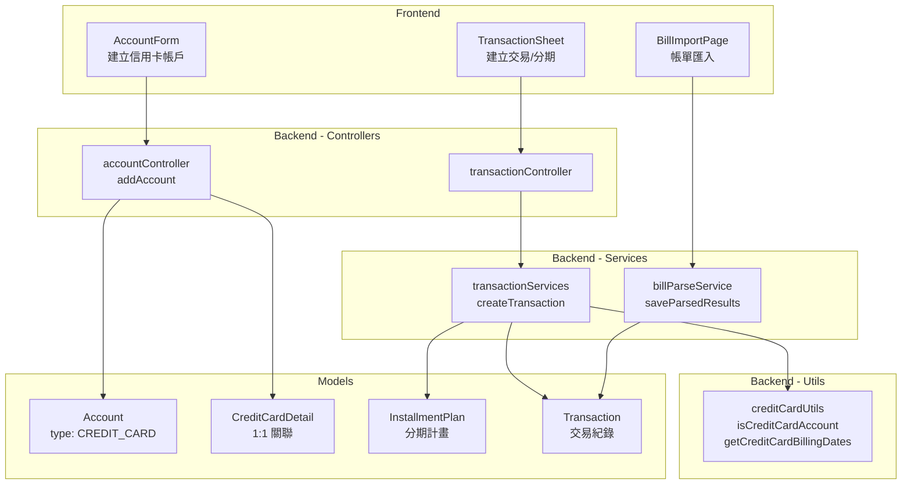
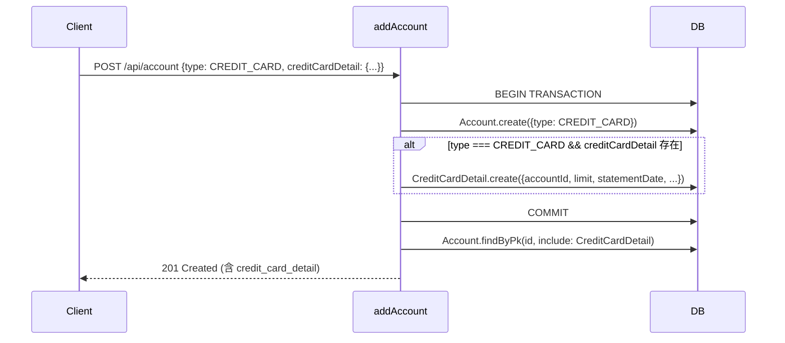
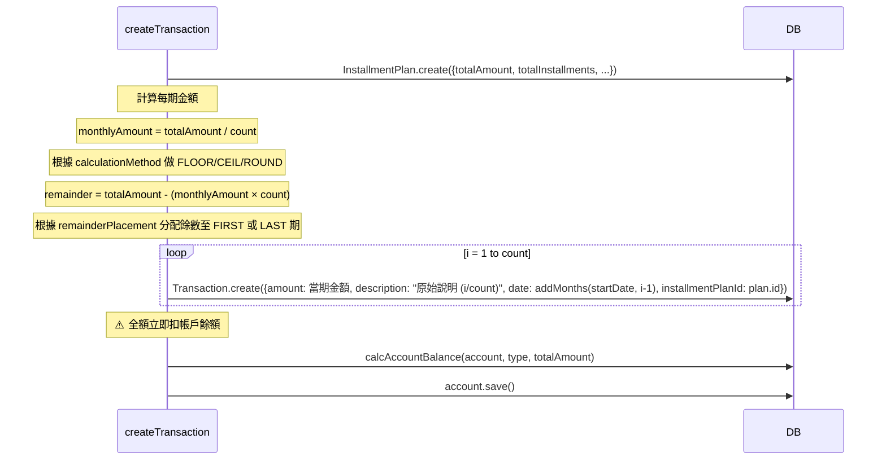
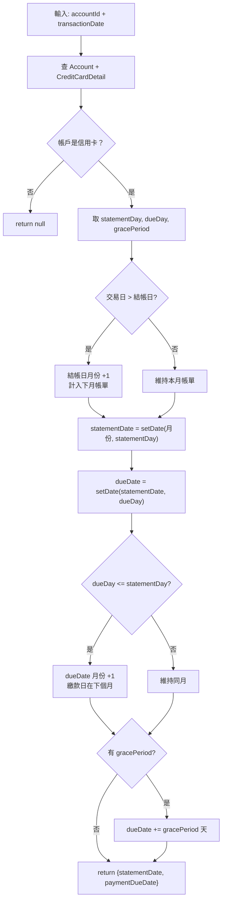
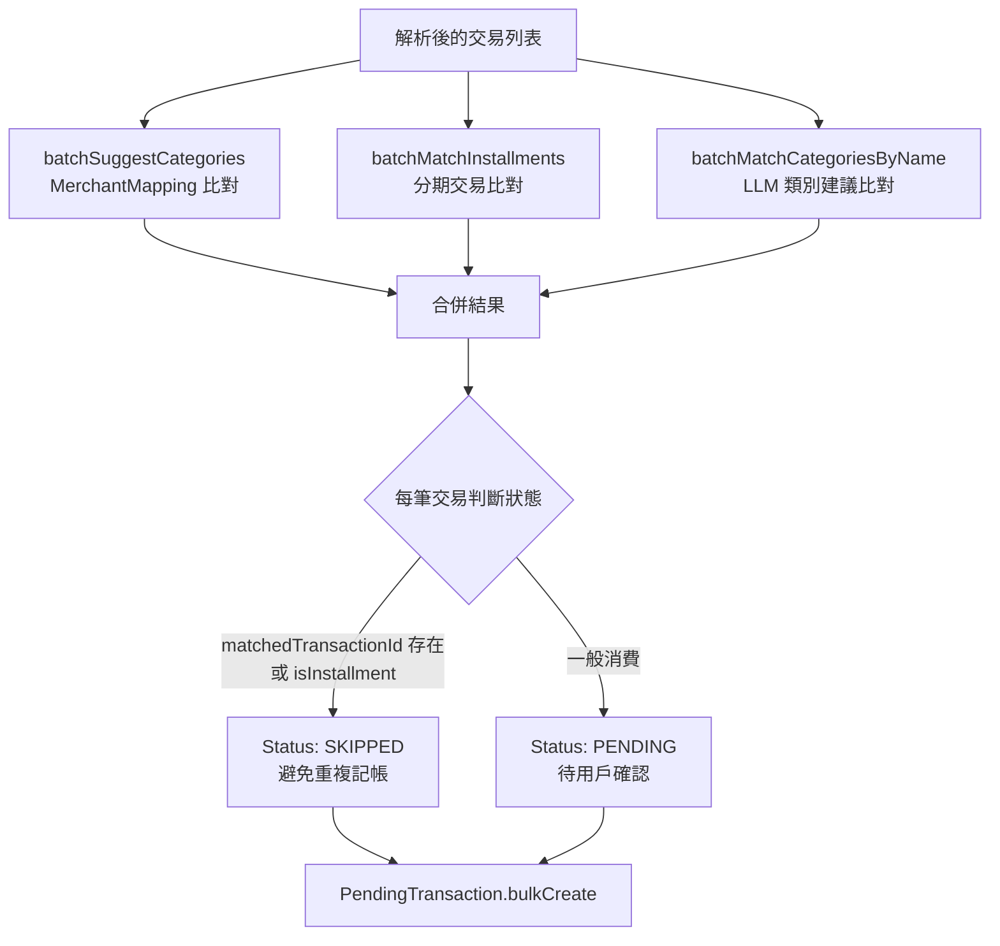

# 信用卡管理功能規格書 (Credit Card Feature Spec)

## 1. 概述 (Overview)

本功能旨在提供完整的信用卡記帳管理，包含信用卡帳戶建立、消費記錄、分期付款管理以及帳單繳款功能。系統需支援自動計算分期金額、處理帳單結帳日與繳款日，並準確反映信用卡負債與可用額度。

## 2. 資料庫設計 (Database Schema)

### 2.1 Account Table (擴充)

- **Type**: 新增 `CREDIT_CARD` (信用卡) 類型。
- **Constraint**: 建立信用卡帳戶時，需同時建立 `CreditCardDetail`。

### 2.2 CreditCardDetail Table (新表)

用於儲存信用卡的專屬設定。

- `id`: UUID, Primary Key
- `accountId`: UUID, Foreign Key -> `Account.id` (1:1 關聯)
- `creditLimit`: Decimal, 信用額度
- `statementDate`: Integer (1-31), 結帳日 (每月幾號結帳)
- `paymentDueDate`: Integer (1-31), 繳款截止日 (每月幾號繳款)
- `includeInTotal`: Boolean, 是否計入總資產 (通常信用卡為負債，預設 True)
- `isArchived`: Boolean, 是否封存
- `deletedAt`: DateTime (Paranoid Soft Delete)

### 2.3 InstallmentPlan Table (新表)

用於儲存分期付款的母計畫資訊。

- `id`: UUID, Primary Key
- `userId`: UUID, Foreign Key -> `User.id`
- `totalAmount`: Decimal, 分期總金額
- `totalInstallments`: Integer, 總期數
- `startDate`: Date, 分期開始日期
- `description`: String, 說明 (e.g. "iPhone 15 分期")
- `deletedAt`: DateTime

### 2.4 Transaction Table (擴充)

- `billingDate`: Date, 帳單歸屬日期 (用於判斷該筆交易屬於哪一期帳單，分期交易此欄位為必填)
- `installmentPlanId`: UUID, Foreign Key -> `InstallmentPlan.id` (若為分期子交易則關聯此欄位)

## 3. 核心邏輯 (Core Logic)

### 3.1 信用卡帳戶 (Credit Card Account)

- **建立**: 呼叫 `POST /api/account`，`type` 為 `CREDIT_CARD` 時，必須在 `creditCardDetail` 欄位提供 `limit`, `statementDate`, `paymentDueDate` 等資訊。
- **餘額 (Balance)**: 信用卡餘額通常為**負值** (代表負債)。消費時餘額減少 (更負)，繳款時餘額增加 (回補)。
- **可用額度**: `CreditLimit + Balance` (假設 Balance 為負數)。

### 3.2 交易處理 (Transaction Processing)

#### A. 一般消費

- 建立支出交易，`accountId` 指向信用卡帳戶。
- `billingDate`: 若未指定，預設同 `date`。系統依據 `statementDate` 判斷此交易歸屬的帳單月份。

#### B. 分期付款 (Installment)

- 當使用者建立一筆分期交易時 (e.g., 刷 12000 元，分 12 期)：
  1.  建立 `InstallmentPlan` 記錄總額與期數。
  2.  自動生成 N 筆 `Transaction`，每筆代表一期。
  3.  **金額計算**:
      - 基本每期金額 = `Total / N` (無條件捨去)
      - 第一期/最後期調整: 將餘數加到第一期或最後期，確保總和正確。
  4.  **日期計算**:
      - `date`: 每月的同一天 (或依邏輯順延)。
  - `billingDate`: 根據每期的實際日期設定，確保落入正確的帳單週期。
  5.  **修改分期 (Modify Installment)**:
      - 若修改分期交易金額，系統應依據新金額重新計算相關紀錄。
      - 依循一般交易修改規則，對帳戶餘額與總資產進行調整。
      - **額度佔用**: 分期付款的 **總金額** 應立即佔用可用額度 (非僅首期金額)。繳納後額度會逐漸釋放。

### 3.3 帳單週期判斷 (Billing Cycle)

- 若交易的 `billingDate` (或 `date`) > `statementDate` (結帳日)，則該筆交易歸入**下個月**的帳單。
- 若交易的 `billingDate` <= `statementDate`，則歸入**本月**帳單。

### 3.4 繳款 (Payment)

- 繳款視為一筆 **轉帳 (Transfer)** 交易。
- `sourceAccountId`: 資產帳戶 (e.g., 銀行戶頭)。
- `targetAccountId`: 信用卡帳戶。
- 效果：銀行餘額減少，信用卡負債減少 (餘額回升)。

## 4. API 規格 (API Design)

### 4.1 POST /api/transaction

Request Payload 新增支援:

```json
{
  "amount": 1000,
  "type": "EXPENSE",
  "accountId": "uuid-cc-account",
  "installment": {
    "totalInstallments": 3,
    "startDate": "2026-01-14"
  }
}
```

- 若帶有 `installment` 物件，後端自動拆分為多筆 Transaction 並回傳 Summary。

### 4.2 POST /api/account

Request Payload:

```json
{
  "name": "My Visa Card",
  "type": "CREDIT_CARD",
  "balance": 0,
  "creditCardDetail": {
    "creditLimit": 50000,
    "statementDate": 5,
    "paymentDueDate": 25
  }
}
```

## 5. 測試重點 (Testing Strategy)

- **分期金額準確性**: 確保 100元/3期 result 為 34, 33, 33 或 33, 33, 34，總和必為 100。
- **帳單歸屬**: 測試跨結帳日的交易是否歸入正確月份。
- **關聯完整性**: 刪除信用卡帳戶時，關聯的 `Detail` 應一併處理 (Soft Delete)。

---

## 6. 業務邏輯流程圖 (Business Logic Diagrams)

### 6.1 架構總覽



### 6.2 建立信用卡帳戶流程



> 使用 Sequelize Transaction 確保 Account 和 CreditCardDetail 原子性建立。

### 6.3 分期付款建立流程



#### 分期金額計算規則

```
1. 基本每期 = total / count，依 calculationMethod 取整
   monthlyAmount = Math.round(totalAmount / count)  // 或 floor / ceil

2. 餘數分配
   remainder = totalAmount - (monthlyAmount × count)
   remainderPlacement = FIRST → 第一期加 remainder
   remainderPlacement = LAST  → 最後期加 remainder
```

**範例**：12000 元 / 7 期 (ROUND, FIRST)

| 期數      | 金額      | 說明                                                                |
| --------- | --------- | ------------------------------------------------------------------- |
| 第 1 期   | 1716      | Math.round(12000/7) = 1714, remainder = 12000 - 1714×7 = 2, 首期 +2 |
| 第 2~7 期 | 1714      | 標準每期金額                                                        |
| **總計**  | **12000** | 1716 + 1714×6 = 12000 ✓                                             |

> **重要**：分期付款的全部債務在建立當下立即反映在帳戶餘額中 (傳入 `calcAccountBalance` 的是原始總金額，而非每期金額)。

### 6.4 帳單週期判斷流程



**範例**：結帳日 25 號、繳款日 5 號、寬限期 3 天

| 交易日 | 結帳日 | 繳款截止日 | 說明                                              |
| ------ | ------ | ---------- | ------------------------------------------------- |
| 1/20   | 1/25   | 2/8        | 交易日 ≤ 結帳日 → 本月帳單，繳款日 2/5 + 3 天寬限 |
| 1/28   | 2/25   | 3/8        | 交易日 > 結帳日 → 下月帳單，繳款日 3/5 + 3 天寬限 |

> **設計決策**：系統以「交易日」而非銀行的「入帳日」為判斷基準，簡化使用者操作。小月溢出（如設定 30 號結帳，遇到 2 月）目前由 date-fns `setDate` 自動進位處理。

### 6.5 帳單匯入與分期比對流程



**分期比對邏輯** (`batchMatchInstallments`)：

- 只對 `isInstallment = true` 的交易做比對
- 查詢範圍：往前 2 年 ~ 往後 30 天
- 比對條件：`paymentFrequency === INSTALLMENT` + `description iLike` + `amount 完全相同`
- 匹配到既有交易 → 自動標記為 `SKIPPED`，避免帳單匯入造成重複記帳

---

## 7. 涉及檔案清單 (File Inventory)

| 層級               | 檔案                                                                        | 角色                        |
| ------------------ | --------------------------------------------------------------------------- | --------------------------- |
| Shared Types       | `packages/shared/src/types/accountTypes.ts`                                 | CreditCardDetailType 定義   |
| Shared Types       | `packages/shared/src/types/transactionTypes.ts`                             | InstallmentPlanType 定義    |
| Backend Model      | `apps/backend/src/models/CreditCardDetail.ts`                               | Sequelize Model             |
| Backend Model      | `apps/backend/src/models/InstallmentPlan.ts`                                | Sequelize Model             |
| Backend Controller | `apps/backend/src/controllers/accountController.ts`                         | 建立帳戶 + CreditCardDetail |
| Backend Service    | `apps/backend/src/services/transactionServices.ts`                          | 交易建立 + 分期邏輯核心     |
| Backend Service    | `apps/backend/src/services/billParseService.ts`                             | 帳單匯入 + 分期比對         |
| Backend Utils      | `apps/backend/src/utils/creditCardUtils.ts`                                 | 帳單週期計算                |
| Frontend           | `apps/frontend/src/components/accounts/accountForm.tsx`                     | 建立信用卡帳戶 UI           |
| Frontend           | `apps/frontend/src/components/transactions/transactionSheet.tsx`            | 建立交易/分期 UI            |
| Frontend           | `apps/frontend/src/app/(main)/bill-import/page.tsx`                         | 帳單匯入 UI                 |
| Migration          | `apps/backend/database/migrations/20260114042020-add_credit_card_tables.js` | DB Schema 建立              |
| Tests              | `apps/backend/tests/unit/installment_service.test.ts`                       | 分期邏輯單元測試            |

---

## 8. 注意事項 (Known Issues & Caveats)

- **小月溢出**：結帳日設 30/31 號時，2 月份 `setDate(feb, 30)` 會自動進位到 3 月，目前未特別處理 clamp 至月底的邏輯。
- **`isCreditCardAccount` 尚無呼叫者**：此 utility function 目前未被任何業務流程使用，為預留功能。
