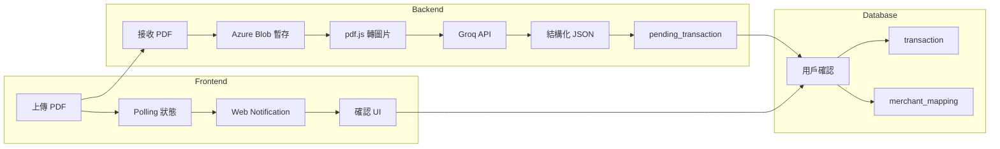
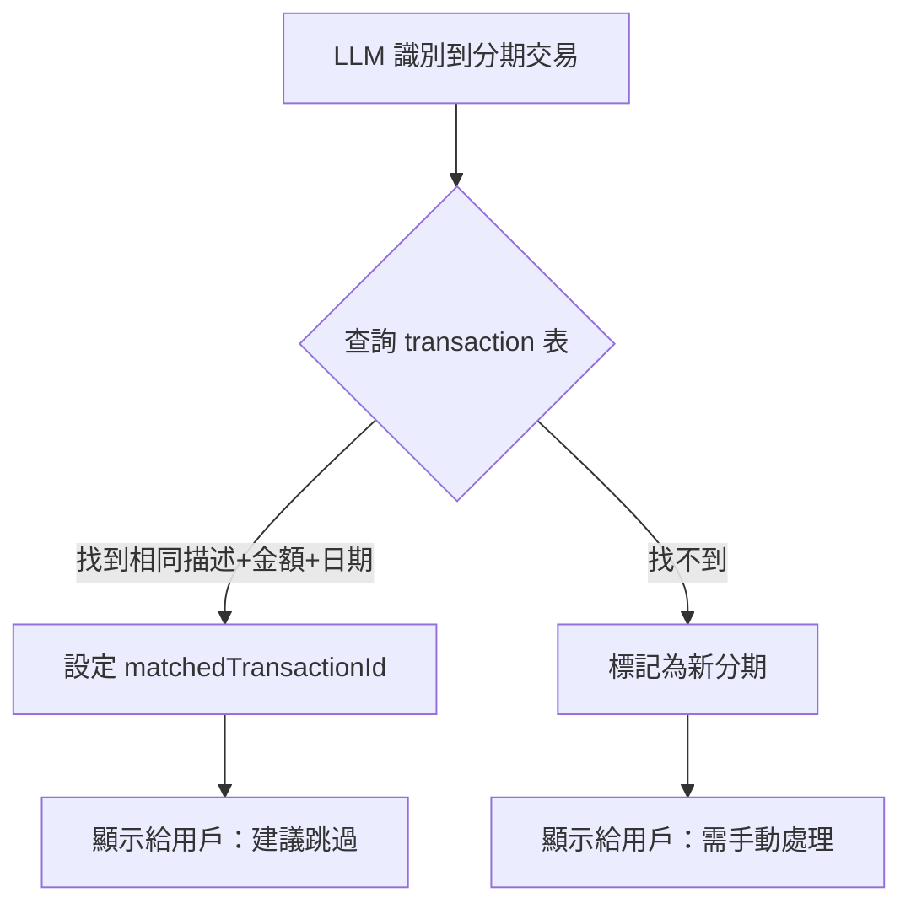
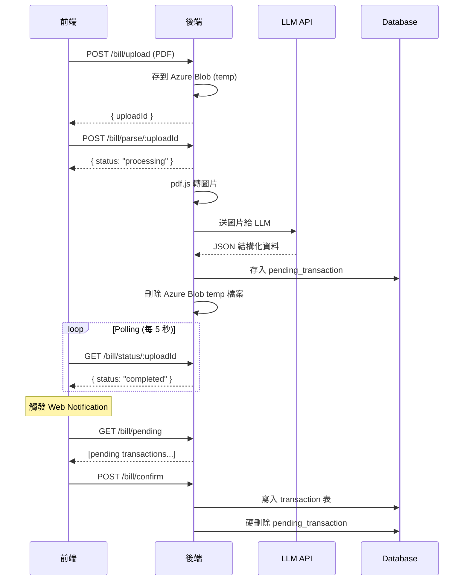
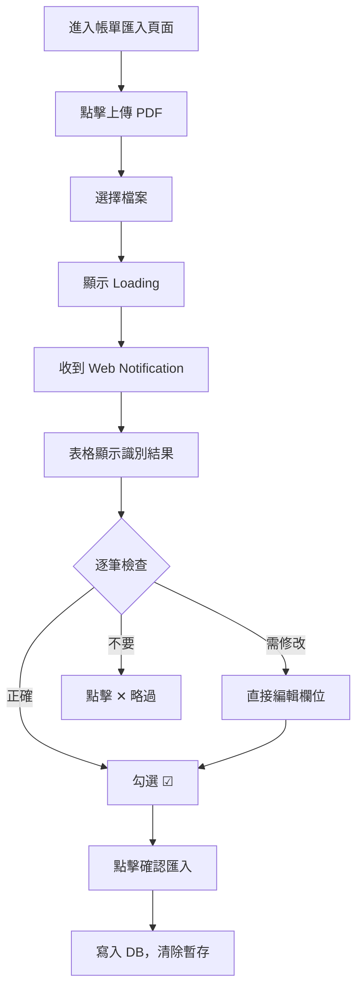

# PDF 帳單自動分析與匯入功能 - 技術提案

> **狀態**: ✅ Approved  
> **作者**: rinouo  
> **日期**: 2026-01-19

---

## 1. 概述 (Overview)

### 1.1 功能描述

讓用戶上傳信用卡 PDF 帳單，系統自動識別交易明細並結構化，經用戶確認後寫入資料庫。

### 1.2 目標

- 減少手動輸入交易的時間
- 準確率目標：98+%（100 筆中 98 筆不需調整）
- 使用免費且不訓練用戶資料的 AI 服務

### 1.3 成功指標

| 指標             | 目標    |
| ---------------- | ------- |
| 識別準確率       | ≥ 98%   |
| 用戶手動修正比例 | ≤ 2%    |
| 單張帳單處理時間 | < 60 秒 |

---

## 2. 系統架構 (Architecture)

### 2.1 整體流程




### 2.2 元件關係

| 元件     | 技術                    | 說明                            |
| -------- | ----------------------- | ------------------------------- |
| 前端     | Next.js                 | 上傳、確認 UI、Web Notification |
| 後端     | Node.js                 | API、pdf.js、LLM 串接           |
| 檔案暫存 | Azure Blob              | PDF 臨時存放                    |
| AI       | Groq (Llama 3.2 Vision) | 圖片 → 結構化資料               |
| 資料庫   | PostgreSQL (Neon)       | 交易、暫存資料                  |

---

## 3. 技術選型 (Technology Options)

### 3.1 整體流程

```
PDF 上傳 → pdf.js 轉圖片 → Multimodal LLM 分析 → 結構化 JSON → 用戶確認 → 寫入 DB
```

### 3.2 PDF 轉圖片

| 方案          | 語言       | 優點                                 | 缺點             |
| ------------- | ---------- | ------------------------------------ | ---------------- |
| **pdf.js** ✅ | JavaScript | 純 JS、可在 Node.js 跑、Mozilla 維護 | 需要 canvas 依賴 |

**選擇理由**：與現有 Node.js 後端技術棧一致，不需額外 Python 環境。

### 3.3 Multimodal LLM API

> [!IMPORTANT]
> 以下服務皆 **明確承諾不使用用戶資料進行模型訓練**

| 服務                      | Model            | 免費額度                   | 隱私政策                                                           |
| ------------------------- | ---------------- | -------------------------- | ------------------------------------------------------------------ |
| **Groq**                  | Llama 3.2 Vision | 30 req/min, 14,400 req/day | ✅ [不訓練](https://groq.com/privacy-policy/)                      |
| **Together AI**           | Llama 3.2 Vision | $1 credit (~1M tokens)     | ✅ [不訓練](https://www.together.ai/privacy)                       |
| **Cloudflare Workers AI** | Llama 3.2 Vision | 10,000 req/day             | ✅ [不訓練](https://developers.cloudflare.com/workers-ai/privacy/) |

**建議策略**：

1. **主力**：Groq（速度最快、額度大）
2. **備援**：Together AI 或 Cloudflare（當 Groq 達到限制時切換）

### 3.4 為什麼不選其他方案

| 方案                 | 排除原因                                 |
| -------------------- | ---------------------------------------- |
| Google Gemini        | 免費版資料可能被用於改進產品             |
| OpenAI GPT-4o        | 非免費                                   |
| Claude               | 非免費                                   |
| Local Model          | 需 8GB+ VRAM，不適合一般伺服器           |
| pdf-parse + Text LLM | 信用卡帳單表格格式不統一，文字抽取易出錯 |

---

## 4. 資料模型 (Data Model)

### 4.1 新增表

#### `merchant_mapping`（商家 → 類別 mapping，全域共用）

| Column       | Type         | Description                        |
| ------------ | ------------ | ---------------------------------- |
| id           | UUID         | PK                                 |
| merchantName | VARCHAR(255) | 商家名稱（from 帳單）              |
| categoryId   | UUID         | FK → category.id                   |
| matchCount   | INT          | 被使用次數（用於未來優化 AI 猜測） |
| createdAt    | TIMESTAMPTZ  |                                    |
| updatedAt    | TIMESTAMPTZ  |                                    |

#### `pending_transaction`（待確認交易暫存）

| Column               | Type         | Description                          |
| -------------------- | ------------ | ------------------------------------ |
| id                   | UUID         | PK                                   |
| userId               | UUID         | FK → user.id                         |
| uploadBatchId        | UUID         | 同一次上傳的 batch ID                |
| rawMerchantName      | VARCHAR(255) | LLM 識別的原始商家名稱               |
| suggestedCategoryId  | UUID         | AI 建議的類別（nullable）            |
| matchedTransactionId | UUID         | 比對到的現有交易（分期用，nullable） |
| isInstallment        | BOOLEAN      | 是否為分期                           |
| installmentNumber    | INT          | 第幾期（nullable）                   |
| status               | ENUM         | `pending` / `confirmed` / `skipped`  |
| transactionData      | JSONB        | 完整 transaction 結構（見下方）      |
| createdAt            | TIMESTAMPTZ  |                                      |
| updatedAt            | TIMESTAMPTZ  |                                      |

**transactionData JSONB 結構**：

```json
{
  "amount": 1500.0,
  "type": "expense",
  "description": "全聯福利中心",
  "date": "2026-01-15",
  "time": "14:30",
  "accountId": null, // 用戶確認時選擇
  "categoryId": null, // AI 建議或用戶選擇
  "extraAdd": 0,
  "extraMinus": 50, // 手續費
  "currency": "TWD"
}
```

### 4.2 分期交易處理流程



### 4.3 現有表不需修改

- `transaction` - 結構不變
- `transaction_extra` - 結構不變
- `installment_plan` - 結構不變

---

## 5. API 設計 (API Design)

### 5.1 Endpoints 總覽

| Method | Endpoint                 | Description                 |
| ------ | ------------------------ | --------------------------- |
| POST   | `/bill/upload`           | 上傳 PDF                    |
| POST   | `/bill/parse/:uploadId`  | 觸發解析                    |
| GET    | `/bill/status/:uploadId` | 查詢解析狀態（for polling） |
| GET    | `/bill/pending`          | 取得待確認交易列表          |
| PATCH  | `/bill/pending/:id`      | 更新單筆狀態                |
| POST   | `/bill/confirm`          | 批次確認寫入 DB             |

### 5.2 流程圖



### 5.3 Request/Response 範例

#### POST `/bill/upload`

```json
// Request: multipart/form-data
{ "file": <PDF binary> }

// Response
{ "uploadId": "abc-123", "filename": "玉山銀行帳單.pdf" }
```

#### GET `/bill/status/:uploadId`

```json
// Response (處理中)
{ "status": "processing", "progress": 60 }

// Response (完成)
{ "status": "completed", "pendingCount": 15 }

// Response (失敗)
{ "status": "failed", "error": "PDF 無法解析" }
```

#### POST `/bill/confirm`

```json
// Request
{
  "confirmed": ["pending-id-1", "pending-id-2"],
  "skipped": ["pending-id-3"]
}

// Response
{ "created": 2, "skipped": 1 }
```

### 5.4 前端通知機制

使用 **Web Notifications API** + Polling：

```javascript
// 請求通知權限（首次使用時）
Notification.requestPermission();

// Polling 檢查狀態
const checkStatus = async (uploadId) => {
  const res = await fetch(`/bill/status/${uploadId}`);
  const data = await res.json();

  if (data.status === 'completed') {
    new Notification('帳單解析完成', {
      body: `已識別 ${data.pendingCount} 筆交易，點擊確認`,
      icon: '/icon.png',
    });
  }
};
```

---

## 6. 前端 UX 流程 (Frontend UX)

### 6.1 頁面入口

- **位置**：左側 Sidebar 新增「帳單匯入」選項
- **路由**：`/bill-import`
- **權限**：登入用戶

### 6.2 頁面結構

```
┌─────────────────────────────────────────────────────────────┐
│  帳單匯入                                    [上傳 PDF]     │
├─────────────────────────────────────────────────────────────┤
│  狀態: 已識別 15 筆交易，待確認 12 筆                        │
├─────────────────────────────────────────────────────────────┤
│  ☑ │ 日期 │ 商家 │ 金額 │ 類別 │ 帳戶 │ 分期 │ 折扣 │ ... │
│  ☑ │ 1/15 │ 全聯 │ 850 │ 食品 │ 玉山 │  -   │  0  │     │
│  ☑ │ 1/16 │ 蝦皮 │ 1200│ 購物 │ 玉山 │ 3/6  │  0  │     │
│  ☐ │ 1/17 │ 台電 │ 2300│ 帳單 │  -   │  -   │  0  │     │
│  ✕ │ 1/18 │ ... │ ... │ ... │ ... │ ... │ ... │     │
├─────────────────────────────────────────────────────────────┤
│                          [確認匯入選取項目] [全部略過]       │
└─────────────────────────────────────────────────────────────┘
```

### 6.3 表格欄位

| 欄位                | 來源    | 可編輯    | 必填 |
| ------------------- | ------- | --------- | ---- |
| 勾選狀態            | -       | ☑/☐/✕    | -    |
| 日期                | LLM     | ✅        | ✅   |
| 時間                | LLM     | ✅        | ❌   |
| 商家/描述           | LLM     | ✅        | ✅   |
| 金額                | LLM     | ✅        | ✅   |
| 類別                | AI 建議 | ✅ (下拉) | ✅   |
| 帳戶                | 用戶選  | ✅ (下拉) | ✅   |
| 分期 (第N期/總期)   | LLM     | ✅        | ❌   |
| 折扣 (extraAdd)     | LLM     | ✅        | ❌   |
| 手續費 (extraMinus) | LLM     | ✅        | ❌   |
| 幣別                | LLM     | ✅ (下拉) | ❌   |
| 備註                | 空白    | ✅        | ❌   |

### 6.4 操作狀態

| 狀態     | 圖示 | 說明                             |
| -------- | ---- | -------------------------------- |
| 待確認   | ☐    | 預設，需要用戶決定               |
| 確認匯入 | ☑   | 點擊後加入 DB                    |
| 略過     | ✕    | 不匯入，從暫存刪除               |
| 已存在   | 🔗   | 比對到現有交易（分期），建議略過 |

### 6.5 使用流程



### 6.6 特殊情況處理

| 情況               | UI 表現                         |
| ------------------ | ------------------------------- |
| 比對到現有分期交易 | 該行標記「🔗 已存在」，預設略過 |
| AI 無法識別類別    | 類別欄位標紅，提示用戶選擇      |
| 必填欄位空白       | 無法勾選確認，顯示警告          |
| 解析失敗           | 顯示錯誤訊息，可重新上傳        |

---

## 7. 安全性考量 (Security)

### 7.1 傳輸安全

| 項目     | 狀態    | 備註                      |
| -------- | ------- | ------------------------- |
| HTTPS    | ✅ 已有 | Vercel / Railway 自動提供 |
| API 認證 | ✅ 已有 | JWT + Cookie              |

### 7.2 檔案上傳驗證

```javascript
// 前端驗證
const allowedTypes = ['application/pdf'];
const maxSize = 10 * 1024 * 1024; // 10MB

if (!allowedTypes.includes(file.type)) {
  throw new Error('只允許上傳 PDF 檔案');
}
if (file.size > maxSize) {
  throw new Error('檔案大小不可超過 10MB');
}

// 後端驗證（雙重檢查）
// 1. MIME type 檢查
// 2. Magic number 檢查（PDF 開頭為 %PDF-）
```

### 7.3 大量資料處理

> [!WARNING]
> 若單張帳單含上千筆交易，需分批處理避免 timeout

| 階段     | 策略                     |
| -------- | ------------------------ |
| LLM 解析 | 分頁處理，每頁獨立請求   |
| 前端載入 | 分頁顯示（如每頁 50 筆） |
| 確認寫入 | 分批送出（每批 100 筆）  |

**API 分頁設計**：

```json
// GET /bill/pending?page=1&limit=50
{
  "data": [...],
  "pagination": {
    "page": 1,
    "limit": 50,
    "total": 1500,
    "totalPages": 30
  }
}
```

### 7.4 資料隱私

| 項目                | 處理方式                                            |
| ------------------- | --------------------------------------------------- |
| PDF 暫存            | 解析完成後立即刪除                                  |
| LLM API             | 使用不訓練資料的服務（Groq/Together AI/Cloudflare） |
| pending_transaction | 用戶確認後硬刪除                                    |

---

## 8. 實作階段 (Implementation Phases)

### Phase 1: 基礎建設（1-2 週）

- [ ] 建立 `merchant_mapping` 表
- [ ] 建立 `pending_transaction` 表
- [ ] 實作 `/bill/upload` API（上傳至 Azure Blob temp）
- [ ] 實作 pdf.js 轉圖片功能
- [ ] 實作 `/bill/status` API（polling 用）

### Phase 2: AI 整合（1-2 週）

- [ ] 串接 Groq API（Llama 3.2 Vision）
- [ ] 設計 LLM Prompt（結構化輸出）
- [ ] 實作 `/bill/parse` API
- [ ] 實作分期交易比對邏輯
- [ ] 實作 merchant_mapping 查詢/新增

### Phase 3: 前端介面（1-2 週）

- [ ] 新增 Sidebar 選項「帳單匯入」
- [ ] 實作上傳 + polling + Web Notification
- [ ] 實作全頁表格 UI
- [ ] 實作編輯/勾選/略過功能
- [ ] 實作 `/bill/confirm` 批次寫入

### Phase 4: 優化與測試（1 週）

- [ ] 大量資料分頁處理
- [ ] 錯誤處理與 retry 機制
- [ ] 備援 LLM（Groq → Together AI → Cloudflare）
- [ ] 端對端測試

---

## 9. 風險與限制 (Risks & Limitations)

### 9.1 已知限制與緩解策略

| 限制         | 說明                          | 緩解策略                      |
| ------------ | ----------------------------- | ----------------------------- |
| LLM 準確率   | 無法保證 100%，可能需人工校正 | 提供易用編輯 UI               |
| 帳單格式多樣 | 各銀行格式不同，可能識別差異  | 持續收集 feedback 改進 prompt |
| 免費額度限制 | 量大時可能達到限制            | 多 provider fallback          |
| 掃描版 PDF   | 圖片品質差時識別率下降        | 提示用戶上傳清晰版本          |

### 9.2 技術挑戰（Reader Testing 發現）

#### 1. 跨頁表格問題

> [!WARNING]
> 多頁帳單的表格會跨頁，第二頁可能沒有表頭

**解決方案**：

- Prompt 優化：明確告知 LLM「這是表格延續，欄位順序同上頁」
- Header Injection：第一頁識別成功後，將表頭作為 context 餵給後續頁面

#### 2. JSON 輸出穩定性

Llama 3.2 處理長列表時可能產生格式錯誤或幻覺

**解決方案**：

- 使用 Zod 嚴格校驗回傳 JSON
- 金額處理：注意千分位符號 `$1,234` → `1234`
- 自動 Retry 機制

#### 3. 商家名稱正規化

帳單商家名稱通常很亂（如 `UBER* EATS HELP.UBER.COM`）

**解決方案**：

- 清洗規則：讓 LLM 提取「品牌名」而非原始敘述
- Fuzzy Match：`merchant_mapping` 查詢使用模糊搜尋而非完全匹配

#### 4. pdf.js 部署限制

pdf.js 依賴 `canvas`，Vercel Serverless 可能有 Native Dependencies 問題

**解決方案**：

- 確認 Vercel 對 canvas 支援度
- 備選：pdf-lib + pdf2pic（需系統依賴）
- 或改為 Railway 處理 PDF 轉換

#### 5. 大量資料前端效能

100+ 筆可編輯欄位會導致 React 效能下降

**解決方案**：

- 使用 Virtualization（如 `@tanstack/react-virtual`）
- 分頁載入（每頁 50 筆）

### 9.3 待驗證項目

- [ ] Llama 3.2 Vision 對繁體中文帳單的識別準確率
- [ ] 複雜分期交易（如循環利息）的處理
- [ ] 單張帳單 100+ 筆交易的處理效能
- [ ] 跨頁表格的 Header Injection 效果
- [ ] Vercel 對 canvas 依賴的支援度

### 9.4 未來優化方向

- 使用 merchant_mapping 累積資料改進 AI 猜測
- 支援更多帳單類型（電信、水電、發票）
- 支援多張 PDF 批次上傳
- 建立常見銀行帳單的專屬 prompt template
