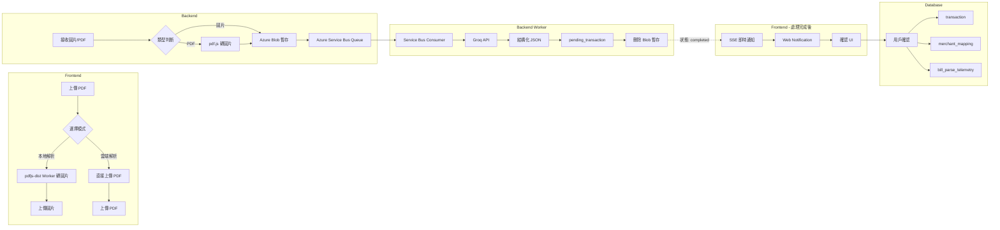
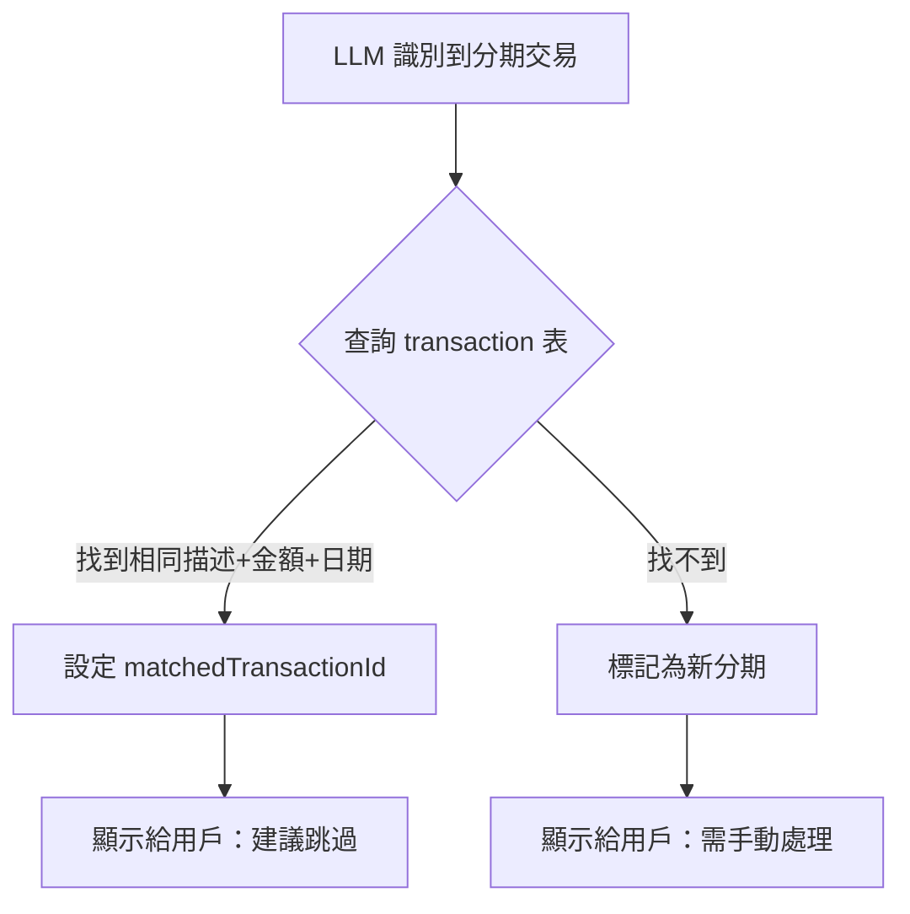
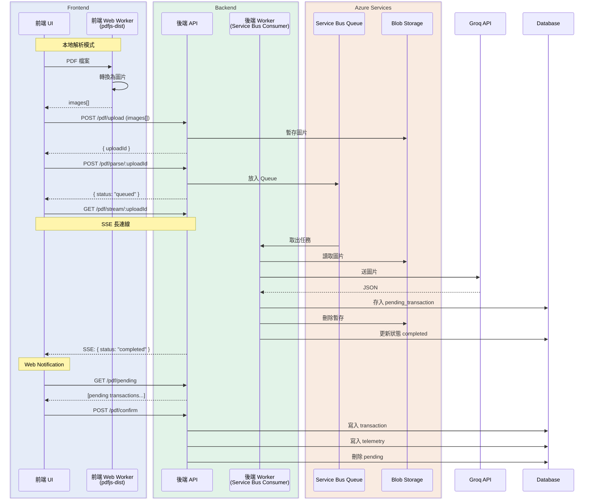
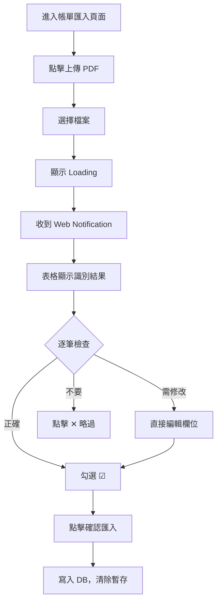

# PDF 帳單自動分析與匯入功能 - 技術提案

> **狀態**: ✅ Approved  
> **作者**: rinouo  
> **日期**: 2026-01-19

---

## 1. 概述 (Overview)

### 1.1 功能描述

讓用戶上傳信用卡 PDF 帳單，系統自動識別交易明細並結構化，經用戶確認後寫入資料庫。

### 1.2 目標

- 減少手動輸入交易的時間
- 準確率目標：98+%（100 筆中 98 筆不需調整）
- 使用免費且不訓練用戶資料的 AI 服務

### 1.3 成功指標

| 指標             | 目標    |
| ---------------- | ------- |
| 識別準確率       | ≥ 98%   |
| 用戶手動修正比例 | ≤ 2%    |
| 單張帳單處理時間 | < 60 秒 |

---

## 2. 系統架構 (Architecture)

### 2.1 整體流程


```mermaid
flowchart LR
    subgraph Frontend
        A[上傳 PDF] --> B{選擇模式}
        B -->|本地解析| C[pdfjs-dist Worker 轉圖片]
        B -->|雲端解析| D[直接上傳 PDF]
        C --> E[上傳圖片]
        D --> F[上傳 PDF]
    end

    subgraph Backend
        G[接收圖片/PDF] --> H{類型判斷}
        H -->|圖片| I[Azure Blob 暫存]
        H -->|PDF| J[pdf.js 轉圖片]
        J --> I
        I --> K[Azure Service Bus Queue]
    end

    subgraph Worker[Backend Worker]
        W[Service Bus Consumer] --> X[Groq API]
        X --> Y[結構化 JSON]
        Y --> Z[pending_transaction]
        Z --> ZZ[刪除 Blob 暫存]
    end

    subgraph Frontend_After[Frontend - 處理完成後]
        O[SSE 即時通知] --> P[Web Notification]
        P --> Q[確認 UI]
    end

    subgraph Database
        R[用戶確認] --> S[transaction]
        R --> T[merchant_mapping]
        R --> U[bill_parse_telemetry]
    end

    K --> W
    ZZ -.->|狀態: completed| O
    Q --> R
```

### 2.2 元件關係

| 元件     | 技術                          | 說明                                  |
| -------- | ----------------------------- | ------------------------------------- |
| 前端     | Next.js + pdfjs-dist          | PDF 轉圖片（本地模式）、上傳、確認 UI |
| 後端     | Node.js + pdfjs-dist          | API、PDF 轉圖片（雲端模式）、SSE 推送 |
| 訊息佇列 | Azure Service Bus             | 解析任務排隊，避免 rate limit         |
| 定時任務 | Azure Functions Timer Trigger | 垃圾資料定期清理                      |
| 檔案暫存 | Azure Blob                    | 圖片/PDF 臨時存放                     |
| AI       | OpenRouter (Kimi K2.5)        | 圖片 → 結構化資料                     |
| 資料庫   | PostgreSQL (Neon)             | 交易、暫存資料、Telemetry             |

---

## 3. 技術選型 (Technology Options)

### 3.1 整體流程

**本地解析模式**：

```
[前端] PDF → pdfjs-dist Worker 轉圖片 → 上傳圖片 → [後端] LLM 分析 → 用戶確認 → 寫入 DB
```

**雲端解析模式**：

```
[前端] PDF → 直接上傳 → [後端] pdf.js 轉圖片 → LLM 分析 → 用戶確認 → 寫入 DB
```

### 3.2 PDF 轉圖片（前端處理）

| 方案              | 語言       | 優點                                | 缺點             |
| ----------------- | ---------- | ----------------------------------- | ---------------- |
| **pdfjs-dist** ✅ | JavaScript | 純 JS、瀏覽器原生支援、Mozilla 維護 | 低階裝置可能較慢 |

**選擇理由**：

1. **分散運算負擔**：PDF 轉圖片在用戶裝置執行，後端只需處理 LLM 請求
2. **避免並發瓶頸**：10,000+ 用戶同時使用時，不會因 PDF 轉換阻塞伺服器
3. **無 canvas 依賴問題**：不需在 Vercel Serverless 處理 Native Dependencies

#### 套件說明

- **pdf.js**：Mozilla 的原始 repo（`mozilla/pdf.js`），是開發用 source code
- **pdfjs-dist**：官方發布的**預編譯版本**，從 npm 安裝即可使用

```bash
pnpm add pdfjs-dist
```

#### Web Worker 配置

pdfjs-dist 使用 Web Worker 在背景執行 PDF 解析，避免阻塞主線程：

```typescript
import * as pdfjsLib from 'pdfjs-dist';

// Webpack 5 / Vite 皆支援此語法
pdfjsLib.GlobalWorkerOptions.workerSrc = new URL(
  'pdfjs-dist/build/pdf.worker.min.mjs',
  import.meta.url,
).toString();
```

> [!NOTE]
> `new URL(..., import.meta.url)` 是 Webpack 5 Asset Modules 語法，會自動處理檔案複製與路徑解析。

#### 前端轉圖片流程

```typescript
async function pdfToImages(file: File): Promise<Blob[]> {
  const arrayBuffer = await file.arrayBuffer();
  const pdf = await pdfjsLib.getDocument({ data: arrayBuffer }).promise;
  const images: Blob[] = [];

  for (let i = 1; i <= pdf.numPages; i++) {
    const page = await pdf.getPage(i);
    const viewport = page.getViewport({ scale: 2.0 }); // 2x for clarity

    const canvas = document.createElement('canvas');
    canvas.width = viewport.width;
    canvas.height = viewport.height;

    await page.render({
      canvasContext: canvas.getContext('2d')!,
      viewport,
    }).promise;

    // 轉成 JPEG 品質 85% 減少上傳量
    const blob = await new Promise<Blob>((resolve) =>
      canvas.toBlob((b) => resolve(b!), 'image/jpeg', 0.85),
    );
    images.push(blob);
  }

  return images;
}
```

> [!NOTE]
> Web Worker 是獨立的執行環境，透過 `postMessage` 與主線程通訊。
> 頁面關閉時 Worker 會終止，轉換中途關閉瀏覽器會中斷處理。

> [!TIP]
> 建議加上 Loading 進度顯示，避免用戶以為當機。

### 3.3 Multimodal LLM API

> [!IMPORTANT]
> OpenRouter 為模型中介平台，隱私政策由各底層供應商管轄。
> Kimi K2.5 由 Moonshot AI 提供，詳見 [Moonshot AI Privacy Policy](https://www.moonshot.cn/privacy)。

| 服務              | Model     | 計費方式      | 隱私政策                                   |
| ----------------- | --------- | ------------- | ------------------------------------------ |
| **OpenRouter** ✅ | Kimi K2.5 | Pay-per-token | ✅ [不訓練](https://openrouter.ai/privacy) |

**Kimi K2.5 特性**：

- **架構**：Native Multimodal，基於 Kimi-K2-Base 持續預訓練
- **多模態**：原生支援文字 + 圖片輸入（約 15T mixed visual and text tokens 預訓練）
- **強項**：Visual coding、agentic tool-calling、general reasoning
- **Agent Swarm**：支援自動分解複雜任務為平行子任務

**策略**：

1. **主力**：OpenRouter → Kimi K2.5（自動路由至最佳 provider）

### 3.4 為什麼不選其他方案

| 方案                 | 排除原因                                 |
| -------------------- | ---------------------------------------- |
| Google Gemini        | 免費版資料可能被用於改進產品             |
| OpenAI GPT-4o        | 非免費                                   |
| Claude               | 非免費                                   |
| Groq (Llama-4)       | 辨識準確率不佳，免費額度限制嚴格         |
| Local Model          | 需 8GB+ VRAM，不適合一般伺服器           |
| pdf-parse + Text LLM | 信用卡帳單表格格式不統一，文字抽取易出錯 |

---

## 4. 資料模型 (Data Model)

### 4.1 新增表

#### `merchant_mapping`（商家 → 類別 mapping，全域共用）

| Column       | Type         | Description                        |
| ------------ | ------------ | ---------------------------------- |
| id           | UUID         | PK                                 |
| merchantName | VARCHAR(255) | 商家名稱（from 帳單）              |
| categoryId   | UUID         | FK → category.id                   |
| matchCount   | INT          | 被使用次數（用於未來優化 AI 猜測） |
| createdAt    | TIMESTAMPTZ  |                                    |
| updatedAt    | TIMESTAMPTZ  |                                    |

**Unique Constraint**: `UNIQUE(merchantName, categoryId)`

> [!NOTE]
> 同一個 `merchantName` 可以對應多個 `categoryId`，形成一對多關係。
> 查詢建議類別時，取 `matchCount` 最高者。
>
> 例如：
> | merchantName | categoryId | matchCount |
> |--------------|------------|------------|
> | 蝦皮購物 | 購物 | 100 |
> | 蝦皮購物 | 副業成本 | 1 |
>
> 此時建議類別會選擇「購物」（matchCount=100）。
>
> **更新時機**：在 `/pdf/confirm` 確認交易時，使用 upsert 更新 matchCount：
>
> ```sql
> INSERT INTO merchant_mapping (merchantName, categoryId, matchCount)
> VALUES ($1, $2, 1)
> ON CONFLICT (merchantName, categoryId)
> DO UPDATE SET matchCount = merchant_mapping.matchCount + 1;
> ```

##### 類別建議策略（Hybrid）

`suggestedCategoryId` 來源優先級：

1. **MerchantMapping**：查 `merchant_mapping` 表，若有匹配則直接使用（免費、確定性高）
2. **LLM 建議**：LLM prompt 注入使用者的 expense 類別清單，回傳 `suggestedCategory` 字串（如 `"飲食/午餐"`），再 fuzzy match 到 `categoryId`
3. **null**：都未匹配

#### `pending_transaction`（待確認交易暫存）

| Column               | Type         | Description                                        |
| -------------------- | ------------ | -------------------------------------------------- |
| id                   | UUID         | PK                                                 |
| userId               | UUID         | FK → user.id                                       |
| uploadBatchId        | UUID         | 同一次上傳的 batch ID                              |
| rawMerchantName      | VARCHAR(255) | LLM 識別的原始商家名稱                             |
| suggestedCategoryId  | UUID         | AI 建議的類別（MerchantMapping > LLM 建議 > null） |
| matchedTransactionId | UUID         | 比對到的現有交易（分期用，nullable）               |
| isInstallment        | BOOLEAN      | 是否為分期                                         |
| installmentNumber    | INT          | 第幾期（nullable）                                 |
| status               | ENUM         | `PENDING` / `CONFIRMED` / `SKIPPED`                |
| transactionData      | JSONB        | 完整 transaction 結構（見下方）                    |
| createdAt            | TIMESTAMPTZ  |                                                    |
| updatedAt            | TIMESTAMPTZ  |                                                    |

**transactionData JSONB 結構**：

```json
{
  "amount": 1500.0,
  "type": "expense",
  "description": "全聯福利中心",
  "date": "2026-01-15",
  "time": "14:30",
  "accountId": null, // 用戶確認時選擇
  "categoryId": null, // Mapping 或用戶選擇
  "extraAdd": 0,
  "extraMinus": 50, // 手續費
  "currency": "TWD"
}
```

### 4.2 分期交易處理流程


```mermaid
flowchart TD
    A[LLM 識別到分期交易] --> B{查詢 transaction 表}
    B -->|找到相同描述+金額+日期| C[設定 matchedTransactionId]
    B -->|找不到| D[標記為新分期]
    C --> E[顯示給用戶：建議跳過]
    D --> F[顯示給用戶：需手動處理]
```

### 4.3 新增表：`bill_parse_telemetry`（解析準確率統計）

| Column               | Type         | Description                         |
| -------------------- | ------------ | ----------------------------------- |
| id                   | UUID         | PK                                  |
| uploadBatchId        | UUID         | 同一次上傳的 batch ID               |
| totalTransactions    | INT          | 總共識別幾筆                        |
| modifiedTransactions | INT          | 用戶修改過幾筆                      |
| skippedTransactions  | INT          | 用戶略過幾筆                        |
| accuracyRate         | DECIMAL(5,4) | 準確率 = (total - modified) / total |
| parseTimeMs          | INT          | LLM 解析耗時 (ms)                   |
| processingMode       | VARCHAR(10)  | `local` / `cloud`                   |
| llmProvider          | VARCHAR(50)  | `groq` / `together`                 |
| llmModel             | VARCHAR(100) | 使用的模型名稱                      |
| pageCount            | INT          | PDF 頁數                            |
| createdAt            | TIMESTAMPTZ  |                                     |

> [!NOTE]  
> 此表不儲存 `userId`，僅用於系統層級準確率統計與宣傳用途。  
> Transaction-level 準確率：一筆交易只要有任一欄位被修改，即計入 `modifiedTransactions`。

### 4.4 現有表不需修改

- `transaction` - 結構不變
- `transaction_extra` - 結構不變
- `installment_plan` - 結構不變

---

## 5. API 設計 (API Design)

### 5.1 Endpoints 總覽

| Method | Endpoint                | Description                            |
| ------ | ----------------------- | -------------------------------------- |
| POST   | `/pdf/upload`           | 上傳圖片（本地模式）或 PDF（雲端模式） |
| POST   | `/pdf/parse/:uploadId`  | 觸發解析                               |
| GET    | `/pdf/stream/:uploadId` | SSE 即時狀態推送                       |
| GET    | `/pdf/pending`          | 取得待確認交易列表                     |
| PATCH  | `/pdf/pending/:id`      | 更新單筆狀態                           |
| POST   | `/pdf/confirm`          | 批次確認寫入 DB                        |

### 5.2 流程圖


```mermaid
sequenceDiagram
    box rgba(59, 130, 246, 0.1) Frontend
        participant U as 前端 UI
        participant FW as 前端 Web Worker<br/>(pdfjs-dist)
    end

    box rgba(34, 197, 94, 0.1) Backend
        participant B as 後端 API
        participant BW as 後端 Worker<br/>(Service Bus Consumer)
    end

    box rgba(249, 115, 22, 0.1) Azure Services
        participant Q as Service Bus Queue
        participant Blob as Blob Storage
    end

    participant AI as Groq API
    participant DB as Database

    Note over U,FW: 本地解析模式
    U->>FW: PDF 檔案
    FW->>FW: 轉換為圖片
    FW-->>U: images[]

    U->>B: POST /pdf/upload (images[])
    B->>Blob: 暫存圖片
    B-->>U: { uploadId }

    U->>B: POST /pdf/parse/:uploadId
    B->>Q: 放入 Queue
    B-->>U: { status: "queued" }

    U->>B: GET /pdf/stream/:uploadId
    Note over U,B: SSE 長連線

    Q->>BW: 取出任務
    BW->>Blob: 讀取圖片
    BW->>AI: 送圖片
    AI-->>BW: JSON
    BW->>DB: 存入 pending_transaction
    BW->>Blob: 刪除暫存
    BW->>DB: 更新狀態 completed

    B-->>U: SSE: { status: "completed" }
    Note over U: Web Notification

    U->>B: GET /pdf/pending
    B-->>U: [pending transactions...]

    U->>B: POST /pdf/confirm
    B->>DB: 寫入 transaction
    B->>DB: 寫入 telemetry
    B->>DB: 刪除 pending
```

### 5.3 Request/Response 範例

#### POST `/pdf/upload`

```json
// Request: multipart/form-data
{ "file": <PDF binary> }

// Response
{ "uploadId": "abc-123", "filename": "玉山銀行帳單.pdf" }
```

#### GET `/pdf/stream/:uploadId` (SSE)

```
// SSE Event Stream
event: status
data: { "status": "queued", "position": 3 }

event: status
data: { "status": "processing", "progress": 60 }

event: status
data: { "status": "completed", "pendingCount": 15 }

// 加密 PDF 情況
event: status
data: { "status": "password_required", "uploadId": "abc-123" }

// 失敗情況
event: error
data: { "status": "failed", "error": "PDF 無法解析" }
```

#### POST `/pdf/confirm`

```json
// Request
{
  "confirmed": ["pending-id-1", "pending-id-2"],
  "skipped": ["pending-id-3"]
}

// Response
{ "created": 2, "skipped": 1 }
```

### 5.4 前端通知機制

使用 **SSE (Server-Sent Events)** + **Web Notifications API**：

```typescript
// SSE 連線
const connectSSE = (uploadId: string) => {
  const eventSource = new EventSource(`/api/pdf/stream/${uploadId}`);

  eventSource.addEventListener('status', (e) => {
    const data = JSON.parse(e.data);

    switch (data.status) {
      case 'completed':
        new Notification('帳單解析完成', {
          body: `已識別 ${data.pendingCount} 筆交易，點擊確認`,
          icon: '/icon.png',
        });
        eventSource.close();
        break;
      case 'password_required':
        // 顯示密碼輸入 dialog
        showPasswordDialog(uploadId);
        eventSource.close();
        break;
      case 'failed':
        toast.error(data.error);
        eventSource.close();
        break;
    }
  });

  eventSource.onerror = () => {
    // SSE 斷線，fallback 到 polling
    eventSource.close();
    fallbackToPolling(uploadId);
  };
};

// 請求通知權限（首次使用時）
Notification.requestPermission();
```

> [!NOTE]
> SSE 需要後端支援長連線，Railway 完全支援。
> 如果 SSE 斷線，則 fallback 到 polling 機制。

---

## 6. 前端 UX 流程 (Frontend UX)

### 6.1 頁面入口

- **位置**：左側 Sidebar 新增「帳單匯入」選項
- **路由**：`/bill-import`
- **權限**：登入用戶

### 6.2 頁面結構

```
┌─────────────────────────────────────────────────────────────┐
│  帳單匯入                      [本地解析 💻] [雲端解析 ☁️]   │
├─────────────────────────────────────────────────────────────┤
│  💡 本地解析：在你的裝置處理，速度較快                       │
│     雲端解析：適合大型 PDF                         │
├─────────────────────────────────────────────────────────────┤
│  狀態: 已識別 15 筆交易，待確認 12 筆                        │
├─────────────────────────────────────────────────────────────┤
│  ☑ │ 日期 │ 商家 │ 金額 │ 類別 │ 帳戶 │ 分期 │ 折扣 │ ... │
│  ☑ │ 1/15 │ 全聯 │ 850 │ 食品 │ 玉山 │  -   │  0  │     │
│  ☑ │ 1/16 │ 蝦皮 │ 1200│ 購物 │ 玉山 │ 3/6  │  0  │     │
│  ☐ │ 1/17 │ 台電 │ 2300│ 帳單 │  -   │  -   │  0  │     │
│  ✕ │ 1/18 │ ... │ ... │ ... │ ... │ ... │ ... │     │
├─────────────────────────────────────────────────────────────┤
│                          [確認匯入選取項目] [全部略過]       │
└─────────────────────────────────────────────────────────────┘
```

### 6.3 表格欄位

| 欄位                   | 來源    | 可編輯    | 必填 |
| ---------------------- | ------- | --------- | ---- |
| 勾選狀態               | -       | ☑/☐/✕    | -    |
| 日期                   | LLM     | ✅        | ✅   |
| 時間                   | LLM     | ✅        | ❌   |
| 商家/描述              | LLM     | ✅        | ✅   |
| 金額                   | LLM     | ✅        | ✅   |
| 類別(SubCategory Only) | AI 建議 | ✅ (下拉) | ✅   |
| 帳戶                   | 用戶選  | ✅ (下拉) | ✅   |
| 分期 (第N期/總期)      | LLM     | ✅        | ❌   |
| 折扣 (extraAdd)        | LLM     | ✅        | ❌   |
| 手續費 (extraMinus)    | LLM     | ✅        | ❌   |
| 幣別                   | LLM     | ✅ (下拉) | ❌   |
| 備註                   | 空白    | ✅        | ❌   |

### 6.4 操作狀態

| 狀態     | 圖示 | 說明                             |
| -------- | ---- | -------------------------------- |
| 待確認   | ☐    | 預設，需要用戶決定               |
| 確認匯入 | ☑   | 點擊後加入 DB                    |
| 略過     | ✕    | 不匯入，從暫存刪除               |
| 已存在   | 🔗   | 比對到現有交易（分期），建議略過 |

### 6.5 使用流程


```mermaid
flowchart TD
    A[進入帳單匯入頁面] --> B[點擊上傳 PDF]
    B --> C[選擇檔案]
    C --> D[顯示 Loading]
    D --> E[收到 Web Notification]
    E --> F[表格顯示識別結果]
    F --> G{逐筆檢查}
    G -->|正確| H[勾選 ☑]
    G -->|需修改| I[直接編輯欄位]
    G -->|不要| J[點擊 ✕ 略過]
    I --> H
    H --> K[點擊確認匯入]
    K --> L[寫入 DB，清除暫存]
```

### 6.6 特殊情況處理

| 情況               | UI 表現                         |
| ------------------ | ------------------------------- |
| 比對到現有分期交易 | 該行標記「🔗 已存在」，預設略過 |
| AI 無法識別類別    | 類別欄位標紅，提示用戶選擇      |
| 必填欄位空白       | 無法勾選確認，顯示警告          |
| 解析失敗           | 顯示錯誤訊息，可重新上傳        |

---

## 7. 安全性考量 (Security)

### 7.1 傳輸安全

| 項目     | 狀態    | 備註                      |
| -------- | ------- | ------------------------- |
| HTTPS    | ✅ 已有 | Vercel / Railway 自動提供 |
| API 認證 | ✅ 已有 | JWT + Cookie              |

### 7.2 檔案上傳驗證

**共用驗證函數**（前後端共用）：

```typescript
// shared/validation/fileValidation.ts
export const PDF_VALIDATION = {
  allowedTypes: ['application/pdf'],
  allowedImageTypes: ['image/jpeg', 'image/png'],
  maxPdfSize: 10 * 1024 * 1024, // 10MB
  maxImageSize: 5 * 1024 * 1024, // 5MB per image
  maxImageCount: 50, // 最多 50 頁
  imageFormat: 'image/jpeg', // PDF 轉圖片統一用 JPEG
  imageQuality: 0.85,
};

export const validatePdfFile = (
  file: File | Buffer,
): { valid: boolean; error?: string } => {
  // MIME type 檢查
  const mimeType = file instanceof File ? file.type : 'application/pdf';
  if (!PDF_VALIDATION.allowedTypes.includes(mimeType)) {
    return { valid: false, error: '只允許上傳 PDF 檔案' };
  }

  // 大小檢查
  const size = file instanceof File ? file.size : file.length;
  if (size > PDF_VALIDATION.maxPdfSize) {
    return { valid: false, error: '檔案大小不可超過 10MB' };
  }

  return { valid: true };
};

export const validateImageFiles = (
  images: Blob[],
): { valid: boolean; error?: string } => {
  if (images.length > PDF_VALIDATION.maxImageCount) {
    return {
      valid: false,
      error: `最多僅支援 ${PDF_VALIDATION.maxImageCount} 頁`,
    };
  }

  for (const img of images) {
    if (img.size > PDF_VALIDATION.maxImageSize) {
      return { valid: false, error: '單頁圖片不可超過 5MB' };
    }
  }

  return { valid: true };
};
```

> [!NOTE]
> 前端轉出的圖片統一使用 **JPEG 格式**，品質 85%，平衡清晰度與檔案大小。

### 7.3 大量資料處理

> [!WARNING]
> 若單張帳單含上千筆交易，需分批處理避免 timeout

| 階段     | 策略                     |
| -------- | ------------------------ |
| LLM 解析 | 分頁處理，每頁獨立請求   |
| 前端載入 | 分頁顯示（如每頁 50 筆） |
| 確認寫入 | 分批送出（每批 100 筆）  |

**API 分頁設計**：

```json
// GET /pdf/pending?page=1&limit=50
{
  "data": [...],
  "pagination": {
    "page": 1,
    "limit": 50,
    "total": 1500,
    "totalPages": 30
  }
}
```

### 7.4 資料隱私

| 項目                | 處理方式                                   |
| ------------------- | ------------------------------------------ |
| PDF 暫存            | 解析完成後立即刪除                         |
| LLM API             | 使用不訓練資料的服務（Groq / Together AI） |
| pending_transaction | 用戶確認後硬刪除                           |

---

## 8. 實作階段 (Implementation Phases)

> 詳細任務清單請參考：[pdf-bill-analysis-tasks.md](./pdf-bill-analysis-tasks.md)

---

## 9. 風險與限制 (Risks & Limitations)

### 9.1 已知限制與緩解策略

| 限制         | 說明                          | 緩解策略                      |
| ------------ | ----------------------------- | ----------------------------- |
| LLM 準確率   | 無法保證 100%，可能需人工校正 | 提供易用編輯 UI               |
| 帳單格式多樣 | 各銀行格式不同，可能識別差異  | 持續收集 feedback 改進 prompt |
| 免費額度限制 | 量大時可能達到限制            | 多 provider fallback          |
| 掃描版 PDF   | 圖片品質差時識別率下降        | 提示用戶上傳清晰版本          |

### 9.2 技術挑戰（Reader Testing 發現）

#### 1. 跨頁表格問題

> [!WARNING]
> 多頁帳單的表格會跨頁，第二頁可能沒有表頭

**解決方案**：

- Prompt 優化：明確告知 LLM「這是表格延續，欄位順序同上頁」
- Header Injection：第一頁識別成功後，將表頭作為 context 餵給後續頁面

#### 2. JSON 輸出穩定性

Llama 3.2 處理長列表時可能產生格式錯誤或幻覺

**解決方案**：

- 使用 Zod 嚴格校驗回傳 JSON
- 金額處理：注意千分位符號 `$1,234` → `1234`
- 自動 Retry 機制

#### 3. 商家名稱正規化

帳單商家名稱通常很亂（如 `UBER* EATS HELP.UBER.COM`）

**解決方案**：

- 清洗規則：讓 LLM 提取「品牌名」而非原始敘述
- Fuzzy Match：`merchant_mapping` 查詢使用模糊搜尋而非完全匹配

#### 4. 前端轉圖片的限制

低階裝置（舊手機、低階筆電）轉換大型 PDF 時可能卡頓

**解決方案**：

- 顯示轉換進度，讓用戶知道處理中
- 提供「上傳原始 PDF」的 fallback 選項（後端處理）
- 限制單次上傳最大頁數（如 50 頁）

#### 5. 大量資料前端效能

100+ 筆可編輯欄位會導致 React 效能下降

**解決方案**：

- 使用 Virtualization（如 `@tanstack/react-virtual`）
- 分頁載入（每頁 50 筆）

### 9.3 待驗證項目

- [ ] Llama-4-Maverick 對繁體中文帳單的識別準確率
- [ ] 複雜分期交易（如循環利息）的處理
- [ ] 單張帳單 100+ 筆交易的處理效能
- [ ] 跨頁表格的 Header Injection 效果
- [ ] 前端轉圖片在低階裝置的效能表現

### 9.4 未來優化方向

- 使用 merchant_mapping 累積資料改進 AI 猜測
- 支援更多帳單類型（電信、水電、發票）
- 支援多張 PDF 批次上傳
- 建立常見銀行帳單的專屬 prompt template

---

## 附錄 A：Azure Service Bus 設定與使用

### A.1 建立 Service Bus Namespace

```bash
# 使用 Azure CLI
az servicebus namespace create \
  --resource-group EasyAccounting \
  --name easyaccounting-bus \
  --location eastasia \
  --sku Basic  # Basic tier 免費額度：每月 100 萬次操作
```

### A.2 建立 Queue

```bash
az servicebus queue create \
  --resource-group EasyAccounting \
  --namespace-name easyaccounting-bus \
  --name bill-parse-queue \
  --max-size 1024  # 1GB
```

### A.3 取得連線字串

```bash
az servicebus namespace authorization-rule keys list \
  --resource-group EasyAccounting \
  --namespace-name easyaccounting-bus \
  --name RootManageSharedAccessKey \
  --query primaryConnectionString \
  --output tsv
```

將連線字串加入 `.env`：

```
AZURE_SERVICE_BUS_CONNECTION_STRING=Endpoint=sb://easyaccounting-bus.servicebus.windows.net/;SharedAccessKeyName=...
```

### A.4 後端 Producer（發送訊息）

```typescript
import { ServiceBusClient } from '@azure/service-bus';

const sbClient = new ServiceBusClient(
  process.env.AZURE_SERVICE_BUS_CONNECTION_STRING!,
);
const sender = sbClient.createSender('bill-parse-queue');

// 在 /pdf/parse API 中
await sender.sendMessages({
  body: {
    uploadId,
    userId,
    blobUrls: ['https://...page1.jpg', 'https://...page2.jpg'],
  },
  messageId: uploadId,
});
```

### A.5 後端 Worker（消費訊息）

```typescript
import { ServiceBusClient } from '@azure/service-bus';

const sbClient = new ServiceBusClient(
  process.env.AZURE_SERVICE_BUS_CONNECTION_STRING!,
);
const receiver = sbClient.createReceiver('bill-parse-queue');

// 持續監聽
receiver.subscribe({
  processMessage: async (message) => {
    const { uploadId, blobUrls } = message.body;

    try {
      // 1. 更新狀態為 processing
      await updateParseStatus(uploadId, 'processing');

      // 2. 呼叫 Groq API 解析圖片
      const result = await parseWithGroq(blobUrls);

      // 3. 寫入 pending_transaction
      await savePendingTransactions(uploadId, result);

      // 4. 刪除 Blob 暫存
      await deleteTempBlobs(blobUrls);

      // 5. 更新狀態為 completed
      await updateParseStatus(uploadId, 'completed');
    } catch (error) {
      await updateParseStatus(uploadId, 'failed', error.message);
    }
  },
  processError: async (error) => {
    console.error('Service Bus error:', error);
  },
});
```

### A.6 Railway 部署 Worker

在 `railway.json` 中新增 Worker 服務：

```json
{
  "services": {
    "api": { ... },
    "worker": {
      "build": { "builder": "NIXPACKS" },
      "deploy": {
        "startCommand": "node dist/worker.js",
        "restartPolicyType": "ALWAYS"
      }
    }
  }
}
```

---

## 附錄 B：垃圾資料清理 Job

### B.1 使用 Azure Functions Timer Trigger

```bash
# 建立 Function App
az functionapp create \
  --resource-group EasyAccounting \
  --name easyaccounting-cleanup \
  --storage-account easyaccountingstorage \
  --consumption-plan-location eastasia \
  --runtime node \
  --runtime-version 20 \
  --functions-version 4
```

### B.2 Timer Trigger 程式碼

```typescript
// cleanupFunction/index.ts
import { app } from '@azure/functions';
import { Pool } from 'pg';
import { BlobServiceClient } from '@azure/storage-blob';

app.timer('cleanupStaleData', {
  schedule: '0 0 3 * * *', // 每天凌晨 3 點執行
  handler: async (myTimer, context) => {
    const pool = new Pool({ connectionString: process.env.DATABASE_URL });
    const blobClient = BlobServiceClient.fromConnectionString(
      process.env.AZURE_BLOB_CONNECTION_STRING!,
    );

    // 1. 清理 7 天前的 pending_transaction（非 completed 狀態）
    const dbResult = await pool.query(`
      DELETE FROM pending_transaction 
      WHERE status IN ('pending', 'processing', 'queued') 
        AND "createdAt" < NOW() - INTERVAL '7 days'
      RETURNING id
    `);
    context.log(`Deleted ${dbResult.rowCount} stale pending_transactions`);

    // 2. 清理 7 天前的 Blob 暫存圖片
    const containerClient = blobClient.getContainerClient('bill-temp');
    const blobs = containerClient.listBlobsFlat();
    let deletedBlobs = 0;

    for await (const blob of blobs) {
      const createdOn = blob.properties.createdOn;
      if (
        createdOn &&
        Date.now() - createdOn.getTime() > 7 * 24 * 60 * 60 * 1000
      ) {
        await containerClient.deleteBlob(blob.name);
        deletedBlobs++;
      }
    }
    context.log(`Deleted ${deletedBlobs} stale blobs`);
  },
});
```

### B.3 免費額度說明

| 服務                    | 免費額度                             |
| ----------------------- | ------------------------------------ |
| Azure Functions         | 每月 100 萬次執行、400,000 GB-s 計算 |
| Azure Service Bus Basic | 每月 100 萬次操作                    |

> [!NOTE]
> 以每天清理一次計算，一個月約 30 次執行，遠低於免費額度。
> Service Bus 以每天 100 個用戶各上傳 5 張帳單計算，每月約 15,000 次操作。

---

## 附錄 C：加密 PDF 處理

### C.1 前端檢測與 UI

```typescript
// 前端 PDF 載入
try {
  const pdf = await pdfjsLib.getDocument({ data: arrayBuffer }).promise;
} catch (e) {
  if (e.name === 'PasswordException') {
    // 顯示密碼輸入 dialog
    showPasswordDialog();
  }
}

// 密碼輸入 dialog
const PasswordDialog = ({ uploadId, onSubmit }) => (
  <Dialog>
    <DialogContent>
      <DialogHeader>
        <DialogTitle>PDF 需要密碼</DialogTitle>
        <DialogDescription>
          此 PDF 已加密，請輸入密碼以繼續解析。
        </DialogDescription>
      </DialogHeader>

      <Input
        type="password"
        placeholder="請輸入 PDF 密碼"
        onChange={(e) => setPassword(e.target.value)}
      />

      <Alert variant="info">
        <AlertCircle className="h-4 w-4" />
        <AlertDescription>
          密碼僅用於解密此 PDF，不會被儲存或傳送至伺服器。
        </AlertDescription>
      </Alert>

      <Tooltip>
        <TooltipTrigger>
          <HelpCircle className="h-4 w-4" />
        </TooltipTrigger>
        <TooltipContent>
          <p>PDF 在您的瀏覽器中解密，</p>
          <p>密碼不會離開您的裝置。</p>
        </TooltipContent>
      </Tooltip>

      <Button onClick={() => onSubmit(password)}>解鎖</Button>
    </DialogContent>
  </Dialog>
);
```

### C.2 使用密碼解密

```typescript
const decryptPDF = async (arrayBuffer: ArrayBuffer, password: string) => {
  const pdf = await pdfjsLib.getDocument({
    data: arrayBuffer,
    password,
  }).promise;

  // 繼續正常的轉圖片流程
  return await pdfToImages(pdf);
};
```

> [!IMPORTANT]
> 密碼**只在前端使用**，用於本地解密 PDF。
> 後端不會收到密碼，也不會儲存密碼。
> 雲端解析模式下，加密 PDF 需先在前端解密後再上傳圖片。

---

## 附錄 D：API 完整列表

### D.1 Endpoints 總覽

| Method | Endpoint                | Description        | 認證   |
| ------ | ----------------------- | ------------------ | ------ |
| POST   | `/pdf/upload`           | 上傳圖片或 PDF     | 需認證 |
| POST   | `/pdf/parse/:uploadId`  | 觸發解析任務       | 需認證 |
| GET    | `/pdf/stream/:uploadId` | SSE 即時狀態推送   | 需認證 |
| GET    | `/pdf/pending`          | 取得待確認交易列表 | 需認證 |
| PATCH  | `/pdf/pending/:id`      | 更新單筆待確認交易 | 需認證 |
| POST   | `/pdf/confirm`          | 批次確認寫入 DB    | 需認證 |

### D.2 Request/Response 詳細規格

#### POST `/pdf/upload`

上傳 PDF（雲端模式）或圖片（本地模式）。

**Request**:

```typescript
// multipart/form-data
interface UploadRequest {
  mode: 'local' | 'cloud'; // 處理模式
  file?: File; // 雲端模式：PDF 檔案
  images?: File[]; // 本地模式：轉換後的圖片陣列
}
```

**Response**:

```typescript
interface UploadResponse {
  uploadId: string; // 上傳批次 ID
  filename: string; // 原始檔名
  pageCount: number; // 頁數
  status: 'uploaded';
}
```

**錯誤碼**:
| 狀態碼 | 說明 |
|--------|------|
| 400 | 檔案格式錯誤或超過大小限制 |
| 401 | 未認證 |
| 413 | 檔案過大 |

---

#### POST `/pdf/parse/:uploadId`

觸發 LLM 解析任務。

**Response**:

```typescript
interface ParseResponse {
  uploadId: string;
  status: 'queued';
  queuePosition?: number; // 排隊位置（optional）
}
```

---

#### GET `/pdf/stream/:uploadId`

SSE 即時狀態推送。

**Event Types**:

```typescript
// event: status
interface StatusEvent {
  status:
    | 'queued'
    | 'processing'
    | 'completed'
    | 'password_required'
    | 'failed';
  progress?: number; // 0-100，僅 processing 時有值
  pendingCount?: number; // 僅 completed 時有值
  queuePosition?: number; // 僅 queued 時有值
  error?: string; // 僅 failed 時有值
}
```

---

#### GET `/pdf/pending`

取得待確認交易列表。

**Query Parameters**:
| 參數 | 類型 | 預設值 | 說明 |
|------|------|--------|------|
| uploadBatchId | UUID | - | 篩選特定上傳批次 |
| page | number | 1 | 頁碼 |
| limit | number | 50 | 每頁筆數 |

**Response**:

```typescript
interface PendingListResponse {
  data: PendingTransaction[];
  pagination: {
    page: number;
    limit: number;
    total: number;
    totalPages: number;
  };
}

interface PendingTransaction {
  id: string;
  uploadBatchId: string;
  rawMerchantName: string;
  suggestedCategoryId: string | null;
  isInstallment: boolean;
  installmentNumber: number | null;
  status: 'pending' | 'confirmed' | 'skipped';
  transactionData: {
    amount: number;
    type: 'income' | 'expense';
    description: string;
    date: string; // YYYY-MM-DD
    time: string | null; // HH:mm
    accountId: string | null;
    categoryId: string | null;
    extraAdd: number;
    extraMinus: number;
    currency: string;
  };
  createdAt: string;
}
```

---

#### PATCH `/pdf/pending/:id`

更新單筆待確認交易。

**Request**:

```typescript
interface UpdatePendingRequest {
  status?: 'pending' | 'confirmed' | 'skipped';
  transactionData?: Partial<TransactionData>;
}
```

---

#### POST `/pdf/confirm`

批次確認寫入資料庫。

**Request**:

```typescript
interface ConfirmRequest {
  confirmed: string[]; // 要確認的 pending_transaction IDs
  skipped: string[]; // 要略過的 pending_transaction IDs
}
```

**Response**:

```typescript
interface ConfirmResponse {
  created: number; // 成功寫入筆數
  skipped: number; // 略過筆數
  telemetryId: string; // 本次統計記錄 ID
}
```

### D.3 幣別說明

> [!NOTE]
> 本系統目前預留幣別欄位，但尚未實作多幣別功能。
> 目前預設所有交易為 `TWD`，未來如需支援外幣交易再行擴充。
