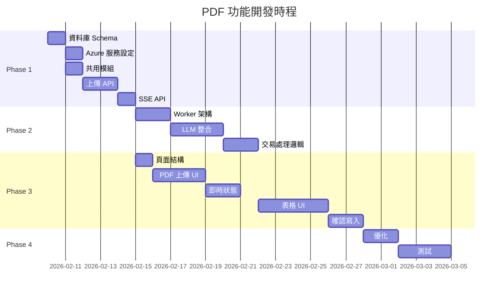

# PDF 帳單自動分析功能 - 開發任務清單

> **對應規格**: [pdf-bill-analysis-rfc.md](./pdf-bill-analysis-rfc.md)  
> **預估總工時**: 5-8 週

---

## Phase 1: 基礎建設

### 1.1 資料庫 Schema ✅

| Task  | 描述                                           | 預估 | 依賴        |
| ----- | ---------------------------------------------- | ---- | ----------- |
| 1.1.1 | ~~建立 `merchant_mapping` 表 + migration~~     | 0.5h | -           |
| 1.1.2 | ~~建立 `pending_transaction` 表 + migration~~  | 0.5h | -           |
| 1.1.3 | ~~建立 `bill_parse_telemetry` 表 + migration~~ | 0.5h | -           |
| 1.1.4 | ~~建立對應的 Sequelize Models~~                | 1h   | 1.1.1-1.1.3 |

### 1.2 Azure 服務設定 ✅

| Task  | 描述                                                      | 預估 | 依賴  |
| ----- | --------------------------------------------------------- | ---- | ----- |
| 1.2.1 | ~~建立 Azure Service Bus Namespace + Queue~~              | 0.5h | -     |
| 1.2.2 | ~~建立 Blob Container `pdf-temp`~~                        | 0.5h | -     |
| 1.2.3 | ~~設定 env vars (`AZURE_SERVICE_BUS_CONNECTION_STRING`)~~ | 0.5h | 1.2.1 |

### 1.3 共用模組 ✅

| Task  | 描述                                           | 預估 | 依賴  |
| ----- | ---------------------------------------------- | ---- | ----- |
| 1.3.1 | ~~建立 `shared/validation/fileValidation.ts`~~ | 1h   | -     |
| 1.3.2 | ~~建立 Service Bus client wrapper~~            | 1h   | 1.2.1 |

### 1.4 後端 API - 上傳 ✅

| Task  | 描述                                   | 預估 | 依賴  |
| ----- | -------------------------------------- | ---- | ----- |
| 1.4.1 | ~~`POST /pdf/upload` - 接收 PDF/圖片~~ | 2h   | 1.3.1 |
| 1.4.2 | ~~上傳圖片到 Blob Storage~~            | 1h   | 1.2.2 |
| 1.4.3 | ~~建立 upload batch 記錄~~             | 1h   | 1.1.4 |

### 1.5 後端 API - SSE ✅

| Task  | 描述                                           | 預估 | 依賴  |
| ----- | ---------------------------------------------- | ---- | ----- |
| 1.5.1 | ~~`GET /pdf/stream/:uploadId` - SSE endpoint~~ | 2h   | -     |
| 1.5.2 | ~~實作狀態變更通知機制~~                       | 1h   | 1.5.1 |

---

## Phase 2: AI 整合

### 2.1 Service Bus Worker

| Task  | 描述                             | 預估 | 依賴  |
| ----- | -------------------------------- | ---- | ----- |
| 2.1.1 | 建立 Worker 入口 (`worker.ts`)   | 1h   | 1.3.2 |
| 2.1.2 | 實作 Service Bus message handler | 2h   | 2.1.1 |
| 2.1.3 | 錯誤處理 + retry 機制            | 1h   | 2.1.2 |

### 2.2 後端 PDF 處理（雲端模式）

| Task  | 描述                         | 預估 | 依賴  |
| ----- | ---------------------------- | ---- | ----- |
| 2.2.1 | 安裝 `canvas` + `pdfjs-dist` | 0.5h | -     |
| 2.2.2 | 實作 PDF → JPEG 轉換         | 2h   | 2.2.1 |

### 2.3 LLM 整合

| Task  | 描述                          | 預估 | 依賴  |
| ----- | ----------------------------- | ---- | ----- |
| 2.3.1 | 建立 Groq API client          | 1h   | -     |
| 2.3.2 | 設計 LLM Prompt（結構化輸出） | 3h   | -     |
| 2.3.3 | Zod schema 驗證 LLM 回傳      | 1h   | 2.3.2 |
| 2.3.4 | 建立 Together AI fallback     | 1h   | 2.3.1 |

### 2.4 交易處理邏輯

| Task  | 描述                                  | 預估 | 依賴  |
| ----- | ------------------------------------- | ---- | ----- |
| 2.4.1 | 解析 LLM 結果 → `pending_transaction` | 2h   | 2.3.3 |
| 2.4.2 | merchant_mapping 查詢建議類別         | 1h   | 1.1.4 |
| 2.4.3 | 分期交易比對邏輯                      | 2h   | 2.4.1 |

### 2.5 後端 API - 解析觸發

| Task  | 描述                                     | 預估 | 依賴  |
| ----- | ---------------------------------------- | ---- | ----- |
| 2.5.1 | `POST /pdf/parse/:uploadId` - 放入 Queue | 1h   | 1.3.2 |

---

## Phase 3: 前端介面

### 3.1 路由 + 頁面結構

| Task  | 描述                         | 預估 | 依賴  |
| ----- | ---------------------------- | ---- | ----- |
| 3.1.1 | 新增 `/pdf-import` 路由      | 0.5h | -     |
| 3.1.2 | Sidebar 新增「PDF 匯入」選項 | 0.5h | 3.1.1 |
| 3.1.3 | 建立頁面 layout 骨架         | 1h   | 3.1.1 |

### 3.2 PDF 上傳

| Task  | 描述                        | 預估 | 依賴  |
| ----- | --------------------------- | ---- | ----- |
| 3.2.1 | 上傳區域 UI + drag & drop   | 2h   | 3.1.3 |
| 3.2.2 | 本地/雲端模式切換按鈕       | 1h   | 3.2.1 |
| 3.2.3 | pdfjs-dist Web Worker 設定  | 1h   | -     |
| 3.2.4 | PDF → JPEG 轉換（本地模式） | 2h   | 3.2.3 |
| 3.2.5 | 加密 PDF 密碼輸入 dialog    | 1h   | 3.2.4 |

### 3.3 即時狀態

| Task  | 描述                               | 預估 | 依賴  |
| ----- | ---------------------------------- | ---- | ----- |
| 3.3.1 | SSE client hook (`useParseStatus`) | 2h   | -     |
| 3.3.2 | 進度 UI 顯示                       | 1h   | 3.3.1 |
| 3.3.3 | Web Notification 整合              | 1h   | 3.3.1 |

### 3.4 待確認交易表格

| Task  | 描述                         | 預估 | 依賴  |
| ----- | ---------------------------- | ---- | ----- |
| 3.4.1 | 表格基本結構 + data fetching | 2h   | -     |
| 3.4.2 | 勾選/略過狀態切換            | 1h   | 3.4.1 |
| 3.4.3 | 行內編輯功能                 | 3h   | 3.4.1 |
| 3.4.4 | 類別下拉選單 (SubCategory)   | 1h   | 3.4.3 |
| 3.4.5 | 帳戶下拉選單                 | 1h   | 3.4.3 |
| 3.4.6 | 分期交易標記 UI              | 1h   | 3.4.1 |

### 3.5 確認寫入

| Task  | 描述                    | 預估 | 依賴  |
| ----- | ----------------------- | ---- | ----- |
| 3.5.1 | 確認匯入按鈕 + API 呼叫 | 1h   | 3.4.2 |
| 3.5.2 | 成功/失敗 toast 通知    | 0.5h | 3.5.1 |

### 3.6 後端 API - 待確認交易

| Task  | 描述                                | 預估 | 依賴  |
| ----- | ----------------------------------- | ---- | ----- |
| 3.6.1 | `GET /pdf/pending` - 列表 + 分頁    | 2h   | 1.1.4 |
| 3.6.2 | `PATCH /pdf/pending/:id` - 更新單筆 | 1h   | 1.1.4 |
| 3.6.3 | `POST /pdf/confirm` - 批次確認      | 3h   | 1.1.4 |
| 3.6.4 | merchant_mapping upsert 邏輯        | 1h   | 3.6.3 |
| 3.6.5 | telemetry 記錄                      | 1h   | 3.6.3 |

---

## Phase 4: 優化與測試

### 4.1 效能優化

| Task  | 描述                                          | 預估 | 依賴  |
| ----- | --------------------------------------------- | ---- | ----- |
| 4.1.1 | 表格 virtualization (@tanstack/react-virtual) | 2h   | 3.4.1 |
| 4.1.2 | 分批確認寫入（每批 100 筆）                   | 1h   | 3.6.3 |

### 4.2 垃圾清理

| Task  | 描述                          | 預估 | 依賴  |
| ----- | ----------------------------- | ---- | ----- |
| 4.2.1 | Azure Functions 專案設定      | 1h   | -     |
| 4.2.2 | Timer Trigger 清理 stale data | 2h   | 4.2.1 |

### 4.3 測試

| Task  | 描述                             | 預估 | 依賴      |
| ----- | -------------------------------- | ---- | --------- |
| 4.3.1 | 單元測試：fileValidation         | 1h   | 1.3.1     |
| 4.3.2 | 單元測試：LLM response parser    | 2h   | 2.4.1     |
| 4.3.3 | 整合測試：上傳 → 解析 → 確認流程 | 3h   | Phase 1-3 |
| 4.3.4 | E2E 測試：完整用戶流程           | 3h   | Phase 1-3 |

---

## 建議開發順序

---

## 優先順序建議

**先做（驗證可行性）**：

1. 2.3.2 LLM Prompt 設計 - 這決定整個功能的準確率
2. 2.2.2 PDF → JPEG - 確認 canvas 能跑
3. 1.4.1 上傳 API - 基礎架構

**可並行**：

- Phase 1（後端）和 Phase 3.1-3.2（前端頁面骨架）
- Phase 2（Worker）和 Phase 3.3（SSE client）

**最後做**：

- 4.2 垃圾清理 - 不影響主功能
- 4.1.1 virtualization - 量大才需要
