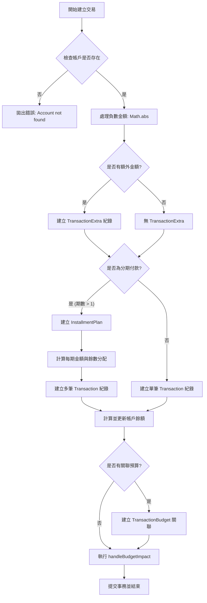
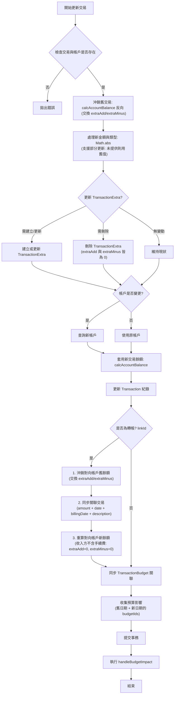

# Transaction API Specification

## 1. 轉帳行為 (Transfer Logic)

當使用者從 **帳戶 A** 轉帳 **$500** 到 **帳戶 B** 時：

### 資料庫紀錄 (DB Records)

- 應產生 **2 筆** 交易紀錄。
- **交易 1 (From A)**:
  - `accountId`: A
  - `targetAccountId`: B
  - `type`: `EXPENSE` (支出)
  - `amount`: 500
- **交易 2 (To B)**:
  - `accountId`: B
  - `targetAccountId`: A
  - `type`: `INCOME` (收入)
  - `amount`: 500
- **關聯性**: 兩筆交易透過 `linkId` 互相參照。

### 帳戶餘額 (Wallet Balance)

- **帳戶 A**: 餘額 **減少 500**。
- **帳戶 B**: 餘額 **增加 500**。

### 刪除連動 (Cascade Delete)

- **規則**: 若刪除其中一筆轉帳交易，**另一筆必須自動刪除**，以確保帳目一致性。
- **餘額還原**: 兩邊帳戶的餘額都必須「反向沖銷」回轉帳前的狀態。
- **資料庫事務 (Database Transaction)**: 轉帳的寫入操作 (建立兩筆交易、更新餘額) **必須** 包在同一個 `sequelize.transaction` 中。若中途失敗，需全數 Rollback，確保資料一致性。
- **負值餘額 (Negative Balance)**: 系統允許帳戶餘額為負值 (e.g. 支出大於餘額)，不需阻擋。

---

## 2. 交易修改與餘額連動 (Update & Balance)

當使用者 **修改** 一筆過去的交易時：

### 2.1 一般收支的餘額更新邏輯 (Revert & Apply)

1.  **Revert (沖銷)**: 先將 **原交易** 對餘額的影響「反向」扣回/加回。
    - 若原為支出 $100 -> 帳戶 +100。
    - 若原為收入 $100 -> 帳戶 -100。
    - 沖銷時需 **交換** `extraAdd` 與 `extraMinus`，因為 Income/Expense 的 Net Amount 公式加減項相反。
2.  **Apply (套用)**: 再計算 **新交易** 對餘額的影響。
    - 若改為支出 $200 -> 帳戶 -200。
3.  **Result**: 只需更新該 Account 的最終 `balance` 欄位，不需重算中間所有歷史流水帳。

### 2.2 轉帳交易的修改 (Transfer Update)

轉帳由 2 筆交易組成 (透過 `linkId` 關聯)。修改轉帳交易時，需額外處理對向交易：

1. **沖銷主交易**：反向沖銷主帳戶餘額。
2. **沖銷對向交易**：查找 `linkId` 關聯的交易，反向沖銷對向帳戶餘額。
3. **套用主交易新值**：更新主帳戶餘額 (含手續費等 Extra)。
4. **同步關聯交易**：將 `amount`、`date`、`billingDate`、`description` 同步到對向交易。
5. **重算對向帳戶餘額**：以新金額重新計算對向帳戶餘額 (**收入方不含手續費**，與 `createTransfer` 一致)。

> **帳戶切換**：目前 `updateIncomeExpense` 支援一般收支的帳戶切換 (`accountId` 變更)，但轉帳的帳戶切換不在此函式處理範圍。

---

## 3. 交易刪除 (Delete)

- 刪除 **收入** 交易 -> 帳戶餘額 **扣回** 該金額。
- 刪除 **支出** 交易 -> 帳戶餘額 **加回** 該金額。
- 若為 **轉帳** 交易 -> 觸發 Cascade Delete (見第 1 點)。

---

## 4. 統計報表 (Summary)

### 篩選規則

- **日期範圍**: `startDate` 到 `endDate` (含頭尾)。
- **排除轉帳**: 統計收入/支出時，應排除轉帳交易。
  - 判斷方式: `linkId` 為 `null` 的即為一般收支，非轉帳。

---

## 5. 零元交易與特殊金額規則 (Zero Amount Logic)

### 通用規則 (General)

- **允許 0 元**: 所有交易類型（支出、收入、轉帳）皆允許 **最終金額 (Net Amount)** 為 `0`。
- **無防呆**: 0 元交易不需要額外的二次確認或防呆機制。
- **0 元轉帳**: 允許建立 0 元轉帳 (A -> B $0)，視為單純紀錄或備忘，對餘額無影響。

### 顯示與統計 (UI & Stats)

- **顏色標示**: 0 元交易在列表中統一顯示為 **綠色** (視同收入樣式)。
- **報表包含**: 在計算交易筆數、圓餅圖、趨勢圖時，**必須包含** 0 元交易。
  - **統計干擾**: 由於圖表 Legend 固定顯示前 3-5 名，0 元項目不佔比且不會擠壓版面，故無干擾問題。

---

## 6. 金額結構與計算 (Amount Structure & Calculation)

為了支援「原價紀錄」與「額外加減金額」，Transaction 資料表需擴充欄位。

### 6.1 資料表設計

為避免 Transaction 表過度膨脹，額外金額資訊獨立成新表。只有當使用者 **實際填寫** 額外金額時才建立記錄。

#### Transaction Table (擴充)

| 欄位                 | 類型 | 說明                                    |
| :------------------- | :--- | :-------------------------------------- |
| `transactionExtraId` | UUID | FK → `TransactionExtra.id`，可為 NULL。 |

#### TransactionExtra Table (新表)

| 欄位              | 類型    | 預設值     | 說明                          |
| :---------------- | :------ | :--------- | :---------------------------- |
| `id`              | UUID    | UUIDV4     | Primary Key                   |
| `extraAdd`        | Decimal | 0          | **額外增加** (如：折扣、回饋) |
| `extraAddLabel`   | String  | `'折扣'`   | 使用者可自訂顯示名稱          |
| `extraMinus`      | Decimal | 0          | **額外減少** (如：手續費)     |
| `extraMinusLabel` | String  | `'手續費'` | 使用者可自訂顯示名稱          |

> **設計理念**:
>
> - 不局限於「手續費」或「折扣」等名詞。一個是 `+` 錢，一個是 `-` 錢。
> - 只有需要時才建立 TransactionExtra 記錄，**舊資料無需 Migration**。
> - 若 `transactionExtraId` 為 NULL，表示該筆交易無額外金額，Net Amount = Amount。

> **刪除規則**:
>
> - **Cascade Delete**: 刪除 Transaction 時，關聯的 TransactionExtra 一併刪除。
> - **自動清理**: 若使用者將 `extraAdd` 和 `extraMinus` 都設為 0 且 Label 為預設值，則刪除該筆 TransactionExtra 並將 `transactionExtraId` 設為 NULL。

### 6.2 實際影響金額 (Net Amount)

系統計算「帳戶餘額變動」與「收支統計」時，統一使用以下公式：

- **Net Amount** = `amount` + `extraMinus` - `extraAdd`
  - (扣更多 = 手續費，扣更少 = 折扣)

> **Example (支出)**:
>
> - 買手機 $1000，折扣 $100，手續費 $10。
> - `amount`: 1000, `extraAdd`: 100, `extraMinus`: 10
> - **Net Amount**: 1000 + 10 - 100 = **910** (帳戶扣除 910)。

> **Example (收入)**:
>
> - 收到薪水 $50000，銀行手續費 $15。
> - `amount`: 50000, `extraMinus`: 15
> - **Net Amount**: 50000 + 15 - 0 = 50015? ❌ 這不對。
> - **修正**: 收入的公式應為 `amount - extraMinus + extraAdd`。
> - **Net Amount**: 50000 - 15 + 0 = **49985** (帳戶入帳 49985)。

### 6.3 收入 vs 支出的公式差異

| 類型 | Net Amount 公式                  |
| :--- | :------------------------------- |
| 支出 | `amount + extraMinus - extraAdd` |
| 收入 | `amount - extraMinus + extraAdd` |

### 6.4 轉帳的額外金額處理

轉帳產生 2 筆交易 (A 支出、B 收入)。若轉帳有手續費：

- **A (支出)**: `extraMinus` = 手續費。
- **B (收入)**: `extraMinus` = 0 (或也可記錄相同值，視需求)。
- **結果**: A 扣 `Amount + Fee`，B 加 `Amount`。

### 6.5 負數輸入處理 (Sign Conversion)

- **DB 規則**: `amount`, `extraAdd`, `extraMinus` 欄位 **只存正數**。
- **使用者輸入負數時**:
  - 系統自動取絕對值，但 **不反轉交易類型**。
  - 例如：使用者在「支出」輸入 `-10`，系統存入 `amount = 10`，`type = EXPENSE`。
- **Schema 驗證**: 不需在前端阻擋負數輸入，後端進行絕對值處理。

### 6.6 分期付款債務邏輯

- **情境**: 分期付款若該期全額折抵 (Net Amount = 0)。
- **債務計算**: `InstallmentPlan` 的剩餘債務，應扣除 **`amount` (原始金額)**，而非 Net Amount。
  - 理由: 即使使用者這期沒付錢 (因為被 extraAdd 抵銷)，該筆「債務」已被履行。

### 6.7 UI 設計 (Extra Amount Input)

- **觸發方式**: 金額輸入框旁邊放置一個小 **icon** (例如 `+/-` 圖示)。
- **展開動畫**: 點擊 icon 後，金額輸入框 **下方** 以動畫滑出。
- **欄位排列**: `extraAdd` 與 `extraMinus` **同一排** (各佔 50% 寬度)。
- **自訂標題**: 點擊欄位標題 (預設「折扣」或「手續費」) 可編輯名稱。
- **預設狀態**: 收合，維持介面簡潔。

---

## 7. 業務邏輯流程圖 (Business Logic Flow Charts)

### 7.1 建立交易流程 (Create Transaction)

### 7.2 更新交易流程 (Update Transaction)

