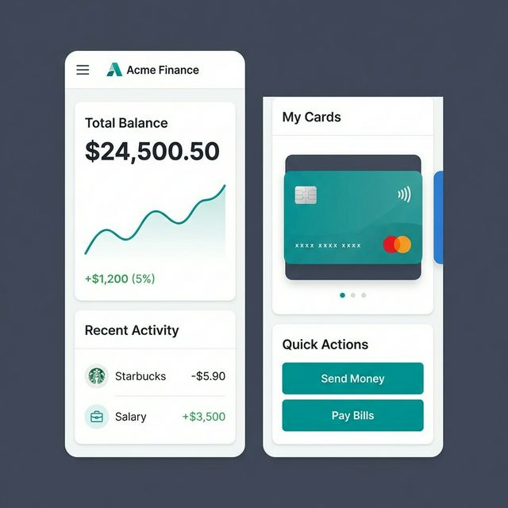
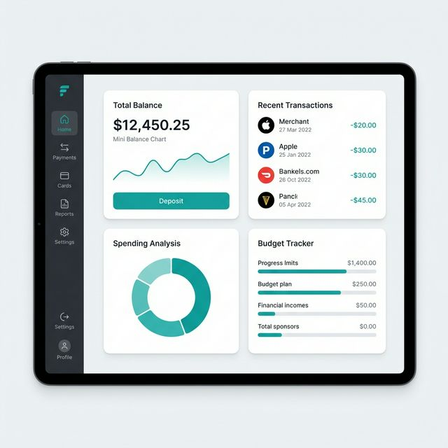
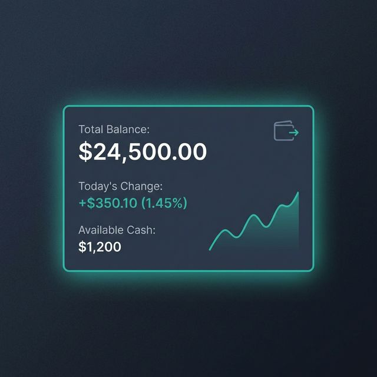
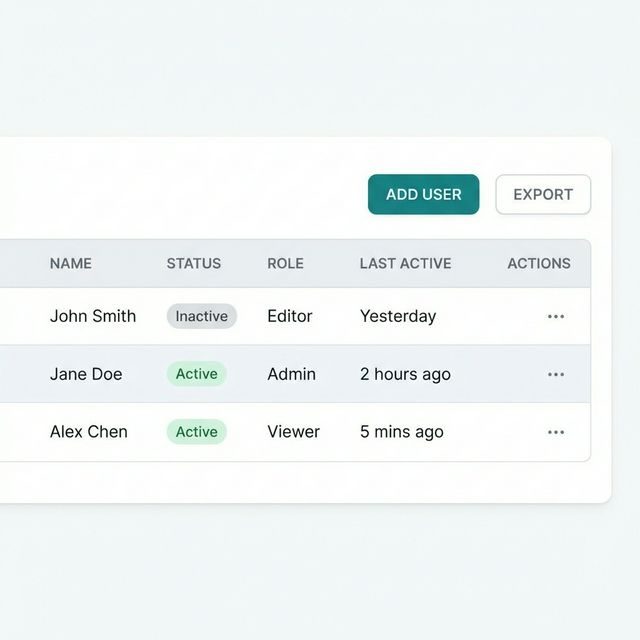

# UI 設計規範：專業簡潔風格 (Teal/Slate)

> [!IMPORTANT]
> 本文件為所有前端開發的 **唯一真實來源 (Single Source of Truth)**。所有 UI 元件與版面配置必須嚴格遵守此規範，以確保一致性與專業品質。

## 1. 視覺概觀 (Visual Overview)

設計理念為 **「專業簡潔 (Clean Professional)」**。優先考慮資料的可讀性，透過中性的「Slate (岩灰色)」建立信任感，並使用「Teal (藍綠色)」作為主要操作與聚焦狀態的顏色。

### 參考範例

_這些圖片代表目標外觀與質感。請參考其間距、密度與元件層級。_

**亮色模式 (Light Mode)**

**深色模式 (Dark Mode)**

---

## 2. 顏色系統 (Color System)

我們使用標準 Tailwind CSS 色票。請勿引入任意的 Hex 代碼。

### 主要品牌色 (Teal)

用於：主要按鈕、啟用狀態、連結、成功指標。

- **基底 (Base)**: `teal-600` (亮色模式) / `teal-500` (深色模式，增加對比度)
- **懸停 (Hover)**: `teal-700` (亮色模式) / `teal-400` (深色模式)
- **背景 (微淡)**: `teal-50` (亮色模式) / `teal-900/20` (深色模式)

### 中性色 (Slate)

用於：文字、邊框、背景、分隔線。使用 **較冷的灰色調** 以符合專業氛圍。

- **背景 (App)**: `slate-50` (亮色模式) / `slate-900` (深色模式)
- **背景 (卡片)**: `white` (亮色模式) / `slate-800` (深色模式)
- **文字 (標題)**: `slate-900` (亮色模式) / `white` (深色模式)
- **文字 (內文)**: `slate-600` (亮色模式) / `slate-300` (深色模式)
- **邊框**: `slate-200` (亮色模式) / `slate-700` (深色模式)

### 語意色彩 (Semantic Colors)

- **成功 (Success)**: `teal-600`
- **錯誤 (Error)**: `rose-600`
- **警告 (Warning)**: `amber-500`
- **資訊 (Info)**: `sky-500`

---

## 3. 排版 (Typography)

**字體家族**: `Inter` (sans-serif)。乾淨、易讀、高度標準化。

### 比例與無障礙性

**基準大小 (Base Size)**: `16px` (1rem)。
所有尺寸必須使用相對單位 (rem) 以支援瀏覽器的縮放偏好。

| 層級      | 大小 (rem) | 大小 (px) | 字重           | 使用情境                 |
| :-------- | :--------- | :-------- | :------------- | :----------------------- |
| **H1**    | `1.875rem` | 30px      | Bold (700)     | 頁面標題                 |
| **H2**    | `1.5rem`   | 24px      | Semibold (600) | 區塊標頭                 |
| **H3**    | `1.25rem`  | 20px      | Semibold (600) | 卡片標題                 |
| **Body**  | `1rem`     | 16px      | Regular (400)  | 主要內容、表格資料       |
| **Small** | `0.875rem` | 14px      | Medium (500)   | Metadata、標籤、表格標頭 |
| **Tiny**  | `0.75rem`  | 12px      | Medium (500)   | 徽章 (Badges)、說明文字  |

> [!NOTE]
> 內文文字顏色不得淺於 `slate-500`，以確保對比度至少達到 4.5:1 的無障礙標準。

---

## 4. 版面配置與間距 (Layout & Spacing)

- **側邊欄 (Sidebar)**: 固定寬度 `250px`。
- **卡片圓角**: `rounded-xl` (12px)。柔和但結構分明。
- **內距 (Padding)**: 卡片內部給予充足空間 (`p-6`)。內容不應感到擁擠。
- **網格 (Grid)**: 相對應於特定視口的 4/8/12 欄網格系統。

### 響應式斷點與行為 (Responsive Behavior)

明確定義側邊欄 (Sidebar) 在不同螢幕寬度下的行為，確保開發順暢。

| 斷點 (Breakpoint)        | 寬度範圍         | 側邊欄行為           | 觸發方式                              |
| :----------------------- | :--------------- | :------------------- | :------------------------------------ |
| **Mobile** (`< md`)      | `< 768px`        | **隱藏 (Hidden)**    | 點擊 Header 的漢堡選單滑出 (Drawer)   |
| **Tablet** (`md` ~ `lg`) | `768px - 1024px` | **收合 (Collapsed)** | 僅顯示圖示 (Icons)，寬度縮減為 `64px` |
| **Desktop** (`>= lg`)    | `>= 1024px`      | **展開 (Expanded)**  | 完整顯示，寬度固定 `250px`            |

**響應式模擬 (Responsive Simulations)**

  
  

---

## 5. 視覺特效與動畫 (Visual Effects & Animation)

### 發光效果 (Glow Effects) - 深色模式專用

為提升深色模式的層次感與「高級感」，定義專屬的 Teal 光暈。不可隨意濫用，僅用於強調重點卡片或聚焦狀態。

- **Class**: `shadow-teal-glow`
- **CSS 定義 (建議)**: `box-shadow: 0 0 15px -3px rgba(20, 184, 166, 0.5);` (使用 `teal-500` 色碼)
- **使用時機**:
  - 主動狀態的卡片 (Active Cards)
  - 聚焦的輸入框 (Focused Inputs)
  - 重要數據圖表 (Key Charts)

### 過渡與動畫 (Transitions)

所有互動元件必須具備平滑過渡，禁止生硬的狀態切換。

- **標準過渡 (Standard)**: `transition-all duration-200 ease-in-out`
- **適用屬性**: `color`, `background-color`, `border-color`, `box-shadow`, `transform`
- **禁止**: 超過 500ms 的緩慢動畫，或無意義的位移。

---

## 6. 元件指南 (Component Guidelines)

### 按鈕 (Buttons)

- **主要 (Primary)**: `bg-teal-600` text-white `rounded-lg` `px-4 py-2` `font-medium`。
- **次要 (Secondary)**: `bg-white` border `border-slate-300` text `slate-700` (亮色模式)。
- **圖示 (Icons)**: SVG 圖示 (Lucide/Heroicons) 在標準按鈕中應為 `w-5 h-5`。

### 卡片 (Cards)

- **亮色模式**: 白色背景, `shadow-sm`, border `border-slate-200`。
- **深色模式**: Slate-800 背景, 無陰影 (或極微弱), border `border-slate-700`。

### 表格 (Tables)

- **標頭 (Header)**: `bg-slate-50` (亮色模式) / `bg-slate-800/50` (深色模式)。文字 `text-xs` uppercase `tracking-wider` `font-semibold`。
- **列 (Rows)**: `border-b` `border-slate-100` (亮色模式) / `border-slate-700` (深色模式)。
- **懸停 (Hover)**: 微妙的 `hover:bg-slate-50` (亮色模式) / `hover:bg-slate-700/50` (深色模式)。

**元件細節模擬 (Component Detail Simulation)**

---

## 6. 無障礙檢查 (Accessibility Checks / A11y)

1. **對比度**: 文字必須符合 WCAG AA (4.5:1)。
2. **聚焦環 (Focus Rings)**: 互動元件必須有可見的聚焦環 (`ring-2 ring-teal-500/50`)。
3. **語意化 HTML**: 使用正確的 `<main>`, `<nav>`, `<header>`, `<table>` 標籤。
