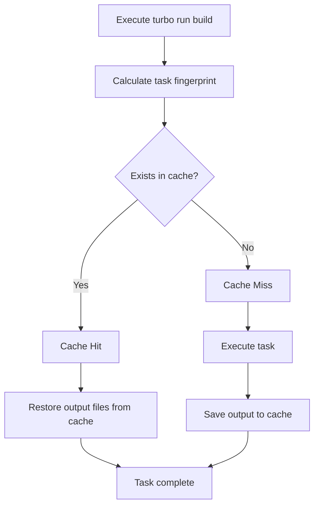
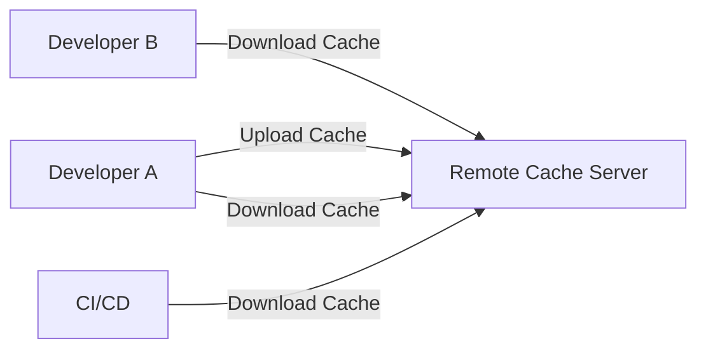
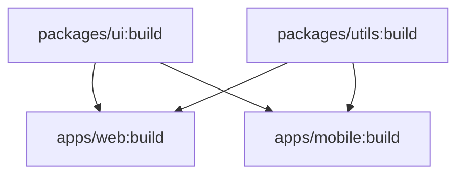
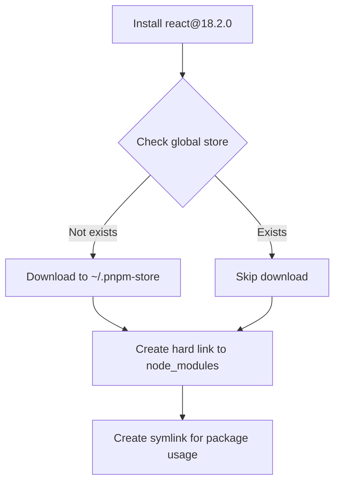
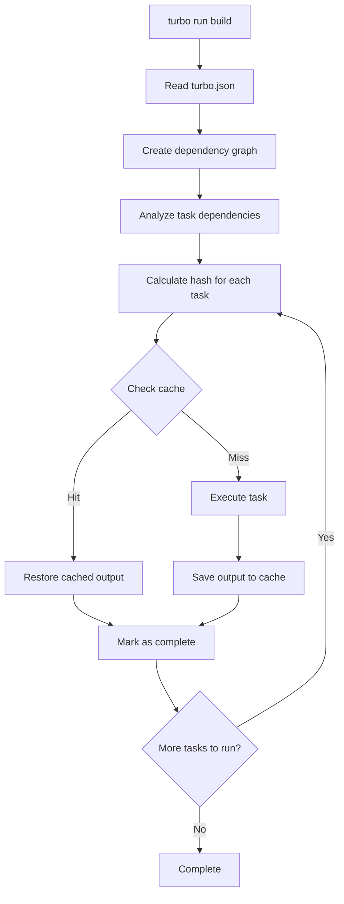

# Turborepo Complete Guide

## Table of Contents

1. [What is Turborepo](#what-is-turborepo)
2. [Core Concepts](#core-concepts)
3. [Underlying Mechanisms](#underlying-mechanisms)
4. [Package Manager Selection](#package-manager-selection)
5. [Basic Configuration](#basic-configuration)
6. [How It Works](#how-it-works)
7. [Advanced Features](#advanced-features)

---

## What is Turborepo

Turborepo is a **high-performance build system** designed for JavaScript and TypeScript projects, specifically optimized for **Monorepo** (single repository) architectures. Developed by the Vercel team, it aims to solve the challenges of build speed and developer experience in large Monorepo projects.

### Key Features

- 🚀 **Extremely Fast**: Significantly reduces build times through smart caching and parallel execution.
- 🔄 **Incremental Builds**: Only rebuilds what has changed.
- 🌐 **Remote Caching**: Shares build caches between team members and CI/CD environments.
- 📦 **Zero Runtime Overhead**: Does not interfere with runtime code or modify sourcemaps.
- 🔧 **Easy Integration**: Seamlessly integrates with existing npm, yarn, and pnpm projects.

---

## Core Concepts

### 1. Monorepo Architecture

Turborepo builds upon the workspace features of JavaScript package managers. A typical project structure looks like this:

```
my-monorepo/
├── apps/
│   ├── web/          # Next.js application
│   └── mobile/       # React Native application
├── packages/
│   ├── ui/           # Shared UI component library
│   ├── utils/        # Shared utility functions
│   └── tsconfig/     # Shared TypeScript configuration
├── package.json      # Root package.json
├── turbo.json        # Turborepo configuration file
└── pnpm-workspace.yaml
```

### 2. Tasks

Tasks are scripts defined in `package.json`, for example:

- `build`: Build the project
- `test`: Run tests
- `lint`: Code linting
- `dev`: Development server

### 3. Dependency Graph

Turborepo automatically analyzes dependencies between projects to create a dependency graph. This allows Turborepo to:

- Execute tasks in the correct order
- Identify which projects need to be rebuilt
- Maximize opportunities for parallel execution

### 4. Caching

The core philosophy of Turborepo is: **Never recompute work that has already been done.**

---

## Underlying Mechanisms

### 1. Cache Fingerprinting

Turborepo generates a unique "fingerprint" (hash) for each task execution. This fingerprint consists of the following factors:

#### File Contents

- Hashes file contents using a **content-aware algorithm**
- Ignores irrelevant metadata like file timestamps
- Only triggers re-execution when the **actual content** of the file changes

#### Environment Variables

- Environment variables specified in `turbo.json` affect the cache
- Changing environment variables causes cache invalidation

#### Dependencies

- Contents of `package.json` and lock files
- Dependencies between projects

#### Task Configuration

- Task settings in `turbo.json`
- `inputs` and `outputs` definitions for tasks

### 2. Cache Hits and Misses



**Cache Hit**:

- Turborepo finds a matching fingerprint
- Directly restores previously saved output files from the cache
- Skips task execution, saving a significant amount of time

**Cache Miss**:

- No matching fingerprint found
- Executes the task normally
- Saves output files to the cache for future use

### 3. Local Cache vs. Remote Cache

#### Local Cache

- Enabled by default
- Cache stored in the local file system (`.turbo/cache/`)
- Only effective for a single developer's machine

#### Remote Cache

- Requires additional configuration
- Cache stored on a cloud server
- Shared across the entire team and CI/CD environment
- **Huge Advantage**: CI servers can use caches built locally by developers, and vice versa



### 4. Parallel Execution

Turborepo analyzes dependencies between tasks and executes independent tasks in parallel whenever possible:



In the diagram above:

- `packages/ui:build` and `packages/utils:build` can **run simultaneously**
- `apps/web:build` and `apps/mobile:build` must wait for dependencies to complete before running
- But `apps/web:build` and `apps/mobile:build` can **run in parallel** with each other

### 5. Incremental Builds

Turborepo only rebuilds parts that have changed:

1. **Change Detection**: Detects changes via file content hashing
2. **Impact Analysis**: Analyzes which packages are affected by the changes
3. **Selective Execution**: Only executes tasks for affected packages

---

## Package Manager Selection

### Package Managers Supported by Turborepo

Turborepo **does not enforce a specific package manager**; it supports:

- **npm** - Default Node.js package manager
- **yarn** - Package manager developed by Facebook
- **pnpm** - High-performance package manager

Turborepo automatically detects the package manager you are using without extra configuration.

### Why Recommend pnpm?

Although all three package managers can be used, **pnpm has significant advantages in Monorepo scenarios**:

#### 1. Extreme Installation Speed ⚡

According to 2025 performance tests:

- **65% faster than npm**
- In large Monorepos, installation speed after clearing cache is **3 times** that of npm
- Even with cache, it is faster than Yarn

#### 2. Amazing Disk Space Savings 💾

**npm/yarn Approach** (Duplicate storage):

```
my-monorepo/
├── apps/web/node_modules/react (5MB)
├── apps/mobile/node_modules/react (5MB)
└── packages/ui/node_modules/react (5MB)
Total: 15MB ❌ Wasted 10MB
```

**pnpm Approach** (Symlinks):

```
~/.pnpm-store/
└── react@18.2.0 (5MB) ← Stored only once

my-monorepo/
├── apps/web/node_modules/react → symlink
├── apps/mobile/node_modules/react → symlink
└── packages/ui/node_modules/react → symlink
Total: 5MB ✅ Saved 67% space
```

**Real-world Case**:

- Monorepo with 10 packages
  - npm: ~1.2 GB
  - pnpm: ~300 MB

#### 3. Strict Dependency Isolation 🔒

This is one of pnpm's most important advantages!

**What are "Phantom Dependencies"?**

```javascript
// apps/web/package.json
{
  "dependencies": {
    "next": "^14.0.0"  // Next.js internally depends on react
  }
}

// In your code
import React from 'react'
```

**Behavior of Different Package Managers**:

| Package Manager | Behavior  | Issue                            |
| --------------- | --------- | -------------------------------- |
| **npm/yarn**    | ✅ Works  | ❌ Hidden dependency risk        |
| **pnpm**        | ❌ Errors | ✅ Enforces explicit declaration |

**Why is this important?**

When using npm/yarn:

- You can use dependencies that are not explicitly declared (because they are "hoisted" to the root)
- When another package removes that dependency, your code suddenly breaks
- "Module not found" errors may occur during Docker builds

When using pnpm:

- **Forces you to explicitly declare all dependencies**
- Each package can only access dependencies declared in its own `package.json`
- More reliable and predictable build process

#### 4. Cleaner Docker Builds 🐳

```dockerfile
FROM node:20-alpine

# pnpm ensures each app explicitly declares dependencies
# No accidental inclusion of unneeded packages
COPY package.json pnpm-lock.yaml ./
RUN pnpm install --frozen-lockfile

# Resulting Docker image is smaller and faster
```

**Advantages**:

- No phantom dependencies, Docker builds are more reliable
- Only includes explicitly declared dependencies, smaller image size
- Reduces "works locally, fails in Docker" issues

#### 5. Perfect Match with Turborepo 🚀

```bash
# Turborepo's cache + pnpm's speed = Extreme Performance
turbo run build

# First run:
# - pnpm quickly installs dependencies
# - Turborepo runs build and caches

# Second run (no changes):
# - pnpm completes instantly from symlinks
# - Turborepo restores from cache
# Total time: Almost 0!
```

### Package Manager Performance Comparison (2025)

| Feature                  | npm                 | yarn             | pnpm                  |
| ------------------------ | ------------------- | ---------------- | --------------------- |
| **Installation Speed**   | Slow                | Medium           | ⭐ **Fastest**        |
| **Disk Space**           | Massive duplication | Improved         | ⭐ **Most Efficient** |
| **Dependency Isolation** | ❌ Loose            | ❌ Loose         | ⭐ **Strict**         |
| **Monorepo Support**     | Basic               | Good             | ⭐ **Excellent**      |
| **Learning Curve**       | Simple              | Simple           | Simple                |
| **Ecosystem**            | ⭐ Largest          | Large            | Growing               |
| **Default Install**      | ⭐ Node.js Built-in | Requires Install | Requires Install      |

### How to Choose?

#### ✅ Use pnpm if:

- You are developing a Monorepo (Highly Recommended)
- You value build speed and disk space
- You want more reliable dependency management
- You need to build in Docker
- You want the best developer experience

#### ✅ Use npm if:

- Your project is small and simple
- You want maximum compatibility
- You don't want to install extra tools
- Your team is not familiar with other tools

#### ✅ Use yarn if:

- You are already using yarn
- You need Plug'n'Play (PnP) features
- Your team is familiar with the yarn workflow

### pnpm Quick Start

#### Install pnpm

```bash
# Install using npm
npm install -g pnpm

# Use Homebrew (macOS)
brew install pnpm

# Use Corepack (Node.js 16.13+)
corepack enable
corepack prepare pnpm@latest --activate
```

#### Basic Command Comparison

| npm                   | pnpm                 | Description          |
| --------------------- | -------------------- | -------------------- |
| `npm install`         | `pnpm install`       | Install dependencies |
| `npm install <pkg>`   | `pnpm add <pkg>`     | Add package          |
| `npm uninstall <pkg>` | `pnpm remove <pkg>`  | Remove package       |
| `npm run <script>`    | `pnpm <script>`      | Run script           |
| `npx <command>`       | `pnpm dlx <command>` | Execute package      |

#### Create pnpm workspace

Create `pnpm-workspace.yaml` in the root directory:

```yaml
packages:
  - 'apps/*'
  - 'packages/*'
```

### Underlying Principles

#### pnpm's Content-Addressable Store



**Key Concepts**:

1. **Global Store**: All packages are stored only once in `~/.pnpm-store`
2. **Hard Link**: Links the package to the project's `node_modules/.pnpm`
3. **Symlink**: Points from `node_modules/<package>` to the actual file in `.pnpm`

**Advantages**:

- Different projects share the same version of packages
- No extra disk space usage
- Extremely fast installation speed

---

## Basic Configuration

### 1. Install Turborepo

#### Create a New Project

```bash
npx create-turbo@latest
```

#### Install in an Existing Project

```bash
npm install turbo --save-dev
# or
pnpm add turbo -D
# or
yarn add turbo -D
```

### 2. Configure Workspace

Configure workspaces in the root `package.json`:

```json
{
  "name": "my-monorepo",
  "private": true,
  "workspaces": ["apps/*", "packages/*"],
  "scripts": {
    "build": "turbo run build",
    "dev": "turbo run dev",
    "test": "turbo run test",
    "lint": "turbo run lint"
  },
  "devDependencies": {
    "turbo": "latest"
  }
}
```

### 3. Create turbo.json

Create a `turbo.json` configuration file in the root directory:

```json
{
  "$schema": "https://turbo.build/schema.json",
  "globalDependencies": [".env", "tsconfig.json"],
  "globalEnv": ["NODE_ENV"],
  "tasks": {
    "build": {
      "dependsOn": ["^build"],
      "outputs": ["dist/**", ".next/**", "!.next/cache/**"]
    },
    "test": {
      "dependsOn": ["build"],
      "outputs": ["coverage/**"],
      "inputs": ["src/**/*.ts", "src/**/*.tsx", "test/**/*.ts"]
    },
    "lint": {
      "dependsOn": ["^build"]
    },
    "dev": {
      "cache": false,
      "persistent": true
    }
  }
}
```

### 4. turbo.json Configuration Details

#### Top-level Properties

**`$schema`**

- Provides IDE autocomplete and validation support
- Links to Turborepo's JSON schema

**`globalDependencies`**

- Array of glob patterns for global dependency files
- Changes to these files invalidate the cache for all tasks
- Defaults include root `package.json` and lock file

**`globalEnv`**

- List of environment variables that affect all task hashes
- Changes to these environment variables invalidate all task caches

**`globalPassThroughEnv`**

- Environment variables to pass through to all tasks
- Enables strict environment variable mode

#### Task Configuration

**`dependsOn`** - Task Dependencies

```json
{
  "build": {
    "dependsOn": ["^build"]
  }
}
```

- `^taskName`: **Topological dependency**, means `taskName` of all dependent packages must complete first
- `taskName`: Task dependency within the same package

**`outputs`** - Output Files

```json
{
  "build": {
    "outputs": ["dist/**", ".next/**", "!.next/cache/**"]
  }
}
```

- Specifies files generated by the task; Turborepo will cache these files
- Supports glob patterns
- Use `!` to exclude specific files
- **Important**: If `outputs` is not declared, Turborepo will not cache any files

**`inputs`** - Input Files

```json
{
  "test": {
    "inputs": ["src/**/*.ts", "test/**/*.ts", "tsconfig.json"]
  }
}
```

- Defines files that affect the task's cache hash
- Task re-runs only when these files change
- Provides precise cache invalidation control

**`cache`** - Cache Control

```json
{
  "dev": {
    "cache": false
  }
}
```

- Explicitly enable or disable cache for specific tasks
- Development server (`dev`) is usually set to `false`

**`env`** - Task-specific Environment Variables

```json
{
  "build": {
    "env": ["API_URL", "API_KEY"]
  }
}
```

- Environment variables that affect the cache hash of a specific task

**`outputMode`** - Output Mode

```json
{
  "build": {
    "outputMode": "new-only"
  }
}
```

- `full`: Show all output
- `new-only`: Show only new output
- `hash-only`: Show only hashes
- `errors-only`: Show only errors

---

## How It Works

### 1. Running Tasks

#### Basic Usage

```bash
# Run build task for all packages
turbo run build

# Run multiple tasks
turbo run build test lint

# Run tasks for a specific package only
turbo run build --filter=web

# Run affected packages
turbo run build --filter=[HEAD^1]
```

#### Filter Syntax

```bash
# Run only web package
--filter=web

# Run web and its dependencies
--filter=web...

# Run packages that depend on web
--filter=...web

# Run multiple packages
--filter={web,mobile}

# Based on git changes
--filter=[HEAD^1]        # Compare with previous commit
--filter=[main]          # Compare with main branch
--filter=[origin/main]   # Compare with remote main branch
```

### 2. Task Execution Flow



### 3. Development Mode

```bash
# Start development server
turbo run dev

# Use watch mode
turbo run build --watch
```

**Watch Mode Features**:

- Automatically detects file changes
- Dependency-aware task re-execution
- Only re-runs affected tasks

### 4. Cache Management

```bash
# View cache status
turbo run build --dry-run

# Force skip cache
turbo run build --force

# Clear local cache
rm -rf .turbo/cache
```

---

## Advanced Features

### 1. Remote Cache Configuration

#### Use Vercel Remote Cache (Free)

```bash
# Login
turbo login

# Link project
turbo link
```

#### Custom Remote Cache

Create `.turbo/config.json`:

```json
{
  "apiurl": "https://your-cache-server.com",
  "token": "your-token",
  "teamid": "your-team-id"
}
```

Or use environment variables:

```bash
export TURBO_API="https://your-cache-server.com"
export TURBO_TOKEN="your-token"
export TURBO_TEAM="your-team-id"
```

#### Cache Signature Verification

Enable in `turbo.json`:

```json
{
  "remoteCache": {
    "signature": true
  }
}
```

Set signature key:

```bash
export TURBO_REMOTE_CACHE_SIGNATURE_KEY="your-secret-key"
```

### 2. Pruning

Create a subset containing only a specific application and its dependencies, used for deployment:

```bash
# Prune the web application
turbo prune --scope=web

# Generated structure
out/
├── package.json
├── turbo.json
├── apps/
│   └── web/
└── packages/
    └── ui/  # Contains only packages web depends on
```

**Use Cases**:

- Docker multi-stage builds
- Reduce deployment size
- Speed up CI/CD

### 3. Visualize Dependency Graph

```bash
# Generate dependency graph
turbo run build --graph

# Generate DOT format
turbo run build --graph=graph.dot

# Visualize using Graphviz
dot -Tpng graph.dot -o graph.png
```

### 4. Interactive Tasks

Turborepo 2.0+ supports interactive tasks:

```json
{
  "tasks": {
    "test:interactive": {
      "interactive": true
    }
  }
}
```

Allows you to enter the shell of a specific task to pass input.

### 5. Package-Level Configuration

Create `turbo.json` in individual packages:

```json
{
  "extends": ["//"],
  "tasks": {
    "build": {
      "outputs": ["custom-dist/**"]
    }
  }
}
```

---

## Performance Optimization Tips

### 1. Precisely Define inputs and outputs

```json
{
  "build": {
    "inputs": ["src/**", "package.json", "tsconfig.json"],
    "outputs": ["dist/**"]
  }
}
```

### 2. Use Remote Cache

- Shared team cache can save 50-90% of build time
- CI/CD environments benefit significantly

### 3. Reasonably Configure dependsOn

```json
{
  "test": {
    "dependsOn": ["^build"] // Only depends on build of dependent packages
  },
  "lint": {
    "dependsOn": [] // No dependencies, can run in parallel
  }
}
```

### 4. Exclude Unnecessary Files

```json
{
  "build": {
    "outputs": [
      "dist/**",
      "!dist/**/*.map" // Exclude source maps
    ]
  }
}
```

### 5. Use --filter to Reduce Execution Scope

```bash
# Build only changed packages
turbo run build --filter=[HEAD^1]
```

---

## FAQ

### Q1: Difference between Turborepo and Nx?

**Turborepo**:

- Lightweight, simple configuration
- Focuses on caching and task execution
- Integrates well with existing toolchains
- Suitable for projects with existing build tools

**Nx**:

- Feature-rich
- Built-in code generators
- More project templates
- Suitable for projects starting from scratch

### Q2: How much space does the cache take?

- Local cache has no limit by default
- Can periodically clean `.turbo/cache/`
- Remote cache is managed by the service provider

### Q3: How to debug cache issues?

```bash
# Use --dry-run to view cache status
turbo run build --dry-run

# Use --force to skip cache
turbo run build --force

# View detailed logs
turbo run build --verbosity=2
```

### Q4: Can it be used in non-Monorepo projects?

Yes, but the benefits are smaller. Turborepo's main advantage lies in managing multiple interdependent packages.

---

## Summary

Turborepo significantly improves Monorepo build performance through the following mechanisms:

1. **Smart Caching**: Content-based cache fingerprinting, never recompute
2. **Remote Caching**: Share build results across team and CI/CD
3. **Parallel Execution**: Maximize CPU resource utilization
4. **Incremental Builds**: Build only what changed
5. **Dependency Awareness**: Intelligent task orchestration

Combined, these features can reduce build times from tens of minutes to seconds, greatly enhancing developer experience and CI/CD efficiency.

---

## Resources

- [Turborepo Official Documentation](https://turbo.build/repo/docs)
- [Turborepo GitHub](https://github.com/vercel/turbo)
- [Vercel Remote Caching](https://vercel.com/docs/monorepos/remote-caching)
