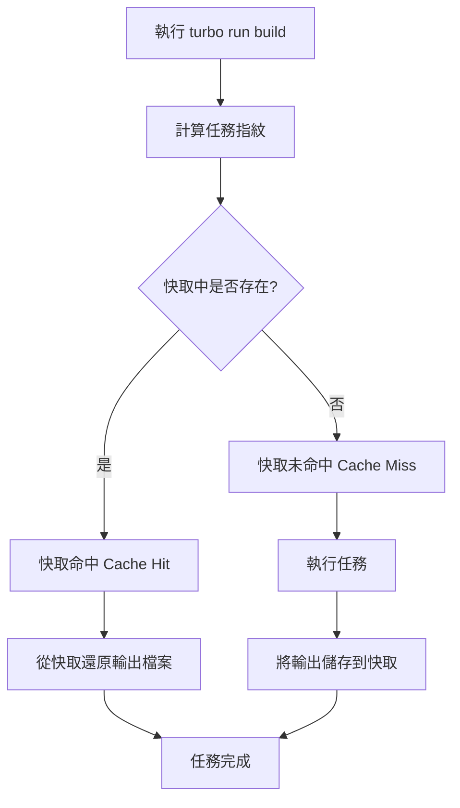
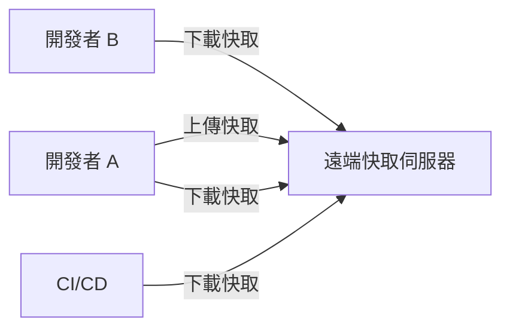
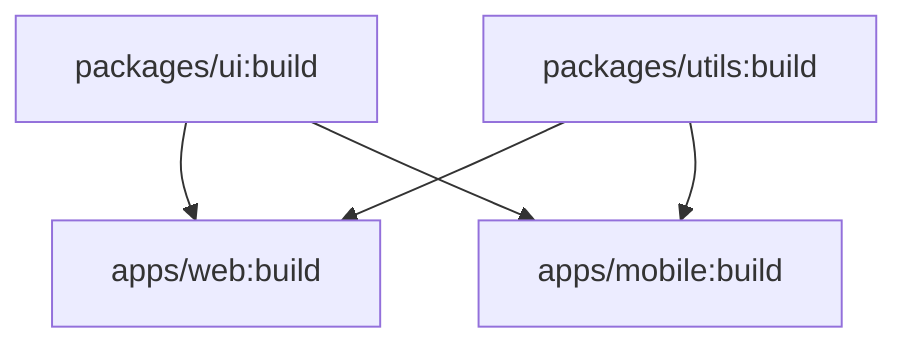
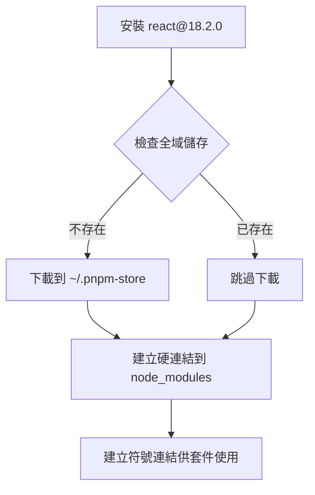
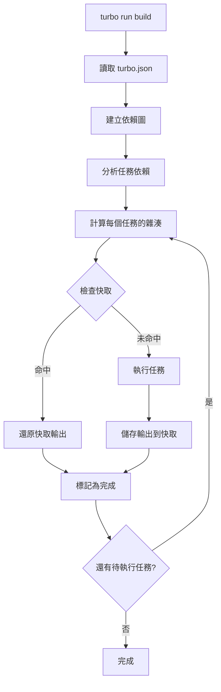

# Turborepo 完整說明文件

## 目錄

1. [什麼是 Turborepo](#什麼是-turborepo)
2. [核心概念](#核心概念)
3. [底層運作機制](#底層運作機制)
4. [套件管理器選擇](#套件管理器選擇)
5. [基礎設定](#基礎設定)
6. [運作方式](#運作方式)
7. [進階功能](#進階功能)

---

## 什麼是 Turborepo

Turborepo 是一個專為 JavaScript 和 TypeScript 專案設計的**高效能建置系統**,特別針對 **Monorepo** (單一儲存庫) 架構進行最佳化。它由 Vercel 團隊開發,目標是解決大型 Monorepo 專案在建置速度和開發體驗上的挑戰。

### 主要特色

- 🚀 **極致快速**: 透過智慧快取和平行執行,大幅減少建置時間
- 🔄 **增量建置**: 只重新建置有變更的部分
- 🌐 **遠端快取**: 團隊成員和 CI/CD 環境共享建置快取
- 📦 **零執行時開銷**: 不會干擾執行時程式碼或修改 sourcemap
- 🔧 **易於整合**: 與現有的 npm、yarn、pnpm 專案無縫整合

---

## 核心概念

### 1. Monorepo 架構

Turborepo 建立在 JavaScript 套件管理器的 workspace 功能之上,典型的專案結構如下:

```
my-monorepo/
├── apps/
│   ├── web/          # Next.js 應用程式
│   └── mobile/       # React Native 應用程式
├── packages/
│   ├── ui/           # 共用 UI 元件庫
│   ├── utils/        # 共用工具函式
│   └── tsconfig/     # 共用 TypeScript 設定
├── package.json      # 根目錄 package.json
├── turbo.json        # Turborepo 設定檔
└── pnpm-workspace.yaml
```

### 2. 任務 (Tasks)

任務是指在 `package.json` 中定義的 scripts,例如:

- `build`: 建置專案
- `test`: 執行測試
- `lint`: 程式碼檢查
- `dev`: 開發伺服器

### 3. 依賴圖 (Dependency Graph)

Turborepo 會自動分析專案之間的依賴關係,建立一個依賴圖。這讓 Turborepo 能夠:

- 以正確的順序執行任務
- 識別哪些專案需要重新建置
- 最大化平行執行的機會

### 4. 快取 (Caching)

Turborepo 的核心哲學是:**永遠不要重複計算已經完成的工作**。

---

## 底層運作機制

### 1. 快取指紋 (Cache Fingerprinting)

Turborepo 為每個任務執行生成一個唯一的「指紋」(hash),這個指紋由以下因素組成:

#### 檔案內容

- 使用**內容感知演算法**對檔案內容進行雜湊
- 忽略檔案的時間戳記等無關的中繼資料
- 只有當檔案的**實際內容**改變時,才會觸發重新執行

#### 環境變數

- 在 `turbo.json` 中指定的環境變數會影響快取
- 環境變數改變會導致快取失效

#### 依賴關係

- `package.json` 和 lock 檔案的內容
- 專案之間的依賴關係

#### 任務設定

- `turbo.json` 中的任務設定
- 任務的 `inputs` 和 `outputs` 定義

### 2. 快取命中與未命中



**快取命中 (Cache Hit)**:

- Turborepo 找到匹配的指紋
- 直接從快取還原先前儲存的輸出檔案
- 跳過任務執行,節省大量時間

**快取未命中 (Cache Miss)**:

- 沒有找到匹配的指紋
- 正常執行任務
- 將輸出檔案儲存到快取供未來使用

### 3. 本地快取 vs 遠端快取

#### 本地快取 (Local Cache)

- 預設啟用
- 快取儲存在本地檔案系統 (`.turbo/cache/`)
- 只對單一開發者的機器有效

#### 遠端快取 (Remote Cache)

- 需要額外設定
- 快取儲存在雲端伺服器
- 整個團隊和 CI/CD 環境共享快取
- **巨大優勢**: CI 伺服器可以使用開發者本地建置的快取,反之亦然



### 4. 平行執行 (Parallel Execution)

Turborepo 會分析任務之間的依賴關係,並盡可能平行執行獨立的任務:



在上圖中:

- `packages/ui:build` 和 `packages/utils:build` 可以**同時執行**
- `apps/web:build` 和 `apps/mobile:build` 必須等待依賴完成後才能執行
- 但 `apps/web:build` 和 `apps/mobile:build` 之間可以**平行執行**

### 5. 增量建置 (Incremental Builds)

Turborepo 只會重新建置有變更的部分:

1. **變更偵測**: 透過檔案內容雜湊偵測變更
2. **影響分析**: 分析哪些套件受到變更影響
3. **選擇性執行**: 只執行受影響套件的任務

---

## 套件管理器選擇

### Turborepo 支援的套件管理器

Turborepo **並不強制使用特定的套件管理器**,它同時支援:

- **npm** - Node.js 預設套件管理器
- **yarn** - Facebook 開發的套件管理器
- **pnpm** - 高效能的套件管理器

Turborepo 會自動偵測你使用的套件管理器,無需額外設定。

### 為什麼推薦 pnpm？

雖然三種套件管理器都可以使用,但 **pnpm 在 Monorepo 場景下有顯著優勢**:

#### 1. 極致的安裝速度 ⚡

根據 2025 年的效能測試:

- **比 npm 快 65%**
- 在大型 Monorepo 中,清空快取後的安裝速度是 npm 的 **3 倍**
- 即使有快取,也比 Yarn 更快

#### 2. 驚人的磁碟空間節省 💾

**npm/yarn 的做法** (重複儲存):

```
my-monorepo/
├── apps/web/node_modules/react (5MB)
├── apps/mobile/node_modules/react (5MB)
└── packages/ui/node_modules/react (5MB)
總共：15MB ❌ 浪費 10MB
```

**pnpm 的做法** (符號連結):

```
~/.pnpm-store/
└── react@18.2.0 (5MB) ← 只儲存一次

my-monorepo/
├── apps/web/node_modules/react → symlink
├── apps/mobile/node_modules/react → symlink
└── packages/ui/node_modules/react → symlink
總共：5MB ✅ 節省 67% 空間
```

**實際案例**:

- 10 個套件的 Monorepo
  - npm: ~1.2 GB
  - pnpm: ~300 MB

#### 3. 嚴格的依賴隔離 🔒

這是 pnpm 最重要的優勢之一！

**什麼是「幽靈依賴」(Phantom Dependencies)？**

```javascript
// apps/web/package.json
{
  "dependencies": {
    "next": "^14.0.0"  // Next.js 內部依賴 react
  }
}

// 在你的程式碼中
import React from 'react'
```

**不同套件管理器的行為**:

| 套件管理器   | 行為        | 問題              |
| ------------ | ----------- | ----------------- |
| **npm/yarn** | ✅ 可以運作 | ❌ 隱藏的依賴風險 |
| **pnpm**     | ❌ 會報錯   | ✅ 強制明確宣告   |

**為什麼這很重要？**

使用 npm/yarn 時:

- 你可以使用沒有明確宣告的依賴（因為它們被「提升」到根目錄）
- 當其他套件移除該依賴時,你的程式碼會突然壞掉
- 在 Docker 建置時可能出現「找不到模組」的錯誤

使用 pnpm 時:

- **強制你明確宣告所有依賴**
- 每個套件只能存取自己 `package.json` 中宣告的依賴
- 更可靠、更可預測的建置過程

#### 4. 更乾淨的 Docker 建置 🐳

```dockerfile
FROM node:20-alpine

# pnpm 確保每個 app 明確宣告依賴
# 不會意外包含不需要的套件
COPY package.json pnpm-lock.yaml ./
RUN pnpm install --frozen-lockfile

# 產生的 Docker image 更小、更快
```

**優勢**:

- 沒有幽靈依賴,Docker 建置更可靠
- 只包含明確宣告的依賴,image 更小
- 減少「本地可以運作,Docker 卻失敗」的問題

#### 5. 完美搭配 Turborepo 🚀

```bash
# Turborepo 的快取 + pnpm 的速度 = 極致效能
turbo run build

# 第一次執行:
# - pnpm 快速安裝依賴
# - Turborepo 執行建置並快取

# 第二次執行（沒有變更）:
# - pnpm 從 symlink 瞬間完成
# - Turborepo 從快取還原
# 總時間：幾乎為 0！
```

### 套件管理器效能比較 (2025)

| 特性              | npm             | yarn    | pnpm        |
| ----------------- | --------------- | ------- | ----------- |
| **安裝速度**      | 慢              | 中等    | ⭐ **最快** |
| **磁碟空間**      | 大量重複        | 有改善  | ⭐ **最省** |
| **依賴隔離**      | ❌ 寬鬆         | ❌ 寬鬆 | ⭐ **嚴格** |
| **Monorepo 支援** | 基本            | 良好    | ⭐ **優秀** |
| **學習曲線**      | 簡單            | 簡單    | 簡單        |
| **生態系統**      | ⭐ 最大         | 大      | 成長中      |
| **預設安裝**      | ⭐ Node.js 內建 | 需安裝  | 需安裝      |

### 如何選擇？

#### ✅ 使用 pnpm 如果:

- 你在開發 Monorepo（強烈推薦）
- 你重視建置速度和磁碟空間
- 你想要更可靠的依賴管理
- 你需要在 Docker 中建置
- 你想要最佳的開發體驗

#### ✅ 使用 npm 如果:

- 你的專案很小且簡單
- 你想要最大的相容性
- 你不想安裝額外工具
- 你的團隊不熟悉其他工具

#### ✅ 使用 yarn 如果:

- 你已經在使用 yarn
- 你需要 Plug'n'Play (PnP) 功能
- 你的團隊熟悉 yarn 工作流程

### pnpm 快速上手

#### 安裝 pnpm

```bash
# 使用 npm 安裝
npm install -g pnpm

# 使用 Homebrew (macOS)
brew install pnpm

# 使用 Corepack (Node.js 16.13+)
corepack enable
corepack prepare pnpm@latest --activate
```

#### 基本指令對照

| npm                   | pnpm                 | 說明     |
| --------------------- | -------------------- | -------- |
| `npm install`         | `pnpm install`       | 安裝依賴 |
| `npm install <pkg>`   | `pnpm add <pkg>`     | 新增套件 |
| `npm uninstall <pkg>` | `pnpm remove <pkg>`  | 移除套件 |
| `npm run <script>`    | `pnpm <script>`      | 執行腳本 |
| `npx <command>`       | `pnpm dlx <command>` | 執行套件 |

#### 建立 pnpm workspace

在根目錄建立 `pnpm-workspace.yaml`:

```yaml
packages:
  - 'apps/*'
  - 'packages/*'
```

### 底層運作原理

#### pnpm 的內容尋址儲存 (Content-Addressable Store)



**關鍵概念**:

1. **全域儲存**: 所有套件只儲存一次在 `~/.pnpm-store`
2. **硬連結 (Hard Link)**: 將套件連結到專案的 `node_modules/.pnpm`
3. **符號連結 (Symlink)**: 從 `node_modules/<package>` 指向 `.pnpm` 中的實際檔案

**優勢**:

- 不同專案共享相同版本的套件
- 不佔用額外磁碟空間
- 安裝速度極快

---

## 基礎設定

### 1. 安裝 Turborepo

#### 建立新專案

```bash
npx create-turbo@latest
```

#### 在現有專案中安裝

```bash
npm install turbo --save-dev
# 或
pnpm add turbo -D
# 或
yarn add turbo -D
```

### 2. 設定 Workspace

在根目錄的 `package.json` 中設定 workspaces:

```json
{
  "name": "my-monorepo",
  "private": true,
  "workspaces": ["apps/*", "packages/*"],
  "scripts": {
    "build": "turbo run build",
    "dev": "turbo run dev",
    "test": "turbo run test",
    "lint": "turbo run lint"
  },
  "devDependencies": {
    "turbo": "latest"
  }
}
```

### 3. 建立 turbo.json

在根目錄建立 `turbo.json` 設定檔:

```json
{
  "$schema": "https://turbo.build/schema.json",
  "globalDependencies": [".env", "tsconfig.json"],
  "globalEnv": ["NODE_ENV"],
  "tasks": {
    "build": {
      "dependsOn": ["^build"],
      "outputs": ["dist/**", ".next/**", "!.next/cache/**"]
    },
    "test": {
      "dependsOn": ["build"],
      "outputs": ["coverage/**"],
      "inputs": ["src/**/*.ts", "src/**/*.tsx", "test/**/*.ts"]
    },
    "lint": {
      "dependsOn": ["^build"]
    },
    "dev": {
      "cache": false,
      "persistent": true
    }
  }
}
```

### 4. turbo.json 設定詳解

#### 頂層屬性

**`$schema`**

- 提供 IDE 自動完成和驗證支援
- 連結到 Turborepo 的 JSON schema

**`globalDependencies`**

- 全域依賴檔案的 glob 模式陣列
- 這些檔案變更時,會使所有任務的快取失效
- 預設包含根目錄的 `package.json` 和 lock 檔案

**`globalEnv`**

- 影響所有任務雜湊的環境變數清單
- 這些環境變數改變會導致所有任務快取失效

**`globalPassThroughEnv`**

- 要傳遞給所有任務的環境變數
- 啟用嚴格環境變數模式

#### 任務設定

**`dependsOn`** - 任務依賴

```json
{
  "build": {
    "dependsOn": ["^build"]
  }
}
```

- `^taskName`: **拓撲依賴**,表示所有依賴套件的 `taskName` 必須先完成
- `taskName`: 同一套件內的任務依賴

**`outputs`** - 輸出檔案

```json
{
  "build": {
    "outputs": ["dist/**", ".next/**", "!.next/cache/**"]
  }
}
```

- 指定任務產生的檔案,Turborepo 會快取這些檔案
- 支援 glob 模式
- 使用 `!` 排除特定檔案
- **重要**: 如果沒有宣告 `outputs`,Turborepo 不會快取任何檔案

**`inputs`** - 輸入檔案

```json
{
  "test": {
    "inputs": ["src/**/*.ts", "test/**/*.ts", "tsconfig.json"]
  }
}
```

- 定義影響任務快取雜湊的檔案
- 只有這些檔案變更時,任務才會重新執行
- 提供精確的快取失效控制

**`cache`** - 快取控制

```json
{
  "dev": {
    "cache": false
  }
}
```

- 明確啟用或停用特定任務的快取
- 開發伺服器 (`dev`) 通常設為 `false`

**`env`** - 任務特定環境變數

```json
{
  "build": {
    "env": ["API_URL", "API_KEY"]
  }
}
```

- 影響特定任務快取雜湊的環境變數

**`outputMode`** - 輸出模式

```json
{
  "build": {
    "outputMode": "new-only"
  }
}
```

- `full`: 顯示所有輸出
- `new-only`: 只顯示新的輸出
- `hash-only`: 只顯示雜湊
- `errors-only`: 只顯示錯誤

---

## 運作方式

### 1. 執行任務

#### 基本用法

```bash
# 執行所有套件的 build 任務
turbo run build

# 執行多個任務
turbo run build test lint

# 只執行特定套件的任務
turbo run build --filter=web

# 執行受影響的套件
turbo run build --filter=[HEAD^1]
```

#### Filter 語法

```bash
# 只執行 web 套件
--filter=web

# 執行 web 及其依賴
--filter=web...

# 執行依賴 web 的套件
--filter=...web

# 執行多個套件
--filter={web,mobile}

# 基於 git 變更
--filter=[HEAD^1]        # 與上一個 commit 比較
--filter=[main]          # 與 main 分支比較
--filter=[origin/main]   # 與遠端 main 分支比較
```

### 2. 任務執行流程



### 3. 開發模式

```bash
# 啟動開發伺服器
turbo run dev

# 使用 watch 模式
turbo run build --watch
```

**Watch 模式特色**:

- 自動偵測檔案變更
- 依賴感知的任務重新執行
- 只重新執行受影響的任務

### 4. 快取管理

```bash
# 檢視快取狀態
turbo run build --dry-run

# 強制跳過快取
turbo run build --force

# 清除本地快取
rm -rf .turbo/cache
```

---

## 進階功能

### 1. 遠端快取設定

#### 使用 Vercel 遠端快取 (免費)

```bash
# 登入
turbo login

# 連結專案
turbo link
```

#### 自訂遠端快取

建立 `.turbo/config.json`:

```json
{
  "apiurl": "https://your-cache-server.com",
  "token": "your-token",
  "teamid": "your-team-id"
}
```

或使用環境變數:

```bash
export TURBO_API="https://your-cache-server.com"
export TURBO_TOKEN="your-token"
export TURBO_TEAM="your-team-id"
```

#### 快取簽章驗證

在 `turbo.json` 中啟用:

```json
{
  "remoteCache": {
    "signature": true
  }
}
```

設定簽章金鑰:

```bash
export TURBO_REMOTE_CACHE_SIGNATURE_KEY="your-secret-key"
```

### 2. Pruning (修剪)

建立只包含特定應用程式及其依賴的子集,用於部署:

```bash
# 修剪出 web 應用程式
turbo prune --scope=web

# 產生的結構
out/
├── package.json
├── turbo.json
├── apps/
│   └── web/
└── packages/
    └── ui/  # 只包含 web 依賴的套件
```

**使用場景**:

- Docker 多階段建置
- 減少部署大小
- 加速 CI/CD

### 3. 視覺化依賴圖

```bash
# 產生依賴圖
turbo run build --graph

# 產生 DOT 格式
turbo run build --graph=graph.dot

# 使用 Graphviz 視覺化
dot -Tpng graph.dot -o graph.png
```

### 4. 互動式任務

Turborepo 2.0+ 支援互動式任務:

```json
{
  "tasks": {
    "test:interactive": {
      "interactive": true
    }
  }
}
```

允許你進入特定任務的 shell,傳遞輸入。

### 5. 套件層級設定

在個別套件中建立 `turbo.json`:

```json
{
  "extends": ["//"],
  "tasks": {
    "build": {
      "outputs": ["custom-dist/**"]
    }
  }
}
```

---

## 效能最佳化建議

### 1. 精確定義 inputs 和 outputs

```json
{
  "build": {
    "inputs": ["src/**", "package.json", "tsconfig.json"],
    "outputs": ["dist/**"]
  }
}
```

### 2. 使用遠端快取

- 團隊共享快取可節省 50-90% 的建置時間
- CI/CD 環境特別受益

### 3. 合理設定 dependsOn

```json
{
  "test": {
    "dependsOn": ["^build"] // 只依賴依賴套件的 build
  },
  "lint": {
    "dependsOn": [] // 不依賴其他任務,可平行執行
  }
}
```

### 4. 排除不必要的檔案

```json
{
  "build": {
    "outputs": [
      "dist/**",
      "!dist/**/*.map" // 排除 source map
    ]
  }
}
```

### 5. 使用 --filter 減少執行範圍

```bash
# 只建置變更的套件
turbo run build --filter=[HEAD^1]
```

---

## 常見問題

### Q1: Turborepo 與 Nx 的差異?

**Turborepo**:

- 更輕量,配置簡單
- 專注於快取和任務執行
- 與現有工具鏈整合良好
- 適合已有建置工具的專案

**Nx**:

- 功能更豐富
- 內建程式碼產生器
- 更多的專案模板
- 適合從零開始的專案

### Q2: 快取會佔用多少空間?

- 本地快取預設無限制
- 可以定期清理 `.turbo/cache/`
- 遠端快取由服務提供商管理

### Q3: 如何除錯快取問題?

```bash
# 使用 --dry-run 檢視快取狀態
turbo run build --dry-run

# 使用 --force 跳過快取
turbo run build --force

# 檢視詳細日誌
turbo run build --verbosity=2
```

### Q4: 可以在非 Monorepo 專案使用嗎?

可以,但效益較小。Turborepo 的主要優勢在於管理多個相互依賴的套件。

---

## 總結

Turborepo 透過以下機制大幅提升 Monorepo 的建置效能:

1. **智慧快取**: 基於內容的快取指紋,永不重複計算
2. **遠端快取**: 團隊和 CI/CD 共享建置成果
3. **平行執行**: 最大化利用 CPU 資源
4. **增量建置**: 只建置變更的部分
5. **依賴感知**: 智慧的任務編排

這些特性結合起來,可以將建置時間從數十分鐘縮短到數秒鐘,大幅提升開發體驗和 CI/CD 效率。

---

## 參考資源

- [Turborepo 官方文件](https://turbo.build/repo/docs)
- [Turborepo GitHub](https://github.com/vercel/turbo)
- [Vercel 遠端快取](https://vercel.com/docs/monorepos/remote-caching)
